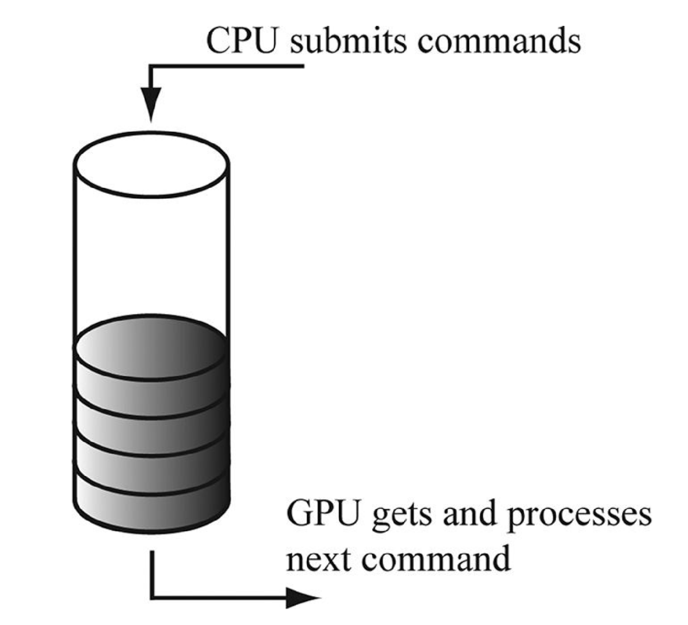

# Chapter 4 Direct3D Initialization

初始化`Direct3D`我们需要了解一些基础的`Direct3D`类型和一些基础的图形概念。
我们将在这一章的第一段和第二段讲述这些知识。
然后我们就介绍初始化`Direct3D`必要的步骤。
之后稍微绕一点远路，介绍下精确的计时和用于实时图形应用的时间测量方法。

目标

- 基本上了解`Direct3D`在3D程序编写上扮演的角色。
- 理解`COM`在`Direct3D`里面中的作用。
- 了解基本的图形概念，例如2D图片如何储存的，页面的过滤，深度缓存，多重采样和`CPU`与`GPU`的交互。
- 学习如何使用计时函数实现高精度的计时器。
- 学习如何初始化`Direct3D`。

## 4.1 PRELIMINARIES

初始化`Direct3D`我们需要了解一些基础的`Direct3D`类型和一些基础的图形概念。
我们在这一段中介绍这些类型和概念，所以不要认为我们离题了。

### 4.1.1 Direct3D 12 Overview

`Direct3D` 是一个用于控制和管理`GPU`(**graphics processing unit**)的底层的图形`API`(**application programming interface**)，它能够让我们使用硬件加速渲染虚拟的3D世界。
我们如果要提交给`GPU`一个指令去清理`Render Target`(屏幕)，我们可以通过使用`Direct3D`函数来做到。
`Direct3D`和硬件驱动将会把`Direct3D`的指令翻译成可以被`GPU`理解的机器语言。
我们并不需要关心具体使用的`GPU`是什么，我们只需要知道他是否支持我们正在使用的`Direct3D`的版本。
通常来说`GPU`厂家，例如`NVIDIA`,`Intel`,`AMD`都会提供支持`Direct3D`的驱动。

`Direct3D 12`增加了一些新的特性，但是相比以前的版本来说，最大的改进还是重新设计了它，减少了对`CPU`的消耗和提高了对多线程的支持。
为了达到这个目的，`Direct3D 12`比`Direct3D 11`变得更加底层，更加接近现代`GPU`架构。
当然使用这样较为麻烦的`API`的优势就是性能得到提升。

### 4.1.2 COM

`Component Object Model`(**COM**)是一项能够让`DirectX`与具体的程序语言无关和向后兼容性的技术。
我们通常用接口`Interface`的形式引用一个`COM`组件，使得我们能够将其视为`C++`里面的类，并且当作类使用。
大多数的`COM`细节在我们使用`C++`编写`DirectX`程序的时候就被隐藏了。
唯一需要注意的是我们是通过指定的函数或者另外一个接口去实例化一个`Interface`，而不是通过使用`C++`的关键字`new`。(**Interface通常声明为一个指针**)。
`COM`组件是引用计数的，也就是说当我们不需要使用一个接口的时候，我们就必须通过`Release`方法去释放它(**所有的Interface都是继承自IUnknown的**)。
当一个`COM`组件的引用次数是0的时候我们才会真正的删除这个组件。

为了帮助我们管理`COM`组件的生命周期，`Windows Runtime Library`提供了一个类`Microsoft::WRL::ComPtr`使我们可以将`COM`组件看作一个智能指针。
当一个`ComPtr`实例再也不会被使用的时候，它就会自己调用`Release`释放自己。这样的话我们就不需要关心自己是否需要释放`COM`组件了。

- `Get`: 返回这个`COM`接口的指针。
- `GetAddressOf`:返回这个`COM`接口的指针的地址。
- `Reset`: 将这个实例设置为`nullptr`，同时会自己释放。

当然，还有很多和`COM`组件有关的东西，但是仅仅只是使用`DirectX`的话，那么就没有必要知道那么多细节。

### 4.1.3 Textures Formats

一个二维纹理是一个数据矩阵。
如果我们使用二维纹理去存储图片的话，那么每个元素里面存储的就是每个像素的颜色。
当然这并不是二维纹理的唯一用处。
`Normal mapping`技术中，每个元素储存的就是一个三维向量，而不是颜色。
虽然纹理通常被用来储存图像数据，但是还是有很多其他用途的。
一个一维纹理就是一个一维数组，二维纹理就是一个二维数组，三维纹理就是一个三维数组。
但是纹理并不单纯只是数组，这个我们会在稍后的章节中讨论到。
纹理有`mipmap levels`，`GPU`可以在这上面做一些特殊的操作，例如过滤和多重采样。
但是纹理并不能存储任意类型的数据，他只能存储一些具体的数据类型，参见`DXGI_FORMAT`。

- `DXGI_FORMAT_R32G32B32_FLOAT`: 每个元素由3个`32bit`大小的浮点型组成。
- `DXGI_FORMAT_R16G16B16A16_UNORM`: 每个元素由4个`16bit`大小的无符号类型组成。
- `DXGI_FORMAT_R32G32_UINT`: 每个元素由2个`32bit`大小的无符号整型组成。
- `DXGI_FORMAT_R8G8B8A8_UNORM`: 每个元素由4个`8bit`大小的无符号类型组成。
- `DXGI_FORMAT_R8G8B8A8_SNORM`: 每个元素由4个`8bit`大小的有符号类型组成。
- `DXGI_FORMAT_R8G8B8A8_SINT`: 每个元素由4个`8bit`大小的有符号整型组成。
- `DXGI_FORMAT_R8G8B8A8_UINT`: 每个元素由4个`8bit`大小的无符号整型组成。

枚举中的`R`,`G`,`B`,`A`通常表示红色，绿色，蓝色和`Alpha`。
颜色是由前面三种颜色组合而成的。而`Alpha`值通常是用于控制物体的透明度的。
纹理中实际存储的元素的类型并不一定要和这个纹理定义的类型一样。
例如`DXGI_FORMAT_R32G32B32_FLOAT`,由3个浮点型组成，那么我同样可以在纹理中存储一个三维向量。
虽然由定义一个纹理的类型，但是并没有强制要求类型，我们只是在一个纹理被绑定到管道上去的时候，将纹理数据放到预留的内存空间里面去。

### 4.1.4 The Swap Chain and Page Flipping

为了避免绘制的时候闪烁，最好的方法就是将要绘制的这一帧绘制到一个离屏的纹理(`Back Buffer`)中去。
只要我们将要绘制的内容全部绘制到`Back Buffer`中去，我们就可以将这一帧呈现到屏幕中去。
这样的话，观看者就不会看到绘制的过程，而是看到完整的一帧。
为了实现这样的技术，我们需要维持两个纹理，一个叫做`Front Buffer`，一个叫做`Back Buffer`。
`Front Buffer`存储正在显示的图像数据，然后下一帧正在绘制到`Back Buffer`中去。
当下一帧绘制完成的时候，我们就切换这两个纹理，`Front Buffer`变成了`Back Buffer`,`Back Buffer`变成了`Front Buffer`。
将这两个纹理切换的过程我们就称之为呈现`presenting`。呈现是一个效率非常高的操作，他只是将两个纹理的指针交换了而已。可以参见图片4.1。


> 图片4.1

我们通常使用交换链来管理这两个纹理。在`Direct3D`中，我们使用`IDXGISwapChain`来管理。
交换链中存储着着两个纹理。我们可以使用`ResizeBuffers`来改变着两个纹理的大小。`Present`来呈现。

使用两个纹理作为`Buffer`的技术我们称作双缓冲。当然你可以使用更多的`Buffer`。

### 4.1.5 Depth Buffering

`Depth Buffer`是一个很好的使用纹理不储存图像数据(**它存储的是深度信息**)的例子。
你可以认为深度信息是一种比较特殊的像素，他的值范围是`[0.0, 1.0]`。
0.0的时候你可以认为这个点距离摄像机最近，1.0的时候就最远。
`Back Buffer`中的像素和`Depth Buffer`中的深度信息是一一对应的，每个在`Back Buffer`中的像素都在`Depth Buffer`中有对应的深度信息(第i,j个像素对应第i,j个深度信息)。
因此如果`Back Buffer`的大小是`1280 x 1024`的话，那么`Depth Buffer`的大小也要是`1280 x 1024`。

图片4.2呈现了一个简单的场景，一些物体在另外一些物体的后面。
`Direct3D`为了确定哪个物体的像素应当在哪些物体的像素前面，因此就使用了**深度缓冲**这一项技术。
这样的话，绘制的顺序就变得无关紧要。


> 图片4.2

为了说明深度缓冲是如何运行的，我们来看一个例子。图片[4.3](#Image4.3)，告诉了我们观看者能够看看到的范围。
从图片中我们可以发现有3个不同的像素将要被渲染到窗口中的同一个位置`P`(我们知道最后肯定是留下最近的一个像素，其余的像素会被最近的像素遮住)。
首先，在渲染之前，`Back Buffer`会被清空为默认的颜色，然后`Depth Buffer`也会被清空为默认的值，通常来说是1。
现在我们假设先绘制圆柱体，然后球体，然后圆锥体。
接下来我们来看`P`和他的深度信息`d`会在渲染一个物体的时候如何改变。


> 图片4.3

| 操作 | $P$ | $d$ | 描述 |
| --- | - | - | ---- |
| 清空操作 | 黑色 | 1.0 | 初始化像素和对应的深度信息 |
| 绘制圆锥体 | $P_3$ | $d_3$ | 因为$d_3 \le d$，所以我们将$P$更新为$P_3$，将$d$更新为$d_3$。 |
| 绘制球体 | $P_1$ | $d_1$ | 因为$d_1 \le d_3$，所以我们将$P$更新为$P_1$，将$d$更新为$d_1$。|
| 绘制圆锥体 | $P_1$ | $d_1$ | 因为$d_2 > d_1$，所以没有通过深度测试，不更新。|

可以发现，我们只有在一个像素他的深度信息小于现有像素的深度信息的时候才更新。这样的话，我们就可以确保最后留下的像素就是距离观看者最近的像素了(你可以尝试改变绘制顺序，然后会发现结果一样)。
总的来说，我们通过计算一个像素的深度值，然后进行深度测试来决定一个像素的去留。
深度测试比较每个像素的深度值，然后深度信息小的留下，对应的像素绘制到`Back Buffer`中去。

`Depth Buffer`也是一个纹理，因此我们创建它的时候需要指定他的格式。
可以使用的格式如下：

- `DXGI_FORMAT_D32_FLOAT_S8X24_UINT`: 使用`32bit`大小的类型，前面`8bit`用于`Depth Buffer`，后面的`24bit`无用。
- `DXGI_FORMAT_D32_FLOAT`: 使用`32bit`大小的浮点型。
- `DXGI_FORMAT_D24_UNORM_S8_UINT`: 前面`24bit`无符号类型用于`Depth Buffer`，后面`8bit`无符号整型用于`Stencil Buffer`。
- `DXGI_FORMAT_D16_UNORM`: 使用`16bit`大小的无符号类型。

通常来说一个纹理可以同时作为`Depth Buffer`和`Stencil Buffer`。我们通常使用`DXGI_FORMAT_D24_UNORM_S8_UINT`来创建纹理。

### 4.1.6 Resources and Descriptors

在渲染的过程中，`GPU`会写入资源(例如`Back Buffer`,`Depth Buffer`)，以及会读入资源(例如一个纹理，或者存储三位顶点数据的缓冲)。
在我们发出绘制指令之前，我们需要将资源绑定到正要使用的渲染管道中去。
有些资源可能会在每次绘制的时候就需要改变，所以我们需要在每次绘制的时候重新更新绑定的资源。
当然，`GPU`资源并不会直接的绑定上去(**即不会将整个资源那么大的空间绑定上去**)。
我们使用`Descriptor`(描述符)来描述一个需要绑定的资源。我们可以认为这是一个大小及其小的结构(**你可以认为是指针**)。
实质上来说这是有一些欺骗含义的，我们给`GPU`一个资源描述符，`GPU`可以通过这个描述符访问到资源里面的具体数据。
然后我们就可以在每次绘制的时候将这资源描述符绑定到渲染管道上。

为什么要这样做？因为GPU资源通常是一大块空间(很多时候我们将很多数据放到一个资源里面去)。
资源通常保持正常状态(在`Direct3D 12`中，资源是有自己的状态的，例如读入，写入等，以前这个是交给了`GPU`自己处理)，从而他可以在渲染管道中的不同的阶段中使用。
例如我们先将其作为`Render Target`渲染，之后我们又作为着色器资源使用。一个资源是不会说明自己是用于做什么的。
如果我们只是想要将一个资源绑定到渲染管道中去，那么我们之后又要如何使用它或者对他进行什么操作？如果一个资源是使用弱格式创建的，`GPU`甚至都不知道这个资源的具体格式是什么。

因此就出现了资源描述符，用于识别资源数据。
资源描述符告诉`GPU`这个资源将会用于什么(即要绑定到管道中的哪个阶段)，资源中的哪一块内存空间我们想要绑定，以及在使用的时候要具体当作什么格式的资源使用，我们必须在使用的时候确定资源的具体格式。

资源描述符有自己的类型，这些类型表示了这个资源描述符将会怎么使用。

- `CBV/SRV/UAV`: 描述常缓冲，着色器资源等。
- `Sampler`: 描述采样器，用于纹理采样。
- `RTV`: 用于`Render Target`的描述符。
- `DSV`: 用于`Depth/Stencil Buffer`的描述符。

描述符堆是一组描述符。它支持放入任何类型的描述符。
你不能将不同的描述符放入同一个堆中。但是你可以创建多个堆并且一个描述符可以放入到多个堆中。

我们可以有多个描述符来使用同样的资源。例如我们可以用多个描述符来使用一个资源中不同位置的资源。
之前说过资源可以绑定到渲染管道中不同的阶段，对于每个阶段，我们需要不同的描述符。
例如一个纹理作为`Render Target`和着色器资源，我们就需要两个描述符(`RTV`和`SRV`)，但是任然只是一个资源。
类似的你创建一个弱格式的资源，他是可以存储不同类型的值的，例如浮点和整型。那么你就需要创建两个描述符，一个描述这个资源是浮点的，一个描述这个资源是整型的。

资源描述符最好在初始化的时候就创建。

### 4.1.7 Multisampling Theory

由于显示器的像素并不是无限小的，所以一条任意的线可能就没有办法完美的呈现到显示器去。
图片$4.4$描述了一个阶梯状的效果，他其实就是一条由像素逼近构成的线。
同样的效果也会在三角形的边上出现。


> 图片4.4

上面的一条线我们发现是有锯齿的。下面的一条线是抗锯齿的线。
你可以发现它附近的像素的颜色还对周边的颜色进行了采样。
你会发现这线会比上面的线更加的平滑了。

减小显示器上的一个像素的大小，即提高显示器的分辨率可以解决上面的锯齿效果。

但是仅仅只是提高分辨率的话，是不够的(开销和成本都很高)，因此我们可以使用抗锯齿技术来解决问题。
首先介绍的是一种叫做超级采样(**SuperSampling**)的技术。它通过将`Back Buffer`，`Depth Buffer`等扩大4倍。
这样的话，物体就渲染在一个比分辨率屏幕还要大的地方。
当我们要将这个`Back Buffer`呈现上去的时候，我们就将4个位置的像素当作一个位置的像素，取平均值作为最后的屏幕上的像素。
换句话说其实就是使用软件的方法将分辨率扩大了4倍。

超级采样开销是非常大的。因为它需要处理的像素是原本的4倍，空间也是原本的4倍。
`Direct3D`支持一种相对折中的抗锯齿算法，多重采样(**Multisampling**)。
它通过共有像素信息使得它开销比超级采样少。
假设我们正在使用4X多重采样(即扩大4倍)，多重采样同样需要扩大4倍的`Back Buffer`,`Depth Buffer`等。
但是不同的是，我们不处理全部的像素，我们只处理4个像素的中间的那个像素。
然后将这个像素的信息作为这一组像素(4个)的信息，这并不代表这一组像素每个点的信息都是中间的那个，如果是这样的话，那和不使用多重采样有什么区别？(深度和模板测试还是需要测试每个像素)。
之后，我们要进行采样，即确定这一组像素(4个)他们的值，这个就由他们是否在多边形内部决定了。
图片4.5给出一个例子。


> 图片4.5

我们看一个穿过多边形边缘的像素(a)，有3个像素的颜色是绿色的，还有一个像素因为在多边形外面，他的颜色并没有被改变，因此他还是以前的颜色。
然后我们计算最后的颜色，即一组像素作为最后的一个像素，我们通常是取平均值来作为最后的颜色。这样的话他就会比原本的锯齿状(阶梯状)平滑很多。

在图片$4.5$中，我们将4个像素分为一个网格模式(即将一个像素组分成4个小矩形)。
但是具体的模式却是由硬件来决定的，即一个像素组里面的子像素在这个像素组中的位置。
`Direct3D`并没有要求子像素的位置在像素组的哪里。

### 4.1.8 Multisampling in Direct3D

在下一部分，我们需要填充一个`DXGI_SAMPLE_DESC`的结构。结构定义如下：

```C++
struct DXGI_SAMPLE_DESC
{
    UINT Count;
    UINT Quality;
};
```

`Count`表示采样的时候几个像素一组。`Quality`表示采样的质量等级(这个的支持需要看具体的硬件)。
高采样数量和采样等级的开销是很大的，所以在质量和效率上面要权衡一下。
纹理格式和采样数量会影响采样等级的范围。

我们可以使用`ID3D12Device::CheckFeatureSupport`来查询采样等级的支持。

> 这一段是代码，可以自己去原书上看

注意第二个参数既是输入的也是输出的，对于输入来说，我们必须确定纹理的格式，采样数量，我们想要查询的采样标识。
然后函数填充`NumQualityLevels`作为输出。质量等级的范围就是`[0,NumQualityLevels)`.

```C++
#define D3D11_MAX_MULTISAMPLE_SAMPLE_COUNT  (32)
```

通常为了保证性能和空间足够，采样数量一般是4或者8就好了(逗我...)。
如果你不想使用多重采样，你可以设置采样数量为1，质量等级为0。

### 4.1.9 Feature Levels

这一章怎么全是`Direct3D 11`的内容，有毒，所以我来意译(YY)了。

`Direct3D 12`介绍了特征等级的概念(即`D3D_FEATURE_LEVEL`类型)。

特征等级严格定义了一些功能，举个例子来说如果`GPU`支持`Direct3D 12`的特征等级的话，那么他就必须支持所有的`Direct3D 12`的功能(还有一些其他功能，例如多重采样还是需要查询，因为他对于不同的设备来可以说有差异)。

如果硬件并不支持现在的特征等级的话，应用就会自己使用最新的硬件支持的版本的特征等级。

### 4.1.10 DirectX Graphics Infrastructure

`DirectX`图形接口是用于`Direct3D`的`API`。
这个接口是基于一些图形`API`会有很多共通的地方从而出现的。
例如2D渲染`API`中你也需要类似3D渲染中一样交换交换链，因此我们就产生了`DXGI`
`IDXGISwapChain`就是`DXGI`中的一部分，它主要用于全屏和窗口的切换，枚举图形系统信息，如显示设备，显示器，支持的显示模式等。

我们会在我们初始化`Direct3D`的时候简要的描述下`DXGI`接口。
例如`IDXGIFactory`主要是用于创建交换链，枚举显示设备。通常来说显示设备是物理硬件的一部分(显卡)。
一个系统可以有很多显卡设备，一个显卡设备使用`IDXGIAdapter`接口。下面的内容是枚举设备的代码。

一个系统可以有几个显示器，一个显示器就是一个显示输出，他被定义为`IDXGIOutput`。
每个显示设备会和多个显示器关联，例如你有3个显示器两个显卡的电脑，那么肯定有一个显卡至少管理两台显示器。下面的代码枚举显示器输出。

### 4.1.11 Checking Feature Support

我们已经使用过`ID3D12Device::CheckFeatureSupport`去检测现在使用的显卡对多重采样的支持了。
但是这只是这个函数可以检测的一部分特性。

```C++
    HRESULT ID3D12Device::CheckFeatureSupport(
        D3D12_FEATURE Feature,
        void *pFeatureSupportData,
        UINT FeatureSupportDataSize);
```

- `Feature`:`D3D12_FEATURE`类型。
  - `D3D12_FEATURE_D3D12_OPTIONS`:检测`Direct3D 12`的特性支持。
  - `D3D12_FEATURE_ARCHITECTURE`:检测硬件架构特性支持。
  - `D3D12_FEATURE_FEATURE_LEVELS`:检测特性等级支持。
  - `D3D12_FEATURE_FORMAT_SUPPORT`:检测纹理格式支持。
  - `D3D12_FEATURE_MULTISAMPLE_QUALITY_LEVELS`:检测多重采样质量等级支持。
- `pFeatureSupportData`:一个存储你需要检测的特性的数据的地址的指针。他的值依据你需要检测的特性。
- `FeatureSupportDataSize`:上一个参数的数据的内存大小。

`ID3D12Device::CheckFeatureSupport`函数支持检测很多特性，很多高级特性并不需要在本书中检测。
建议大佬们还是去看官方文档比较好。

### 4.1.12 Residency

一个复杂的游戏会使用到很多资源，例如纹理和模型网格，但是很多资源并不需要一直使用下去。
例如我们绘制一个森林和一个巨大的洞穴，在玩家们进入洞穴之前洞穴的资源是没有必要的。
当玩家进入洞穴后，森林的资源就是没有必要的了。

在`Direct3D 12`中，应用通过将资源从显存中移除来管理资源。
然后在又需要这个资源的时候重新加载。
最基本的想法就是尽量减少显存的使用，因为我们可能没有办法将整个游戏的资源存到显存里面去，又或者有其他应用需要使用到显存。
性能上要注意的是不要将一个资源覆盖掉这个相同的资源。
如果你想要将一个资源从显存中移除，那么这个资源最好是一段时间不需要使用的资源。

通常来说，一个资源在创建的时候就会被加入显存，丢弃的时候会从显存中移除。
但是应用也可以使用`ID3D12Device::MakeResident`来管理。

```C++
    HRESULT ID3D12Device::MakeResident(
        UINT NumObjects,
        ID3D12Pageable *const *ppObjects);

    HRESULT ID3D12Device::Evict(
        UINT NumObjects,
        ID3D12Pageable *const *ppObjects);
```

第一个参数是资源个数，第二个参数是一个`ID3D12Pageable`类型的数组。
因为本书里面的东西太弱，所以不使用这个东西，你可以去看看文档里面的例子。

## 4.2 CPU/GPU INTERACTION

我们知道图形编程中是有两个处理器同时工作的，一个`CPU`一个`GPU`。
他们同时工作，但有的时候他们需要进行同步。
为了达到理想的性能，我们需要尽可能的减少同步次数。
同步并不是很好的情况，这意味着会有一个处理器处于空闲状态去等待另外一个处理器完成他的任务。
换句话说，他破坏了他们互相间的运行的独立。

### 4.2.1 The Command Queue and Commmand Lists

`GPU`有一个指令队列(`Command Queue`)。`CPU`通过使用`Direct3D`中的指令表(`Command List`)将指令提交到指令队列中去(参见图片[4.6](#Image4.6))。
有一个重要的地方是，当一组指令被提交到指令队列后`GPU`并不会立马执行他。
这些指令将会放在指令队列里面，等待`GPU`处理完前面提交的指令后处理他。


> 图片4.6

如果指令队列是空的，那么由于没有事情可以处理，`GPU`就是空闲的了。
另一方面来说，如果指令队列太满了，那么`CPU`就可能需要等待`GPU`处理完他的指令。
这两种情况都不是很好的情况，这意味着有性能浪费。

在`Direct3D 12`中，指令队列被声明为`ID3D12CommandQueue`。
它通过填充`D3D12_QUEUE_DESC`结构，调用`ID3D12Device::CreateCommandQueue`函数来创建。

下面是创建代码。

其中有一个成员函数`ExecuteCommandLists`就是可以将指令列表提交到指令队列中去。

```C++
void ID3D12CommandQueue::ExecuteCommandLists(
    UINT Count, //要提交的指令列表的数量
    ID3D12CommandList *const *ppCommandLists); //指令列表的数组
```

我们可以从上面的代码看出，一个图形指令列表声明为`ID3D12GraphicsCommandList`他继承自`ID3D12CommandList`。
图形指令列表有很多方法加入指令，例如设置`ViewPort`,清理`Render Target`。例如：

```C++
    CommandList->RSSetViewports(1, &myViewport);
    CommandList->ClearRenderTargetView(CurrentBackBuffer, Color, 0, nullptr);
    CommandList->DrawIndexedInstanced(36, 1, 0, 0, 0);
```

虽然看起来这些函数是调用后就立马执行的，但是其实并不是。上面的代码只是将指令加入到指令列表中去而已。
`ExecuteCommandLists`才将指令加入到指令队列中去，然后`GPU`从指令队列中读取指令去处理指令。
通过这本书我们将会学习`ID3D12GraphicsCommandList`支持的各种不同的指令。
当我们将所有的指令加入到指令列表后，我们需要使用`ID3D12GraphicsCommandList::Close`去关闭指令队列。

```C++
    CommandList->Close();
```

注意必须在指令列表被提交到指令队列前关闭他。

一个和指令列表有关联的就是指令分配器(`ID3D12CommandAllocator`)，指令列表记录指令，而指令分配器则是存储具体的数据。
当一个指令列表被指令队列提交的时候，指令队列会使用指令分配器里面的数据。

```C++
    HRESULT ID3D12Device::CreateCommandAllocator(
        D3D12_COMMAND_LIST_TYPE type,
        REFIID riid,
        void **ppCommandAllocator);
```

- `type`: 允许什么类型的指令列表可以和指令分配器关联。
  - `D3D12_COMMAND_LIST_TYPE_DIRECT`: 存储直接提交给`GPU`类型的指令列表
  - `D3D12_COMMAND_LIST_TYPE_BUNDLE`: 由于`CPU`在构建指令列表的时候也是有开销的，因此`Direct3D 12`提供了一个优化，让我们能够记录一组指令到所谓的`Bundle`中去。在一个`Bundle`被记录后，驱动会预处理一些指令来在渲染的时候优化他的执行。因此，`Bundle`中的指令应当在开始的时候就记录下来。因为`Direct3D 12`的`API`效率已经足够高了，所以你并不需要经常使用`Bundle`，你最好只在你能够确保使用`Bundle`能够提高性能的情况下使用他。
- `riid`: `ID3D12CommandAllocator`的**COM ID**。
- `ppCommandAllocator`: 创建的指令分配器。

```C++
    HRESULT ID3D12Device::CreateCommandList(
        UINT nodeMask,
        D3D12_COMMAND_LIST_TYPE type,
        ID3D12CommandAllocator *pCommandAllocator,
        ID3D12PipelineState *pInitialState,
        REFIID riid,
        void **ppCommandList
    );
```

- `nodeMask`: 通常设置为0。在这里他确定和这个指令队列关联的`GPU`是哪个。
- `type`: 上面有解释了。
- `pCommandAllocator`: 关联的指令分配器。指令分配器支持的类型必须和这个指令列表类型一致。
- `pInitialState`: 使用的初始的渲染管道，没有的话就设置为`nullptr`。
- `riid`: `ID3D12GraphicsCommandList`的**COM ID**。
- `ppCommandList`: 创建的指令列表。

你可以创建多个指令列表同时关联同一个指令分配器，但是你不能同时记录指令。
也就是说我们必须保证除了正在记录指令的那个指令列表外，其他的指令列表必须被关闭。
这样的话，所有的由这个指令列表发出的指令就在指令分配器那里是连续的了。
注意的是，只要一个指令列表是被创建或者重置(**Reset**)了，那么就代表他被打开了。
所以如果我们在一行代码里面创建两个关联同一个指令分配器的指令列表的话就会报错。

```Unknown Language
D3D12 ERROR: ID3D12CommandList:: {Create,Reset}CommandList: The command allocator is currently in-use by another command list.
```

在我们将一个指令列表提交给指令队列后，重新使用他的内存去记录新的指令是没问题的。
我们使用函数`ID3D12CommandList::Reset`来重置他。他们的参数和创建的时候差不多。

```C++
    HRESULT ID3D12CommandList::Reset(
        ID3D12CommandAllocator *pAllocator,
        ID3D12PipelineState *pInitialState);
```

这样的话我们就可以让指令列表变得和创建的时候一样了，并且可以重新使用他原本的内存空间，以至于可以不用释放内存重新创建一个新的指令列表了。
重置一个指令列表不会影响到指令队列里面的指令，因为那些指令存储仍然储存在指令分配器里面。

在我们已经提交完这一帧的渲染指令后，我们也可以重新使用指令分配器里面的内存。因此我们可以重置他。

```C++
    HRESULT ID3D12CommandAllocator::Reset();
```

这个方法类似于`std::vector::clear`。能让里面的值变为0，但是大小仍然不变。
当然由于指令队列要从指令分配器中获取指令数据，**一个指令分配器必须在`GPU`处理完这个分配器里面的所有指令后才可以重置**。

### 4.2.2 CPU/GPU Synchronization

由于由两个处理器同时在运行，一系列同步的问题就出现了。
假设我们有一些想要绘制资源**R**。然后再**p1**的时候，`CPU`更新了他的数据，并且发出了绘制他的指令**C**。
由于加入指令到指令队列后，并不会阻碍`CPU`的继续运行，所以`CPU`继续运行。然后在**p2**的时候`CPU`重新更新了资源`R`的数据，然后将其提交到队列中去。
参见图片[4.7](#Image4.7)


> 图片4.7

只是一个错误的例子。因为指令**C**绘制的图形可能是**p2**这个时候的数据信息，或者是**R**被更新过后的数据信息。

我们的解决方法就是让`CPU`等待`GPU`运行到某一时刻(**fence**)再运行。
我们称之为清理队列。我们可以使用`fence`来做到这点。

```C++
    HRESULT ID3D12Device::CreateFence(
        UINT64 InitialValue,
        D3D12_FENCE_FLAGS Flags,
        REFIID riid,
        void **ppFence
    );
```

伴随着`fence`的还有一个`UINT64`的值。
我们初始化他为0，然后在每次我们需要在标志一个新的点作为同步的标志的时候，我们都需要将这个数字增加。
这里还是给个例子。

```C++
    CommandQueue->Signal(Fence, ++CurrentFence);

    if (Fence->GetCompletedValue() < CurrentFence) {
        HANDLE eventHandle = CreateEventEx(nullptr, false,
            false, EVENT_ALL_ACCESS); //创建事件

        Fence->SetEventOnCompletion(CurrentFence, eventHandle); //设置事件等待

        WaitForSingleObject(eventHandle, INFINITE); //等待只要完成为止
        CloseHandle(eventHandle);
    }
```


> 图片4.8

现在`GPU`处理指令到了$x_{gpu}$，`CPU`开始调用`ID3D12CommandQueue::Signal`到**n+1**。
`ID3D12Fence::GetCompletedValue`会返回最后一个完成的点的值。

因此在之前的例子中，在`CPU`加入绘制指令**C**，他将会重新更新**R**之前完成指令队列里面的指令。
但是这个方案并不是一个很好的方案，因为他让`CPU`去等待`GPU`完成。
但是这是一个最为简单的方案，我们会一直用到第7章。
你可以在任何时候调用这个方法清理掉队列。
例如你需要在进入主循环之前加载一些资源的时候，你就可以调用这个方法先清理掉队列里面的指令。

这个方法同样也可以解决我们上面提到的**必须完成指令队列中的所有指令后才可以去重置指令分配器**的问题。

### 4.2.3 Resource Transitions

实现一个简单的效果，一般都会有一步就是`GPU`写入资源**R**。
然后在之后的某些时候，读入资源**R**。
这样的话，如果在读入资源**R**的时候，`GPU`并没有写入完资源或者还没开始写，那么就比较尴尬了。
为了解决这样的尴尬情况，`Direct3D`给资源增加了一个新的状态。
资源创建的时候为默认状态，然后应用程序需要告诉`Direct3D`资源状态的改变。
这样的话`GPU`就可以做他需要做的而不用担心遇到上面那种尴尬情况了。
例如你有一个纹理，你将他的状态设置为`Render Target`，然后我们需要读取这个纹理，我们将会将他的状态设置为`Shader Resource`。
通过资源状态的变换，`GPU`设法回避上面的尴尬情况，例如等待所有写入操作完成后再去读取。
这样的话，其实资源状态的转变的开销也会变低。因为程序开发者是知道资源转变是什么时候发生的，而一个自动判断资源转变的系统却是要增加额外的开销。

接下来原文中是介绍了使用`D3DX12`进行资源转换的例子。这里可以自己去看。

### 4.2.4 Multithreading with Commands

`Direct3D 12`对多线程的支持很好。
指令列表的设计就是为了让`Direct3D`能够在多线程上面发挥优势。
对于一个很大的有很多物体的场景，构建指令列表去绘制整个场景要花费很多时间。
因此就产生一个同时构建指令列表的主意。
比如说你可以开4个线程，然后每个线程构建 **25%** 的指令。

但是如果你使用多个线程构建指令列表的话，需要注意下面的问题：

- 指令列表并不是无限制的，多个线程里面并不能使用同一个指令列表，因此每个线程都需要有自己的一个指令列表。
- 指令分配器也是不能同时用于多个线程，每个线程必须创建自己的指令分配器。
- 指令队列是可以共用的，也就是说每个线程的指令列表都可以提交给同一个指令队列。
- 由于性能原因，必须在初始化的时候说明最多同时使用多少个指令列表。

我们并不会在本书中设计多线程。
如果读者看完了本书，我们推荐去学习**Multithreading12 SDK sample** 来了解多线程。
一个应用程序想最大化使用系统资源的话，对于多核`CPU`来说，使用多线程是很有优势的。

## 4.3 INITIALIZING DIRECT3D

接下来将要介绍如何初始化`Direct3D`。
步骤稍微多，不过并不需要一次性完成。
我们可以分为这些步骤：

- 使用`D3D12CreateDevice`函数创建`ID3D12Device`。
- 创建`ID3D12Fence`并且查询描述符大小。
- 检测`4XMSAA`的质量等级支持。
- 创建指令队列，指令分配器和指令列表。
- 创建交换链。
- 创建程序需要的描述符堆。
- 从`Back Buffer`中创建`Render Target View`。
- 创建`Depth/Stencil Buffer`和`Depth/Stencil View`。
- 设置视口和裁剪矩形。

### 4.3.1 Create the Device

初始化`Direct3D`的第一步就是创建`Direct3D 12`设备(**device**)。
一个设备就表示了一个显示适配器，通常来说一个显示适配器就表示了一块3D硬件(显卡)。
当然系统也可以在枚举3D硬件的时候枚举到软件显示适配器(**WARP**)。
`Direct3D 12`设备可以检测支持的特性和创建`Direct3D`接口，例如资源(**Resource**)，标志符(**View**)以及指令列表等。

```C++

    HRESULT WINAPI D3D12CreateDevice(
        IUnknown* pAdapter,
        D3D_FEATURE_LEVEL MinimumFeatureLevel,
        REFIID riid,
        void** ppDevice
    );

```

- `pAdapter`: 指定我们创建的设备要使用哪块显示适配器。如果设置成`nullptr`的话，那么我们就使用默认的显示适配器。我们将会在后面介绍如何枚举系统的显示适配器。
- `MinimumFeatureLevel`: 我们程序要求的最低等级的特征等级，如果硬件连这个都不支持的话，那么设备就会创建失败。
- `riid`: 我们需要创建的设备的**COM ID**。
- `ppDevice`: 返回我们创建的设备。

下面部分是代码...

我们最好在`Debug`的时候开启调试层，当我们的调试层已经开启的时候，`Direct3D`将会进行额外的调试并且会将会发送消息到`VC++ Output Window`。

如果我们使用硬件创建设备失败了的话，我们就尝试使用软件创建。
`WARP`，**Windows Advanced Rasterization Platform**。

- `Windows7`支持的特征等级是`10.1`。
- `Windows8`支持的特征等级是`11.1`。

### 4.3.2 Create the Fence and Descriptor Sizes

在我们创建完设备后，我们需要创建一个用于`GPU`和`CPU`同步的`Fence`。
由于我们使用描述符，因此我们需要知道不同的描述符他的大小。
由于描述符大小不同的`GPU`有不同的值，因此我们需要查询他的大小。

```C++
    Device->CreateFence(0, D3D12_FENCE_FLAG_NONE,
        IID_PPV_ARGS(&Fence));

    Device->GetDescriptorHandleIncrementSize(Type);
```

### 4.3.3 Check 4X MSAA Quality Support

在这里，我们检测`4XMSAA`的质量等级。
我们选择4X的原因是因为他的开销并不是很大，并且所有的`Direct3D 11`设备都支持各种格式的`Render Target`使用`4XMSAA`。
也就是说只要是支持`Direct3D 11`的设备那么就肯定支持`4XMSAA`。
但是我们必须检测`4XMSAA`的质量等级。

下面是代码。

由于在这里`4XMSAA`是肯定被支持的，那么检测出来的等级肯定是大于0的。
所以我们在这里设置一个断言。

### 4.3.4 Create Command Queue and Command List

我们回顾**4.2.1**可以知道：

- `ID3D12CommandQueue`: 指令队列。
- `ID3D12CommandAllocator`: 指令分配器。
- `ID3D12GraphicsCommandList`: 指令列表。

```C++
    queueDesc.Type = D3D12_COMMAND_LIST_TYPE_DIRECT;
    queueDesc.Flags = D3D12_COMMAND_QUEUE_FLAG_NONE;

    Device->CreateCommandQueue(&queueDesc, IID_PPV_ARGS(CommandQueue));

    Device->CreateCommandAllocator(D3D12_COMMAND_LIST_TYPE_DIRECT,
        IID_PPV_ARGS(CommandAllocator));

    Device->CreateCommandList(0, D3D12_COMMAND_LIST_TYPE_DIRECT,
        CommandAllocator, nullptr, IID_PPV_ARGS(CommandList));

    CommandList->Close();
```

由于这一章节我们并不需要使用指令列表绘制什么，因此初始化的渲染管道就被设置为空了。
我们将在第6章介绍渲染管道。

### 4.3.5 Describe and Create the Swap Chain

初始化的下一步是创建交换链。我们创建交换链的时候首先需要填充`DXGI_SWAP_CHAIN_DESC`结构。
我们需要这个就够来描述我们要创建什么属性的交换链。

```C++
    struct DXGI_SWAP_CHAIN_DESC
    {
        DXGI_MODE_DESC BufferDesc;
        DXGI_SAMPLE_DESC SampleDesc;
        DXGI_USAGE BufferUsage;
        UINT BufferCount;
        HWND OutputWindow;
        BOOL Windowed;
        DXGI_SWAP_EFFECT SwapEffect;
        UINT Flags;
    };

    struct DXGI_MODE_DESC
    {
        UINT Width; //缓存的宽度
        UINT Height; //缓存的高度
        DXGI_RATIONAL RefreshRate;
        DXGI_FORMAT Format; //缓存的格式
        DXGI_MODE_SCANLINE_ORDER ScanlineOrdering;
        DXGI_MODE_SCALING Scaling; //如何在显示器上缩放显示
    };
```

我们将会使用较为常用的属性去填充下面的成员。
如果你想了解更多填充的属性，你可以去参阅**SDK**文档。

- `BufferDesc`: 描述我们创建的`BackBuffer`的属性，主要属性就是他的宽度高度以及他的格式。其余的可以去参考**SDK**文档。
- `SampleDesc`: 多重采样的数量和质量等级，我们设置成采样数量为1，质量等级为0。
- `BufferUsage`: 设置为`DXGI_USAGE_RENDER_TARGET_OUTPUT`。
- `BufferCount`: 我们在交换链中要使用多少个缓冲，由于我们使用双缓冲因此设置为2。
- `OutputWindow`: 我们要呈现的窗口的句柄。
- `Windowed`: 设置为`true`就是窗口模式，否则是全屏模式。
- `SwapEffect`: 设置为`DXGI_SWAP_EFFECT_FLIP_DISCARD`。
- `Flags`: 一些其他设置。如果你设置了`DXGI_SWAP_CHAIN_FLAG_ALLOW_MODE_SWITCH`，那么在你切换到全屏模式的时候就会选择一个最适合当前程序的显示模式，如果你没有设置这个属性，那么你切换成全屏的时候他就使用当前桌面的显示模式。

在我们填充完毕这个结构后，我们就可以创建交换链了。

```C++
    HRESULT IDXGIFactory::CreateSwapChain(
        IUnknown *pDevice, //ID3D12CommandQueue
        DXGI_SWAP_CHAIN_DESC *pDesc,
        IDXGISwapChain **ppSwapChain);
```

下面是代码。

### 4.3.6 Create the Descriptor Heaps

我们需要创建描述符堆去存储我们程序需要的描述符。
一个描述符堆使用的是`ID3D12DescriptorHeap`接口。
我们可以使用`ID3D12Device::CreateDescriptorHeap`来创建描述符堆。
在本章中，我们需要我们在交换链中使用的缓冲个数那么多的`Render Target View`去描述交换链中的缓冲资源，这些资源将存储我们最后要呈现的内容。
并且我们还需要一个`Depth/Stencil View`去描述一个用于深度测试的`Depth/Stencil Buffer`资源。
因此我们需要一个堆存储`Render Target View`和`Depth/Stencil View`。

下面是代码。

我们需要记录当前使用的后台缓冲是哪一个，当我们每次交换两个缓冲的位置的时候(即**Present**)，我们绘制到的缓冲就会改变了，原本我们绘制到的那个就作为显示的缓冲了，而原本的显示的就变成了要被绘制的了。

在我们创建完描述符堆后，我们需要能够访问堆里面存储的描述符。因此我们定义了一个句柄(`Handle`)来用于访问描述符堆里面的描述符。
我们可以通过`ID3D12DescriptorHeap::GetCPUDescriptorHandleForHeapStart`函数来获得描述符堆中第一个描述符，然后我们可以对其加减来获取前面的或者后面的描述符。
但是加减的话，我们是需要知道描述符大小的，即我们加减的偏移量就是描述符的大小。

```C++
    rtvHandle = heap->GetCPUDescriptorHandleForHeapStart(); //第一个描述符
    rtvHandle += rtvDescriptorSize; //第二个描述符
```

### 4.3.7 Create the Render Target View

在**4.1.6**中，我们并没有直接将一个资源绑定到渲染管道中去。
相反，我们给资源创建了一个描述符(**Descriptor**)或者视图(**View**)，然后将描述符和视图绑定到渲染管道上去。
为了将后台缓冲(`Back Buffer`)绑定到渲染管道中的输出合并阶段(**Output Merger Stage**)，我们需要给后台缓冲创建一个`Render Target View`。

第一步就是首先获得后台缓冲:

```C++
    HRESULT IDXGISwapChain::GetBuffer(
        UINT Buffer,
        REFIID riid,
        void **ppSurface);
```

- `Buffer`: 第几个缓冲。
- `riid`: 我们这里使用`ID3D12Resource`的**COM ID**。
- `ppSurface`: 这里我们输出的是一个`ID3D12Resource`类型的缓冲。

使用`IDXGISwapChain::GetBuffer`这个函数会增加你得到的那个缓冲资源的引用，因此你必须在使用完这个缓冲后就将这个缓冲释放，如果你使用了`ComPtr`的话他会自己释放。

```C++
    void ID3D12Device::CreateRenderTargetView(
        ID3D12Resource* pResource,
        const D3D12_RENDER_TARGET_VIEW_DESC *pDesc,
        D3D12_CPU_DESCRIPTOR_HANDLE DestDescriptor);
```

- `pResource`: 创建`Render Target View`的资源，在这里就是我们的后台缓冲。
- `pDesc`: 描述一个资源里面的元素的格式，如果资源创建的时候的类型已经确定，即不是弱类型(**typeless**)，那么就可以设置为`nullptr`。因为我们已经指定了后台缓冲的格式，所以这里我们可以设置为`nullptr`。
- `DestDescriptor`: 我们想要用来存储`Render Target View`的描述符的句柄(**Handle**)。

这里需要注意的是，每个后台缓冲都必须创建一个`Render Target View`，因为每次呈现后，后台缓冲都交换了，所以每个缓冲都可能作为`Render Target View`使用。

```C++
    var rtvHandle = rtvHeap->GetCPUDescriptorHandleForHeapStart();

    for (int i = 0; i < BufferCount; i++){
        Device->CreateRenderTargetView(BackBuffer[i], nullptr, rtvHandle);
        rtvHandle += rtvDescriptorSize;
    }
```

### 4.3.8 Create the Depth/Stencil Buffer and View

我们现在需要创建深度模板缓冲(`Depth/Stencil Buffer`)。
我们在**4.1.5**说过深度缓冲其实就是一个存储深度信息的二维纹理而已。
纹理也是`GPU`资源的一种，所以我们可以通过填充`D3D12_RESOURCE_DESC`结构来创建一个纹理资源。
然后使用`ID3D12Device::CreateCommittedResource`来创建资源。

```C++
    struct D3D12_RESOURCE_DESC
    {
        D3D12_RESOURCE_DIMENSION Dimension;
        UINT64 Alignment;
        UINT64 Width;
        UINT Height;
        UINT16 DepthOrArraySize;
        UINT16 MipLevels;
        DXGI_FORMAT Format;
        DXGI_SAMPLE_DESC SampleDesc;
        D3D12_TEXTURE_LAYOUT Layout;
        D3D12_RESOURCE_MISC_FLAG MiscFlags;
    };
```

- `Dimension`: 确定资源的类型。
  - `D3D12_RESOURCE_DIMENSION_UNKNOWN = 0`
  - `D3D12_RESOURCE_DIMENSION_BUFFER = 1`
  - `D3D12_RESOURCE_DIMENSION_TEXTURE1D = 2`
  - `D3D12_RESOURCE_DIMENSION_TEXTURE2D = 3`
  - `D3D12_RESOURCE_DIMENSION_TEXTURE3D = 4`
- `Width`: 纹理的宽度(**不是字节大小，而是每一行有多少个元素**)，对于缓冲来说就是他的字节大小。
- `Height`: 纹理的高度。
- `DepthOrArraySize`: 纹理的深度，对于二维和一维的纹理来说就是他的数组元素个数。这样的话我们是不能够使用三维纹理的数组的。
- `MipLevels`: `Mipmap Level`，明细层次。我们将会在第9章介绍他。对于深度模板缓冲，我们只需要设置为1就好了。
- `Format`: 纹理的格式，`DXGI_FORMAT`类型。对于深度模板缓冲，我们从[**4.1.5**](#4.1.5)中提到的格式中选一个。
- `SampleDesc`: 多重采样的等级等信息。具体你可以参见[**4.1.7**](#4.1.7)和[**4.1.8**](#4.1.8)。如果你在创建交换链的时候使用了多重采样，那么你的深度缓冲也要和后台缓冲一样使用同样的设置。
- `Layout`: 他确定了纹理的布局，现在我们没必要了解，我们设置为`D3D12_TEXTURE_LAYOUT_UNKNOWN`。
- `MiscFlags`: 各种混杂的资源标志，用于描述资源其他属性。对于深度模板缓冲来说，我们设置为`D3D12_RESOURCE_MISC_DEPTH_STENCIL`。

`GPU`资源存储在堆中，本质上来说就是一部分带有具体数据信息的显存。
`ID3D12Device::CreateCommittedResource`创建一个资源并且将其提交到我们指定的堆中。

```C++
    HRESULT ID3D12Device::CreateCommittedResource(
        const D3D12_HEAP_PROPERTIES *pHeapProperties,
        D3D12_HEAP_MISC_FLAG HeapMiscFlags,
        const D3D12_RESOURCE_DESC *pResourceDesc,
        D3D12_RESOURCE_USAGE InitialResourceState,
        const D3D12_CLEAR_VALUE *pOptimizedClearValue,
        REFIID riidResource,
        void **ppResource);

    struct D3D12_HEAP_PROPERTIES
    {
        D3D12_HEAP_TYPE Type;
        D3D12_CPU_PAGE_PROPERTIES CPUPageProperties;
        D3D12_MEMORY_POOL MemoryPoolPreference;
        UINT CreationNodeMask;
        UINT VisibleNodeMask;
    };
```

- `pHeapProperties`: 我们想要将资源提交到的堆的属性。现在我们主要关心的是堆的类型(**D3D12_HEAP_TYPE**)。
  - `D3D12_HEAP_TYPE_DEFAULT`: 存储只能被`GPU`读取的资源的堆。深度模板缓冲就是一个例子，`GPU`需要读写深度模板缓冲的数据，而`CPU`并不需要，因此我们就使用默认的堆。
  - `D3D12_HEAP_TYPE_UPLOAD`: 存储即能够被`CPU`有能够被`GPU`访问的资源的堆，严格来说他是以`CPU`资源的形式存在，然后使用的时候上传数据作为`GPU`资源被`GPU`读取。
  - `D3D12_HEAP_TYPE_READBACK`: 存储只能被`CPU`读取的资源的堆。
  - `D3D12_HEAP_TYPE_CUSTOM`: 有一些其他用途，具体可以去参考**MSDN**。
- `HeapMiscFlags`: 我们将资源提交到的堆的属性。通常我们并不需要使用，设置为`D3D12_HEAP_MISC_NONE`。
- `pResourceDesc`: 我们要创建的资源的属性的指针。
- `InitialResourceState`: 资源的初始状态。我们在[**4.2.3**](#4.2.3)讨论过资源的状态。对于深度模板缓冲来说我们首先设置为`D3D12_RESOURCE_USAGE_INITIAL`，之后再去转换为`D3D12_RESOURCE_USAGE_DEPTH`，这样他就可以作为深度模板缓冲绑定到渲染管道上去了。
- `pOptimizedClearValue`: 设置最佳的清理值，清理资源的时候(指的是将资源的值全部变成给定值)使用的值如果是在这里设置的值，那么就会比不是这里设定的值快很多。这里可以认为是一个优化。你可以设置为`nullptr`。
- `riidResource`:`ID3D12Resource`的**COM ID**。
- `ppvResource`: 返回创建的资源。

资源通常来说都会放到默认堆中，这样的话性能上也是最好的。只有在必须的时候才放在上传堆等堆中。

在使用深度模板缓冲前，我们需要创建一个视图去绑定到渲染管道上。
这个和创建`Render Target`的视图**差不多**。

接下来是代码。

### 4.3.9 Set the ViewPort

通常来说我们会把3D场景绘制到整个后台缓冲中去，即在全屏模式下绘制到整个屏幕，窗口模式下绘制到整个窗口的客户区。
但有时候我们可能会需要将其绘制到后台缓冲的一个子矩形去。参见图片[4.9](#Image4.9)。


> 图片4.9

我们可以绘制3D场景到后台缓冲的一个子矩形里面去，而后台缓冲仍然占据整个客户区。

这个后台缓冲的子矩形我们称之为视口(**ViewPort**)。

```C++
    struct D3D12_VIEWPORT
    {
        FLOAT TopLeftX;
        FLOAT TopLeftY;
        FLOAT Width;
        FLOAT Height;
        FLOAT MinDepth;
        FLOAT MaxDepth;
    };
```

前面4个成员描述这个子矩形(可以发现我们的视口大小是浮点类型，也就是说我们指定的范围的边界可以包含一个像素的一部分)。
在`Direct3D`中，深度值存储在深度缓冲中，并且范围会限定在 **[0, 1]** 之间。然后`MinDepth`和`MaxDepth`就将会把深度值放缩到 **[MinDepth, MaxDepth]**。
有时候放缩深度值可以实现一些特别的特效。

在我们填充完这个结构后，我们通过`ID3D12CommandList::RSSetViewports`来设置视口。

```C++
    ViewPort.TopLeftX = 0.0f;
    ViewPort.TopLeftY = 0.0f;
    ViewPort.Width = width;
    ViewPort.Height = height;
    ViewPort.MinDepth = 0.0f;
    ViewPort.MaxDepth = 1.0f;

    CommandList->RSSetViewports(1, &ViewPort);
```

第一个参数是绑定的视口的个数(某些高级效果可能需要多个视口)，第二个参数就是视口数组的第一个元素的地址。

你可以使用视口来实现分屏游戏。
即你创建两个视口，一个用于窗口的左半部分，一个用于右半部分。那么你就可以设置第一个视口来渲染玩家1的场景，然后设置第二个视口来渲染玩家2的场景。

### 4.3.10 Set the Scissor Rectangles

我们可以定义一个裁剪矩形来将后台缓冲中超出这个矩形范围的像素裁剪掉。
这是一个优化的方法，即我们知道整个屏幕是会在最顶层包含一些**UI**元素的，**UI**存在的地方是没有必要处理像素信息的，因为最后会被**UI**覆盖掉。

一个裁剪矩形定义如下。

```C++
    typedef struct tagRect
    {
        LONG left;
        LONG top;
        LONG right;
        LONG bottom;
    } RECT;
```

我们使用`ID3D12CommandList::RSSetScissorRects`设置裁剪矩形。

```C++
    rect = { 0, 0, width, height };
    CommandList->RSSetScissorRects(1, &rect);
```

和设置视口类似，第一个参数是个数，第二个参数是数组头元素的指针。

视口和裁剪矩形每个`Render Target`只能设置一个，并且两者在指令列表重置的时候需要重新设置。

整个4.4章节是在写计时器。我觉得这个很没必要用那么大的篇幅来写，以及他主要也是代码实现。

整个4.5章节是在写这本书的例子的代码框架，这个的话看代码就好了。

整个4.7章节是在写如果调试`Direct3D`，主要方法就是通过读取`HResult`返回的值来报错。

## 4.7 SUMMARY

- `Direct3D`可以被认为程序和图形硬件之间的中介。例如程序通过使用`Direct3D`的函数将资源试图绑定到硬件渲染管道上去，管理渲染管道的输出以及绘制3D图形。
- `Component Object Model`是一项让`DirectX`能够和具体的语言无关，以及拥有向后兼容性的技术。我们并不需要了解`COM`的工作原理和细节，我们只需要知道如何得到`COM`接口和释放`COM`接口。
- 一维纹理类似一维数组，二维纹理类似二维数组，三维纹理类似三维数组。每个纹理都需要定义每个元素的格式，你可以认为是定义数组的类型。纹理不仅仅只用于存储图片信息，他还可以做很多事情，例如存储深度信息。`GPU`可以在纹理上面做很多操作，例如过滤和多重采样。
- 为了回避绘制的时候闪烁，最好的方法就是绘制到一个离屏的纹理上去，即后台缓冲。当整个场景被绘制完毕后，我们直接将这一个场景呈现到屏幕。这样的话，就不会看到这一帧中的物体被绘制的过程了。在每一帧呈现后，原本的后台缓冲会变成前台缓冲用于显示，原本的前台缓冲换成后台缓冲，这样的操作就叫做呈现。我们使用交换链来实现这个功能，使用两个缓冲的方法我们称之为双缓冲。
- 假设在一个不透明的场景中，离摄像机最近的点将会遮盖住所有在他后面的点。深度缓冲就是一项用来确定离摄像机最近的点的技术。通过使用这样的方法，我们就不需要关心渲染3D场景物体的顺序了。
- 在`Direct3D`中，资源并不是直接绑定到渲染管道上去。我们绑定到渲染管道上去的是一个资源的描述符。一个描述符可以看作一个轻量的结构来告诉`GPU`资源的类型等信息。同一个资源可能会创建不同类型的描述符，毕竟一个资源用途未必单一。例如他绑定到渲染管道的不同阶段，又或者他可以作为另外的类型的纹理来使用。应用程序创建描述符堆来存储描述符。
- `ID3D12Device`可以认为就是`Direct3D`中控制物理图形的控制器。我们可以使用这个控制器来创建`GPU`资源，又或者创建其他控制图形硬件的接口。
- `GPU`有一个指令队列，`CPU`通过使用`Direct3D API`将指令列表提交到指令队列。提交到指令并不是马上就会执行，而要等到`GPU`执行完毕所有他前面提交到指令后才会执行当前的这个指令。如果指令队列是空的，那么`GPU`就会变成空闲状态，因为他没有任何需要处理的事情了。另一方面如果`GPU`的指令队列太满了，那么`CPU`就会等待`GPU`赶上自己。但是上面的两者情况都没有充分利用系统资源。
- `GPU`是系统第二个处理器，他独立于`CPU`运行。有时候我们需要同步`CPU`和`GPU`。例如，`GPU`的指令队列里面有一个指令需要使用一个资源，`CPU`是不能在`GPU`处理完这个指令之前去修改或者销毁那个资源的。任意一次同步就意味着有一方会处于空闲状态，这样的我们应当尽可能少的出现，这意味着我们没有充分发挥两个处理器优势。
