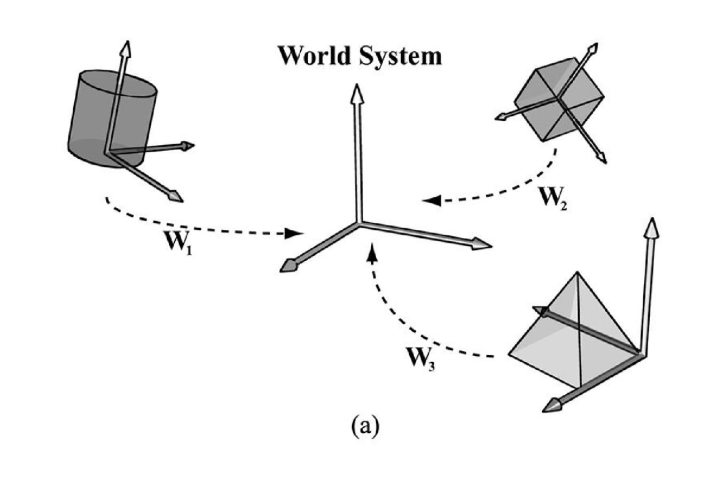
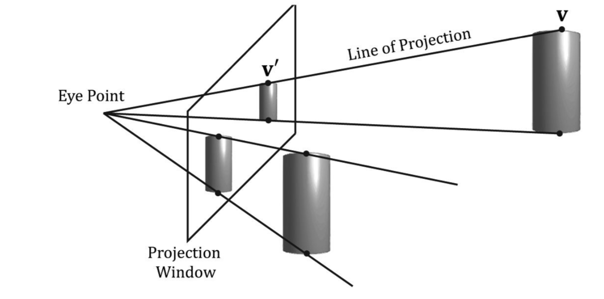
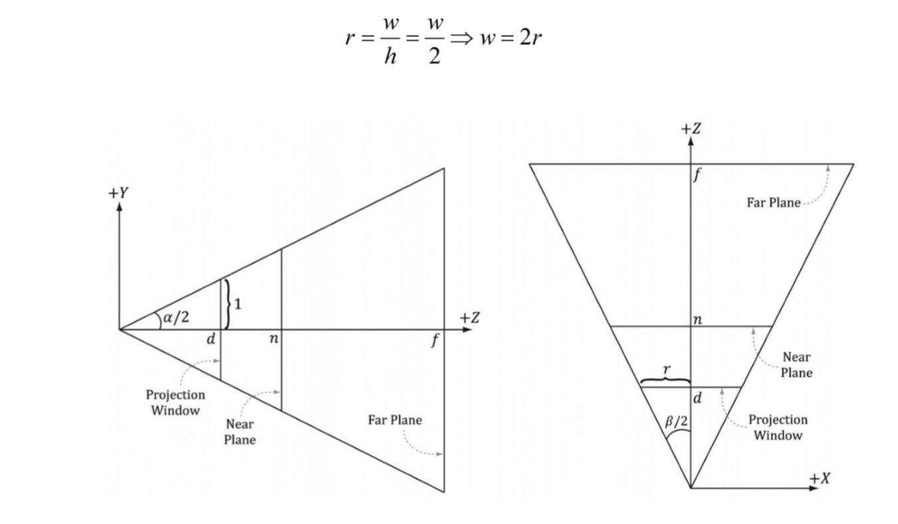
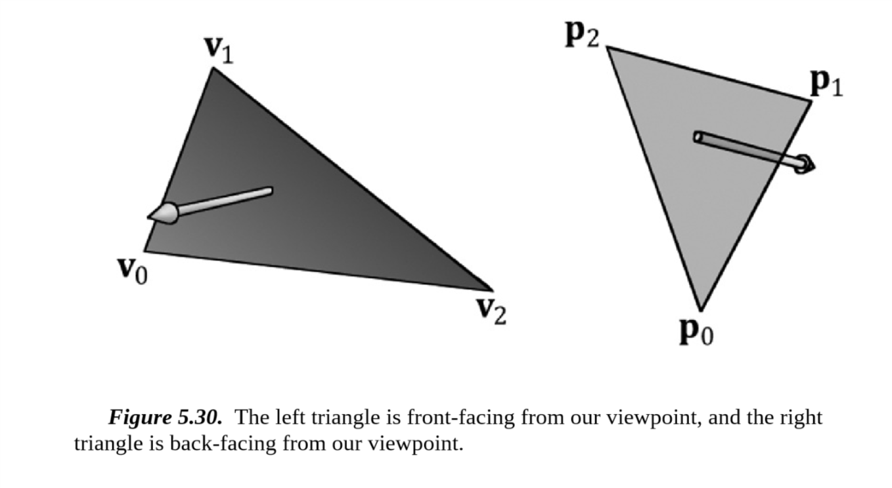

# Chapter 5 THE RENDERING PIPELINE

本章主要介绍的是渲染管道。
给你一个3D场景和一个摄像机，渲染管道的任务就是将摄像机看到的内容绘制到一个2D的图片上面来(图片5.1))。
这一章的大部分内容是理论知识，下一章我们将会使用`Direct3D`来练习如何绘制。
在我们开始讲渲染管道之前，我们还有两个小部分内容需要先讲：首先会讲到一些3D错觉(即我们通过一个2D屏幕去看一个3D的世界)，然后我们将会解释颜色是如何呈现的。

> 目标

- 掌握用2D图片去描述一个3D物体的关键。
- 发现我们如何使用`Direct3D`呈现3D物体。
- 学习摄像机的定义。
- 理解渲染管道，即将3D场景处理成2D图片的过程。


最左边图片是从侧面看的情况，中间那张是从上面看到情况，最右边那张就是摄像机那个位置看的情况。
我们可以看到从摄像机那里出现了一个4棱锥，我们称之为视锥体，我们能够看到的范围就是视锥体的范围，在视锥体范围外的我们是没有办法看见的。

## 5.1 THE 3D ILLUSION

在我们踏上3D计算机图形之旅之前，我们还有一个简单的问题没有解决。
我们如何将一个3D场景显示到一个2D屏幕上去。
幸好的是，这个问题已经研究的很深了，就如同艺术家们研究了几个世纪如何将景象更好的画到画板上一样。
在本段中，我们将列出几个让图片更接近3D场景的关键技术。

假设你看到一条没有弯曲的很长的铁路，我们知道这条铁路两边的铁轨肯定是平行的，但是你站在铁路上看铁路的话，你会发现铁路的两边离你离的越远就靠得越近，当距离到达无限的时候，他们就会相交了。
这是我们人类的视觉系统的一个特点，平行线在远处会看做相交于一个点了。参见图片5.2。


另一个特点就是物体的大小会随着距离的增大而显得变小。即同一个物体离我们近的看起来会比离我们远的大。
例如一个离我们远的房子会看起来很小，而离我们近的一棵树却会看起来很大。
图片5.3就显示了物体按照离摄像机的距离摆放，离的越远的物体看起来越小，但其实他们的大小一样大。
同样你也会发现当他们离的足够远的时候，他们就会看起来变成了一个点了。


我们知道物体会重叠(参见图片5.4)。
不透明的物体遮住了在他后面的物体的一部分。
这是一个很重要的分辨能力，即通过这个场景能够得到物体的远近关系的能力。
我们已经在第4章讨论了`Direct3D`将会使用深度缓冲来讨论一个像素是否会被遮挡以及是否需要绘制。


思考图片5.5。左边是一个没有光照的球，右边是有一个光照的球。
你可以发先左边的球比较扁平，甚至他可能不是球，只是一个圆。
可以从这里看出，光照和阴影对描述一个实体的3D物体有很大作用。


最后，图片5.6显示了一个飞船和他的影子。
他的影子给我们提供了两个关键的信息，第一个是它告诉我们了光源在哪，第二个是它告诉我们了他距离地面的高度。


虽然这都是日常中很常见的情况，但是这能够帮助我们明确和整理清楚这些东西，也能让我们在学习和使用3D计算机图形的时候将这些现象保留在脑海里面不至于遗忘或者忽略。

## 5.2 MODEL REPRESENTATION

一个单纯的3D物体可以近似的用三角形网格去呈现。
因此三角形就是我们构建模型的基础的部分。
图片5.7我们可以看到一些3D物体使用三角形网格来绘制。
通常来说如果你使用的三角形数量越多，你就可以让你的模型的细节更加丰富。
但同样的也会带来效率上的负担，你需要处理的三角形就会越多。因此两者之间需要平衡好。
在另外的一些情况下，我们可能需要绘制的是点和线，例如我们需要绘制一条曲线，我们就会使用多个线段来逼近这个曲线。

> 图片5.7


可以看出图片5.7中的模型是由三角形描绘而成的。
由于很多模型的三角形数量很多，因此构建一个模型就变得及其麻烦。
也因此出现了一些特殊的程序用来设计和构建模型。
这些软件能够让我们使用很多工具并且可视化的设计和构建模型。
例如[3D Studio Max](https://www.autodesk.com/products/3ds-max/overview), [LightWave 3D](https://www.lightwave3d.com/), [Maya](https://www.autodesk.com/products/maya/overview), [Softimage|XSI](https://www.autodesk.com/products/softimage/overview), [Blender](https://www.blender.org/)(免费开源)。

在本书中，我们通常手工构建模型或者使用数学公式构建一些简单模型，例如球体，圆锥，圆柱等。
在本书的第三部分，我们将会演示如何加载一个模型并且绘制他。

## 5.3 BASIC COMPUTER COLOR

计算机的显示器的每一个像素其实就是通过将红光，绿光，蓝光混合发出，从而显示出各种颜色。
当混合的光射到眼睛里的视网膜的时候，视网膜细胞感受到刺激发出神经冲动到我们的大脑，然后大脑将这个冲动重新识别为颜色。
如果光的混合比例(**即光的强度**)不同，那么发出的神经冲动也会不同，从而大脑也会识别成不同的颜色。
图片5.8举出了一些不同比例的混合会得到什么颜色的例子，以及不同强度下的红光。
因此我们就可以混合不同强度的光来得到各种各样的颜色和我们需要的颜色。

描述一个颜色有很多种方法，其中在程序中最合适的就是使用`RGB`(**red, green, blue**)来描述，例如**Adobe Photoshop**和**Win32**的选择颜色框。


一个显示器发出的不同的颜色的光的强度也是有限制的。
因此我们使用 $[0.0, 1.0]$ 这个范围的值来描述光的强度，$0$即代表没有，$1$即代表最大强度。
例如 $(0.25, 0.67, 1.00)$ 就意味着 $25\%$ 的红光， $67\%$ 的绿光和 $100\%$ 的蓝光。
这样的形式也代表着我们可以使用一个三维向量来描述一个颜色，然后向量的每一个维度都可以描述一种颜色的强度。

### 5.3.1 Color Operations

我们既然使用向量存储颜色，那么也就代表这我们可以对颜色进行一些向量的运算。例如我们可以对颜色做加减。

> $$(0.0, 0.5, 0) + (0, 0.0, 0.25) = (0.0, 0.5, 0.25)$$
> $$(1, 1, 1) - (1, 1, 0) = (0, 0, 1)$$
当然也可以进行乘法。
> $$0.5 x (1, 1, 1) = (0.5, 0.5, 0.5)$$
> $$(r, g ,b) x (x, y ,z) = (rx, ry, rz)$$

我们在进行运算的过程中允许计算出的值在 $[0, 1]$ 之外，但是我们将会在呈现到显示器的时候将比$0$小的看作$0$，比$1$大的看作$1$。

### 5.3.2 128-Bit Color

我们通常还会给记录颜色的向量增加一个分量，阿尔法值(`Alpha`)。
阿尔法分量通常是在混合(`Blending`)用于描述颜色的不透明度。我们现在不使用混合，就当作设置为$1$就好了。

加入了阿尔法分量后，我们的颜色向量就变成了一个四维向量了$(r, g, b, a$)。
由于他是一个四维向量，我们可以使用`XMVECTOR`来优化他。当然你也可以使用其他的类似的来优化他。
`XMVECTOR`使用了`SIMD`指令来优化他的运算，它实质上是一个$128bit$大小的整型变量。具体的使用你可以去看看[DirectXMath](https://msdn.microsoft.com/en-us/library/windows/desktop/hh437833(v=vs.85))。
如果你使用的是C#的话，那么在 .NET $4.6.2$以上的版本中他已经有了支持了`SIMD`指令的向量。

### 5.3.3 32-Bit Color

我们还有一种$32bit$大小的类型存储颜色，即每个分量占$8bit$，他们的取值范围就在 $[0, 255]$ 。
我们可以将其存储在一个$32$位整型里面，每$8$位占据一个颜色分量。具体你也可以去看[DirectXMath](https://msdn.microsoft.com/en-us/library/windows/desktop/hh437833(v=vs.85))的`XMCOLOR`类型。

$32bit$大小的颜色也可以将其转换为四维向量的存储方法，做法就是直接将其每个分量除以$255$，然后得到一个范围在 $[0, 1]$ 的浮点类型的值。

例如：
> $$(80, 140, 200, 255) \approx (0.31, 0.55, 0.78, 1.0)$$

在`DirectXMath`中也提供了转换的函数，但是需要注意的存储颜色值的顺序。
在`XMCOLOR`中颜色值是按照$ARGB$顺序(**从高位到低位**)来的。参见图片5.10。


我们使用$128$位颜色的优势就在于计算的时候的误差会比$32$位颜色小很多，因为我们有更大的空间存储更大范围更加精确的值，而$32$位颜色只有$8$位存储每个颜色分量。
但是在现在的后台缓冲中我们仍然使用$32$位颜色来存储最后要输出的颜色，毕竟现今大部分显示设备也没有办法充分利用很高的颜色分辨率。

## 5.4 OVERVIEW OF THE RENDERING PIPELINE

给你一个3D场景和一个摄像机，渲染管道能够将摄像机看到的东西绘制成一张2D的图片。
图片5.11解释了渲染管道的组成，虽然出现了`GPU`资源，但是他并不属于渲染管道。
从`GPU`资源指向渲染管道的某个阶段的箭头表示这个阶段可以读取这些资源，例如我们在像素着色器阶段读取纹理信息。
而从某个阶段指向`GPU`资源的箭头就表示这个阶段可以写入这些资源，例如我们在输出合并阶段向后台缓冲和深度缓冲中写入像素信息。
从图片中可以看出大部分阶段都是可以读取资源而不是写入资源以及一个阶段的输出就是下一个阶段的输入，比如我们在顶点着色器中处理完的数据就会作为几何着色器的输入数据。


## 5.5 THE INPUT ASSEMBLER STAGE

这个阶段从内存里读取图形数据，即顶点数据和索引数据，然后使用这些数据取组成一些基础图形，例如三角形和线。
索引数据我们待会在后面的部分会提到，他主要是用于描述一个基础图形是由哪些顶点构成的。

### 5.5.1 Vertices

从数学的角度上来说，三角形的顶点就是他两条边的交点，线的顶点就是他的终点和起点。
对于一个简单的点来说，它本身就是他的顶点。图片5.12举出了这些例子。


可以看出三角形的三个顶点是($v_0, v_1, v_2$)，线的顶点是($p_0, p_1$)，而点的顶点是它本身$Q$。

从图片5.12中可以看出顶点只是图形中的一些特殊的点。
但是在`Direct3D`中，顶点并没有那么简单。他还可以附加一些其他信息从而去实现一些复杂的特效。
例如在第$8$章中我们就会在顶点数据中存储法向量来实现光照，并且在第$9$章的时候我们会增加存储纹理坐标来实现纹理的采样。
我们可以自由的定义顶点存储的数据，准确来说我们可以在`Direct3D`中自由的组合一些分量(例如法向量，纹理坐标，顶点颜色等)来构成顶点。

### 5.5.2 Primitive Topology

我们通过使用顶点缓冲来绑定顶点数据到渲染管道，准确来说顶点缓冲也只是一个缓冲而已。
一个顶点缓冲存储一组顶点数据，但这并不意味着一个顶点缓冲只存储一个图形的顶点数据，他可以存储多个图形的数据。

这些顶点在绘制图形的时候会组合起来，组合的方式是由我们自己来决定的，我们可以决定是使用线组合，还是使用三角形来组合等待方式。

```C++
    void ID3D12GraphicsCommandList::IASetPrimitiveTopology(
        D3D_PRIMITIVE_TOPOLOGY Topology);
```

这个函数会设置构成图形的方式，即我们使用什么基础图形来组合我们要绘制的图形。

`D3D_PRIMITIVE_TOPOLOGY`可以去看文档了解具体有哪些枚举。

注意下面说的点是允许重复的。

#### 5.5.2.1 Point List

直接绘制顶点，具体参见图片5.13的$a$部分。

#### 5.5.2.2 Line Strip

将顶点按照顺序用线连接起来，具体参见图片5.13的$b$部分。
即$n+1$个点会构成$n$条线。

#### 5.5.2.3 Line List

将给的点按照顺序两个两个一组用线连接起来，具体参见图片5.13的$c$部分。
即$2n$个点构成了$n$条线。

#### 5.5.2.4 Triangle Strip

将顶点按照顺序连接成三角形，具体参见图片5.13的$d$部分。
即$n+2$个点构成了$n$个三角形。


#### 5.5.2.5 Triangle List

将给点的点按照顺序三个三个一组构成三角形，具体参见图片5.14的$a$部分。
即$3n$个点构成了$n$个三角形。


#### 5.5.2.6 Primitives with Adjacency

我们在几何着色器中使用一些算法的时候可能需要去找一个三角形的邻边三角形。
对于邻边三角形具体参见图片5.14的$b$部分。
为了实现这个功能，我们就需要将一个三角形的邻边三角形和他一起绑定到渲染管道中。

需要注意的是，作为邻边三角形绑定到管道上的三角形是不会被渲染的，他只会作为几何着色器的输入数据。
哪怕你没有使用几何着色器它也不会被渲染。

具体细节你可以参见文档。

#### 5.5.2.7 Control Point Patch List

具体在14章讨论。

### 5.5.3 Indices

之前已经提到，三角形是构成实体3D物体的基础。下面的代码分别使用顶点构造了一个四边形和八边形。

```C++
    Vertex quad[6] = {
        v0, v1, v2, //Triangle 0
        v0, v2, v3  //Triangle 1
    };

    Vertex octagon[24] = {
        v0, v1, v2, //Triangle n
        v0, v2, v3,
        v0, v3, v4,
        v0, v4, v5,
        v0, v5, v6,
        v0, v6, v7,
        v0, v7, v8,
        v0, v8, v1
    };
```

构建三角形的三个点的顺序是很重要的，它将决定这个面是正面还是反面，具体会在5.10.2中解释。

从图片5.15可以看出来一个顶点在3D物体中可能会被共用很多次。
例如在5.15的$a$部分中，$v_0$和$v_2$就被两个三角形共用了。
而在5.15的$b$部分中，每个三角形都包括$v_0$这个顶点，每两个相邻的三角形就共用两个顶点。
可以看出当图形越来越复杂越来越详细的时候，我们共用的顶点就会越来越多，这无疑是一种浪费。


使用重复的顶点有两个主要的不好的影响：

- 增加内存使用量。
- 图形硬件要处理同样的顶点多次，这无疑会增加时间开销。

在某些情况下或许我们可以使用三角形带(**Triangle Strip**)来解决这个问题。
但是三角形组(**Triangle List**)比三角形带更加灵活，有些图形是三角形带没法描绘的，比如两个不相连的三角形。
因此就出现了索引(**Indices**)这一概念。

我们创建两组缓冲，第一组存储我们要绘制的图形的顶点数据，顶点顺序无所谓并且不包含重复顶点。
第二组缓冲就通过使用第一组中的顶点数据来构建三角形从而构造3D图形。那么之前的例子就可以这样表示了。

```C++
    Vertex v[4] = { v0, v1, v2, v3};

    UINT indexList[6] = {
        0, 1, 2, //Triangle 0
        0, 2, 3 //Triangle 1
    };
```

在索引数组里面，每三个元素就表示一个三角形，即 **v[0], v[1], v[2]** 构成一个三角形， **v[0], v[2], v[3]** 构成一个三角形。

```C++
    Vertex v[9] = { v0..v8};

    UINT indexList[24] = {
        0, 1, 2, //Triangle n
        0, 2, 3,
        0, 3, 4,
        0, 4, 5,
        0, 5, 6,
        0, 6, 7,
        0, 7, 8,
        0, 8, 1
    };
```

在处理完这些顶点后，显卡就可以使用索引数据来构建三角形，严格来说顶点共用还是存在，但是相比之前的做法好了很多。

- 索引只是一个整型变量，相比一个顶点所占的内存，一个索引占的内存少了很多。
- 对于每个顶点数据只需要处理一次，而不像之前的方法一个顶点重复几次就处理几次。

## 5.6 THE VERTEX SHADER STAGE

每个顶点在被用于绘制的时候我们都需要对其进行一些处理，这个过程是由我们自己来给定的(**使用HLSL编写**)。
大致你可以认为是这样的一个过程。

```C++
    for (UINT i = 0; i < numVertices; ++i)
        outputVertex[i] = VertexShader(inputVertex[i]);
```

`VertexShader`这个函数由我们自己来实现，但是它并不是由`CPU`去执行，而是由`GPU`去执行，因此哪怕是处理每个顶点所需要的时间开销也并不大。

很多特效可以在顶点着色器(`VertexShader`)中实现例如对顶点进行变换，光照以及对纹理进行位移。
在顶点着色器里面我们不但可以访问输入的顶点数据并且我们还可以访问存储在显存中的纹理数据或者其他缓冲，比如变换矩阵，场景的光源什么的。

### 5.6.1 Local Space and World Space

当我们在制作一个场景的时候，场景中的模型通常是分开来做的。
我们在制作模型的时候并不会使用同样的坐标系，即这个场景中的坐标系，我们称之为世界坐标系，所在的空间称之为世界空间。
而是使用另外的坐标系，我们称之为模型坐标系或者本地坐标系。
因为在构建模型的时候你使用本地坐标系会比使用世界坐标系方便很多，我们可以针对这个模型来建立模型坐标系而不是使用固定的世界坐标系。
我相信各位都做过立体几何的数学题，建系的位置很大程度上决定了难易程度。
但是这样做的话，我们就必须对其进行一些转换来将其放置到场景中我们想要放置的位置(严格来说这样的转换是对其坐标系的轴和原点进行转换，而模型本身并没有变换，但是因为坐标系的改变，模型在世界坐标系中肯定也会改变，参见图片5.16。
这样的过程我们叫做世界变换(**World Transform**)，将模型坐标系转换的矩阵我们称之为世界矩阵(**World Matrix**)。
场景中的每个物体都应该有一个自己的世界矩阵，这样的话我们模型的构建就和具体场景无关了，我们可以在构建模型的时候不需要考虑具体的场景了(这些问题就又强加给程序员啦)。



模型的每个顶点都是定义模型坐标系中的，如果我们想要将一个模型放到世界坐标中的一个位置，那么我们是需要对其进行变换的。
从某种角度上说这样的变换其实就是改变了模型坐标系的坐标轴和原点。


如果我们以原点作为正方体的中心，并且正方体的三边分别和坐标轴平行的话，我们是很容易就可以算出它$8$个顶点的坐标。
而如果不是这样的话，那么我要算出正方体$8$个顶点的坐标就不是那么简单了。
因此我们就定义了模型坐标系来方便我们构建模型。

使用模型坐标系的优点:

- 简单，通常我们都是将原点作为模型的中心，然后选择一个主要的坐标轴将模型分割成对称的两半(也未必完全对称，只是布局上大致对称)。
- 可以在多个场景中重复使用。因为我们构建模型的时候本身就和世界坐标系无关了，那么我们只需要简单的改变下他的世界矩阵就可以用于其他场景了。
- 有时候我们可能在一个场景中绘制多个这样的物体，每个物体不同的地方只是在于它的变换矩阵不同。那么我们就没有必要处理每个实例(即物体)了，我们只需要记录下它在模型坐标系中的信息(即顶点和索引缓冲)，然后在绘制的时候使用对应的世界矩阵就可以完成绘制了。这样的方法我们称之为`Instancing`。

> 现在先忽略你可以去查阅这部分相关内容，世界矩阵很多博客上都会讲到。

### View Space

在3D场景中我们肯定是需要一个观察这个场景的摄像机。
摄像机会定义一块可视区域，表示这一块区域将会被看到，或者说被摄像机拍到，同时这一块区域也是我们需要将其渲染到2D平面上的区域。
我们定义摄像机的模型坐标系叫做摄像机坐标系或者视角坐标系，所在的空间我们就称之为视角空间。
观察图片5.19。
摄像机在坐标系的原点，然后X轴在摄像机的右方，Y轴在摄像机的上方，Z轴朝向纸面。
除了将物体转换到世界坐标系外，我们在渲染管道的之后的某个阶段也需要重新将物体转换到摄像机坐标系。
我们将物体从世界坐标系转换到视角坐标系的过程叫做视角变换(**View Transform**)，转换的矩阵就叫做视角矩阵了。


> 矩阵部分了，等以后打出PDF的时候再考虑补了。其实我觉得我这种数学渣去讲这东西估计没人看得懂。矩阵的话要注意左手和右手坐标系，视角矩阵和投影矩阵都分左右手坐标系

### 5.6.3 Projection and Homogeneous Clip Space

我们已经介绍了摄像机的位置和朝向这两个属性，现在我们介绍摄像机的另外一个属性，摄像机的可视范围。
我们通常使用一个平截头体来规定摄像机的可视范围，参见图片5.21。


而我们需要做的就是将在平截头体内部的3D图形投影到2D的平面上去。
并且我们投影后的图形必须满足平行线最后要交于一个点以及物体会随着距离越远越小。
而透视投影恰好可以做到这些，具体参见图片5.22。
我们把一个顶点和摄像机的位置的连线叫做这个点的投影线，那么我们就可以得到透视投影的变换就是将顶点$v$变换到投影线和投影窗口的交$v'$，我们就称 $v'$为$v$的投影。
对于一个3D图形来说他的投影就是将它的所有顶点进行投影后的图形。



#### 5.6.3.1 Defining a Frustum

我们需要在视角空间中描述一个平截头体，并且这个平截头体的中心要在原点以及它朝向Z轴的正半轴。
我们使用如下4个参数来描述它，一个近平面$n$,一个远平面$f$,竖直视野角度大小$α$以及长宽比$r$。
在视角空间中，远平面和近平面是和$XY$轴构成的平面平行的，因此我们只需要确定这两个平面到原点的距离就好了。
长宽比$r=w/h$，即投影的平面的宽度(**Width**)除以高度(**Height**)。
由于我们之后要将投影窗口的内容映射到后台缓冲中去，因此我们需要确定投影窗口的长宽比要和后台缓冲一致。
因此我们可以认为后台缓冲的大小将会决定投影窗口的长宽比。例如后台缓冲的大小是$800\times600$，那么我们就设$r$为$r = 800/600 \approx 1.333$
如果长宽比和后台缓冲的大小不一致的话，我们就会在映射的时候将其进行缩放，**但是这样的缩放宽度和高度缩放的值未必一样**，因此可能会导致图形变形，例如圆可能会变成椭圆。

我们设水平视野角度为$β$，由于我们确定了竖直视野角度$α$以及长宽比$r$，因此$β$的值并不需要我们设定，我们可以计算出来。
参见图片5.23，我们首先可以知道投影窗口的大小并不重要，为了方便我们就认为投影窗口的高度为$2$，宽度的话就可以通过长宽比来得到。



为了保证水平视野角度$α$，因此投影窗口到原点的距离$d$并不是随意的，我们需要计算出来。

> $$tan (\frac{α}{2}) = \frac{1}{d} => d = cot (\frac{α}{2})$$

因此我们就可以算出投影窗口(**高度为2**)到原点的距离$d$了。
我们因此也可以算出$β$:

> $$tan (\frac{β}{2}) = \frac{r}{d} = \frac{r}{cot(\frac{α}{2})}$$
> $$tan (\frac{β}{2}) = r \times tan(\frac{α}{2}) $$
> $$β = 2 tan^{-1} (r \times tan (\frac{α}{2})) $$


#### 5.6.3.2 Projecting Vertices

我们看图片5.24，给你一个点 $(x, y, z)$，我们需要找到他在平面(**$z = d$**)上面的投影 $(x', y', d)$。
我们可以得到下面的式子(**先用图片顶替吧哎QAQ**)。


因此如果一个点他在这个平截头体里面的话，那么它投影后的点必然在投影窗口内，当然这个点的$Z$轴坐标必然要在 $(n, f)$ 内。

#### 5.6.3.3 Normalized Device Coordinates (NDC)

我们在先前的章节计算了一个顶点投影后的坐标。
并且我们知道在视角空间中，投影窗口的高度是$2$，他的宽度是$2r$($r$是长宽比)。
也就是说投影窗口的大小就由$r$来决定。
因此我们的硬件在处理关于投影窗口的操作(例如将投影窗口的内容映射到后台缓冲中去)的时候是肯定需要知道$r$的，因此我们需要告诉硬件$r$的值。
那么如果我们能够将这些操作变成和$r$无关的话，那么就更好了。
因此我们就对投影的$X$轴坐标进行缩放，从原本的 $[-r, r]$ 到 $[-1, 1]$。即:

> $$-r \le x' \le r $$
> $$-1 \le \frac{x'}{r} \le 1$$

经过这样的变换后的坐标系我们称之为标准化设备坐标系(**Normalized Device Coordinates,NDC**)，注意的是我们并没有对Z轴坐标进行任何改变。
这样的话，如果一个点 $(x, y, z)$ 在平截头体里的话，就必须满足如下条件:

> $$-1 \le \frac{x'}{r} \le 1$$
> $$-1 \le y' \le 1$$
> $$n \le z \le f $$

我们可以通过使用单位换算的方式来将视角空间的点变换到NDC空间。
我们能够知道在NDC中1个单位(**我们设为ndc**)在视角空间中就是r个单位(**我们设为vs**)。
因此，如果告诉你在视角空间的$X$坐标，你能够很简单的就将其转换的NDC空间中去(**Y, Z坐标并不需要转换**)。

> $$(x) vs \times (\frac{(1) ndc}{(r) vs}) = \frac{x}{r} ndc$$

因此我们就有了直接将$X$和$Y$分量转换到NDC空间的公式了。

> $$x' = \frac{x}{r \times z tan (\frac{α}{2})} $$
> $$y' = \frac{y}{z tan (\frac{α}{2})}$$
> (eq. 5.1)

我们可以知道在NDC空间中，投影窗口就变成了一个宽度和高度都为$2$的正方形了，即我们确定了他的尺寸。
也就是说硬件就不需要知道长宽比也能够处理所有操作了，不过我们也就需要将点转换到NDC坐标系中去。

#### 5.6.3.4 Writing the Projection Equations with a Matrix

同样的，我们也可以使用矩阵来表示投影变换。
虽然方程5.1不是线性的，也就是说他并不能直接使用矩阵表示。
因此我们需要使用一些小技巧来构造这个矩阵。
首先我们将方程分为两个部分，线性部分和非线性部分(**非线性部分是除以z，我们之后讨论这个部分**)。
然后我们还需要将$Z$轴坐标标准化，即将$Z$值固定在一定范围内。
我们得到的矩阵如下。


注意到我们还留下了两个值$A, B$，我们将会使用这两个参数来使得我们的矩阵乘法能够将$Z$轴的值固定到一定范围。
我们现在给点一个点 $(x, y, z, 1)$。


在我们处理完线性部分后，我们还需要将结果处理z来完成非线性部分的运算。


如果z是0的话那么我们就会除以0，因此我们的近平面就必须要求大于0，这样的话z为0的点就不会参与投影变换了。
这个除法操作也被称之为透视除法。

#### <element id = "5.6.3.5"> 5.6.3.5 Normalized Depth Value</element>

我们知道投影后所有的能够被看到的点都会在投影窗口上，并且之后他们会构成一张图片来呈现这个3D场景。
然而我们还是需要知道这些点的深度值从而来进行深度测试。为了方便，我们将XY值投影到一定范围后，我们也可以要将Z值投影到一定范围内 **[0, 1]**。
我们可以构造一个函数g(z)来将我们的z值转换到 **[0, 1]** 范围内，但同时我们也需要保证的是原本z值小的点在转换后他肯定也要小，至少要比那些原本z值比自己大的点小。
换句话说就是如果 **z<sub>1</sub> < z<sub>2</sub>** 那么 **g(z<sub>1</sub>) < g(z<sub>2</sub>)**。也就是说我们将z值转换了，但是他们的相对关系还是没有变，因此我们使用转换后的值进行深度测试也是没有任何问题的。

我们可以对 **[n, f]** 范围进行缩放和平移来转换到 **[0, 1]** 范围，但是这样的方法未必能够将其和投影一起进行运算(即将一个点投影的时候顺便也将这个变换插入到投影矩阵中，使得我们能够只需要一个投影矩阵就可以完成所有变换)。
我们看方程5.3，z值的值是 **A + B / z**。

因此我们需要选择A和B的值去满足下面的条件：

- **g(n) = A + B / n = 0**
- **g(f) = A + B / f = 1**

我们解决第一个条件的话只需要将 **B = -An** 就可以了，然后我们在确定B的情况下来考虑第二个条件从而可以得出A的值。

 </img>

图片[5.25](#Image5.25)将函数g(z)的图像画了出来，并且我们发现它并不是线性增长的，值域的大部分都在靠近近平面的部分，而在靠近远平面的部分所占的值域却很少。
这将导致精度问题(变量并不可能准确存储一个位数很高的小数值，我们通常采用科学计数法表示，因此如果两个值相差的太小那么他们不同的部分可能就在存储的时候就被舍弃了，那么我们也就没有办法分辨出两者的大小了)。因此最好在允许的范围内将远平面和近平面拉近，不要离开的太远，从而降低精度误差。

 </img>

现在我们就可以将透视投影矩阵完成了。

 </img>

一个点在乘以投影矩阵后但是如果没有进行透视除法的话，它仍然还是在投影空间内。
只有在进行透视除法后它才被转换到了NDC空间内。

## <element id = "5.7"> 5.7 THE TESSELLATION STAGES </element>

曲面细分是将网格的三角形再细分成一些小块的三角形。我们可以将这些新的三角形移动到新的位置来使得我们的网格更加精细(参见图片[5.26](#Image5.26))。

 </img>

以下是使用曲面细分的好处：

- 我们可以实现一个有细节层次(**level-of-detail**)的网格，距离我们摄像机近的就使用曲面细分使得细节更加详细，距离远的就不使用曲面细分就显得简单些。
- 我们只需要在内存中存储一个简单的网格，然后在运行中的时候动态的添加细节，这样我们可以节约空间。
- 我们对粗略的模型进行物理或者动画运算，但是我们使用曲面细分来使得渲染的模型细节更加详细。

曲面细分阶段首先出现在`Direct3D 11`里面，使得我们能够使用`GPU`去将一个图形细分。
那么也就是说在`Direct3D 11`以前，我们想实现曲面细分的话就必须使用`CPU`去做了，并且我们还需将完成曲面细分后的网格重新提交到`GPU`去渲染。
然而将网格从内存中提交到显存中是非常慢的，以及我们的`CPU`还有计算曲面细分的开销。

因此在`Direct3D 11`以前并不怎么提倡使用曲面细分，但是我们在`Direct3D 11`中提供了使用显卡去完成曲面细分的API。
我们将会在第14章的时候继续讨论曲面细分。

## <element id = "5.8"> 5.8 THE GEOMETRY SHADER STAGE </element>

我们在第12章之前不会使用几何着色器，因此这里我们只简单的介绍下什么是几何着色器。
我们在使用几何着色器的时候会将整个图形的所有的图元作为输入数据。例如我们绘制的是方式是`Triangle List`，几何着色器的输入数据就是三角形的三个顶点(**这些顶点都已经通过了顶点着色器阶段**)。

几何着色器的主要功能就是创建图形和销毁图形。例如，我们能够将输入的图元拓展到其他图元上去，又或者在某些条件下不输出某些图元。
和顶点着色器相比较的话，顶点着色器不能创建一个顶点只能输入一个顶点输出一个顶点。但是对于几何着色器来说它能够将一个点拓展成一个四边形或者将一条线拓展成四边形。

我们在图片[5.11](#Image5.11)中可以知道在几何着色器之后有一个`stream-out`阶段。
这个阶段能够让我们将几何着色器构成的图形数据输入到内存中去，具体的之后会讲到。

## <element id = "5.9"> 5.9 CLIPPING </element>

我们是没有办法看到我们视野外的图形的，因此所有在我们视角范围(即一个平截头体范围)的图形是没有必要绘制的，如果一个图形有部分在外面，那么在外面的部分也是没有必要去绘制的。
因此我们必须裁剪(**Clip**)掉这些在外面的部分，参见图片[5.27](#Image5.27)。

 </img>

首先我们可以认为一个平截头体由6个面构成，即上下左右和远近这6个平面。
如果要将一个图形裁剪的话，我们就对一个一个的讨论平截头体的每个面。
如果一个面和图形的一个面相交的话(参见图片[5.28](#Imgae5.28))，我们就将这个面在这个平截头体外面的部分裁剪掉。
还有就是一个凸的多边形被裁减的话得到的仍然是一个凸的多边形。
由于裁剪通常是由硬件帮我们完成的，因此我们没有必要去了解这些细节。
但是我们仍然建议读者去阅读`Sutherland-Hodgeman`裁减算法，他是通过找到平面和边的交点然后将这些交点排序从而得到被裁减的图形。

 </img>

我们接下来将会介绍如果在4D齐次裁剪空间内进行裁剪。
我们假设有一个在NDC空间的点 **(x/w , y/w, z/w, 1)**。
其中满足如下条件：

**<center> -1 ≤ x/w ≤ 1</center>**

**<center> -1 ≤ y/w ≤ 1</center>**

**<center> 0 ≤ z/w ≤ 1</center>**

在齐次裁剪空间内，这些点还没有进行透视除法，因此这个点就是 **(x, y, z, w)**。
并且满足如下条件：

**<center> -w ≤ x ≤ w</center>**

**<center> -w ≤ y ≤ w</center>**

**<center> 0 ≤ z ≤ w</center>**

也就是说，这些点的边界是可以确定的。

**<center>Left : w = -x</center>**

**<center>Right : w = x</center>**

**<center>Bottom : w = -y</center>**

**<center>Top : w = y</center>**

**<center>Near : z = 0</center>**

**<center>Far : z = w</center>**


## <element id = "5.10"> 5.10 THE RASTERIZATION STAGE </element> 

光栅化阶段的主要目的就是通过投影的3D图形来计算像素的颜色。

### <element id = "5.10.1"> 5.10.1 Viewport Transform</element>

在裁剪后，硬件可以进行透视除法来将点从齐次裁剪空间转移到NDC空间中去。
我们将会根据点的XY轴的值将NDC空间中的点转换到后台缓冲中的一个矩形区域内去，这个矩形区域我们称之为视口(**ViewPort**)。
在转换后，点的XY轴的值的单位就是像素了。Z轴的值并不会在这里进行修改，它主要是用于深度测试的。
但是Z轴的值会被限定在一定范围 **[MinDepth, MaxDepth]** (超过这个范围的话就取最接近的值)，这个范围由视角来设定，并且这个范围必须在 **[0, 1]** 之间。

### <element id = "5.10.2"> 5.10.2 Backface Culling </element>

一般来说三角形会有两个面，为了区分三角形的两个面，我们如下定义。
如果一个三角形的顶点顺序是 **v<sub>0</sub> ,v<sub>1</sub>, v<sub>2</sub>** 的话，我们计算他的法向量n。

 </img>

射出法向量的那一个面作为正面，而另外一面就作为反面。

图片[5.30](#Image5.30)中左边的三角形就是正面，右边的就是反面。
并且我们可以看出左边的三角形的顶点顺序是顺时针的，而右边的顺序是逆时针的。
这并不是巧合，因此我们也可以认为如果一个面的顶点是顺时针的排列的话，这个面就是正面，否则就是反面。

 </img>

假设我们使用三角形去构建一个封闭物体，并且保证每个面的法向量朝向外面。
这样的话摄像机是没法看到背面的，因为所有的背面都被正面挡住了。
图片[5.31](#Image5.31)从2D角度解释了这个情况，而图片[5.32](#Image5.32)则是3D角度。
由于背面被正面遮挡住了，我们没有必要去对背面进行绘制。
背面剔除(**Backface Culling**)就是在渲染管道中抛弃背面三角形的过程。
这样做的话，能够减少约一半左右需要处理的三角形。

 </img>

 </img>

在`Direct3D`中，通常默认三角形的顺时针顺序是前面(**这个顺序是对于观看者来说的**)，逆时针顺序是背面。
但我们可以通过修改`Direct3D`渲染设置来改变这个定义。

### <element id = "5.10.3"> 5.10.3 Vertex Attribute Interpolation </element>

我们是通过一些顶点来构成三角形的。
除了顶点的位置，我们还可以给顶点附加颜色，法向量，纹理坐标等属性。
在我们将顶点转换到后台缓冲中之后(**ViewPort Transform**)，这些顶点的属性需要进行插值算出每个被三角形覆盖的像素的属性。
除了顶点的属性外，我们还需要对顶点的深度值进行插值，来算出每个像素的深度值。
这些顶点的属性的插值是基于其对应的三角形在3D空间的线性插值来实现的(参见图片[5.33](#Image5.33))。
我们称这种方法叫做**透视校正插值**(`Perspective Correct Interpolation`)。
本质上来说，我们是使用插值来通过顶点的属性算出每个像素的属性。

 </img>

我们并不需要关心实现透视矫正插值的细节，硬件会帮我们实现插值。
我们在图片[5.34](#Image5.34)中简单介绍下。

 </img>

一条在3D空间的线它投影到2D屏幕上去，虽然我们在3D空间中对其进行线性插值，但是在实际的2D屏幕中我们做的却不是线性的插值。

## <element id = "5.11"> 5.11 THE PIXEL SHADER STAGE </element>

像素着色器同样也是由`GPU`执行的程序。
像素着色器是处理每一个像素的片段的着色器，他将使用这个像素位置对应的顶点的数据作为输入数据，并计算出这个像素的颜色。
像素着色器可以单纯的只返回一个常量颜色，也可以去计算一些复杂的东西例如光照，反射以及阴影效果。

## <element id = "5.12"> 5.12 THE OUTPUT MERGER STAGE </element>

在我们使用像素着色器处理完像素片段后，我们就到了渲染管道的输出合并(**Output Merger**)阶段。
在这个阶段，一些像素可能会被忽略(**例如没有通过深度测试或者模板测试的像素**)，然后没有被忽略的像素就会被写入到后台缓冲中去。
同时混合也会在这个阶段进行。具体我们会在第十章讲到混合。

## <element id = "5.13"> 5.13 SUMMARY </element>

- 我们可以通过使用一些基于真实世界中看物体的技术将一个3D场景使用2D图片呈现出来。我们会发现平行线最后会相交到一个点，物体的大小会随着距离我们越远越小，物体会遮挡在他后面的物体，光照和阴影将会使得一个物体具有体积感，阴影能够告诉我们光源的位置和这个物体和其他物体的位置关系。
- 我们使用三角形网格来近似模拟一个物体。我们使用3个顶点来构建三角形。在很多网格中，一个顶点会被几个三角形共用，因此我们使用索引来避免一个顶点被重复定义。
- 我们使用4D向量来表示一个颜色，前面三个分量是红色，绿色，蓝色。我们为了混合，增加一个Alpha分量。并且他们的值全部在 **[0, 1]** 范围内。关于向量运算我们可以使用一些支持SIMD指令的数学库，SIMD指令能够加快我们的向量运算。
- 给你一个在3D场景的图形，并且告诉你摄像机的位置和朝向，渲染管道就会将这个摄像机能够看到的内容经过一些必要的阶段后变成一个2D图片呈现到屏幕上。
- 我们可以将渲染管道分成几个主要的部分。分别是IA, VS, GS, RS, PS, OM阶段。


