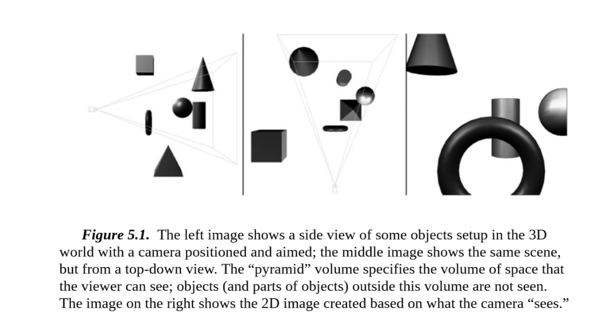
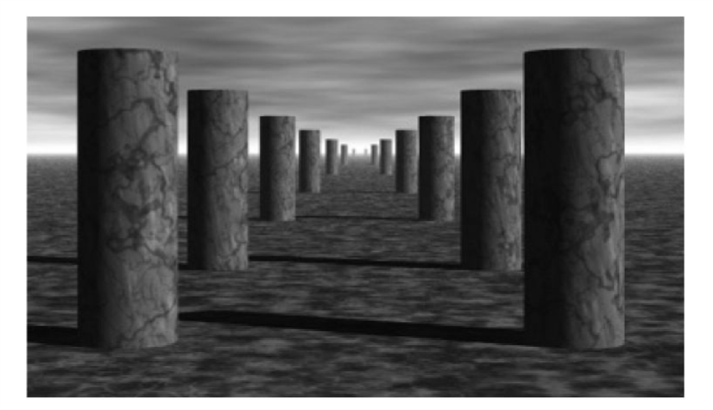
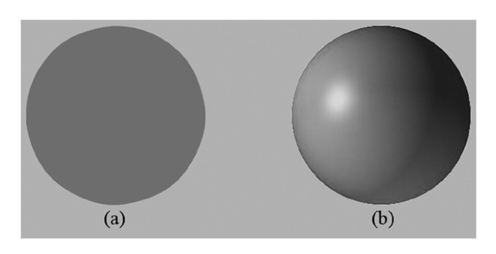
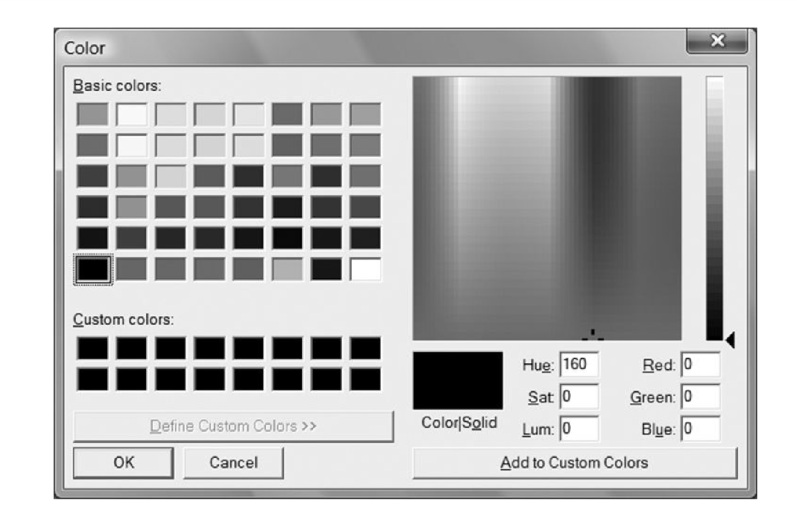

# <element id = "5"> Chapter 5 THE RENDERING PIPELINE </element>

本章主要介绍的是渲染管道。
给你一个3D场景和一个摄像机，渲染管道的任务就是将摄像机看到的内容绘制到一个2D的图片上面来(图片[5.1](#Image5.1))。
这一章的大部分内容是理论知识，下一章我们将会使用`Direct3D`来练习如何绘制。
在我们开始讲渲染管道之前，我们还有两个小部分内容需要先讲：首先会讲到一些3D错觉(即我们通过一个2D屏幕去看一个3D的世界)，然后我们将会解释颜色是如何呈现的。

**目标**

-  掌握用2D图片去描述一个3D物体的关键。
-  发现我们如何使用`Direct3D`呈现3D物体。
-  学习摄像机的定义。
-  理解渲染管道，即将3D场景处理成2D图片的过程。

 </img>

最左边图片是从侧面看的情况，中间那张是从上面看到情况，最右边那张就是摄像机那个位置看的情况。
我们可以看到从摄像机那里出现了一个4棱锥，我们称之为视锥体，我们能够看到的范围就是视锥体的范围，在视锥体范围外的我们是没有办法看见的。


## <element id = "5.1"> 5.1 THE 3D ILLUSION </element>

在我们踏上3D计算机图形之旅之前，我们还有一个简单的问题没有解决。
我们如何将一个3D场景显示到一个2D屏幕上去。
幸好的是，这个问题已经研究的很深了，就如同艺术家们研究了几个世纪如何将景象更好的画到画板上一样。
在本段中，我们将列出几个让图片更接近3D场景的关键技术。

假设你看到一条没有弯曲的很长的铁路，我们知道这条铁路两边的铁轨肯定是平行的，但是你站在铁路上看铁路的话，你会发现铁路的两边离你离的越远就靠得越近，当距离到达无限的时候，他们就会相交了。
这是我们人类的视觉系统的一个特点，平行线在远处会看做相交于一个点了。参见图片[5.2](#Image5.2)。

 </img>

另一个特点就是物体的大小会随着距离的增大而显得变小。即同一个物体离我们近的看起来会比离我们远的大。
例如一个离我们远的房子会看起来很小，而离我们近的一棵树却会看起来很大。
图片[5.3](#Image5.3)就显示了物体按照离摄像机的距离摆放，离的越远的物体看起来越小，但其实他们的大小一样大。
同样你也会发现当他们离的足够远的时候，他们就会看起来变成了一个点了。

 </img>

我们知道物体会重叠(参见图片[5.4](#Image5.4))。
不透明的物体遮住了在他后面的物体的一部分。
这是一个很重要的分辨能力，即通过这个场景能够得到物体的远近关系的能力。
我们已经在第4章讨论了`Direct3D`将会使用深度缓冲来讨论一个像素是否会被遮挡以及是否需要绘制。

 </img>

思考图片[5.5](#Image5.5)。左边是一个没有光照的球，右边是有一个光照的球。
你可以发先左边的球比较扁平，甚至他可能不是球，只是一个圆。
可以从这里看出，光照和阴影对描述一个实体的3D物体有很大作用。

 </img>

最后，图片[5.6](#Image5.6)显示了一个飞船和他的影子。
他的影子给我们提供了两个关键的信息，第一个是它告诉我们了光源在哪，第二个是它告诉我们了他距离地面的高度。

 </img>

虽然这都是日常中很常见的情况，但是这能够帮助我们明确和整理清楚这些东西，也能让我们在学习和使用3D计算机图形的时候将这些现象保留在脑海里面不至于遗忘或者忽略。

## <element id = "5.2"> 5.2 MODEL REPRESENTATION </element>

一个单纯的3D物体可以近似的用三角形网格去呈现。
因此三角形就是我们构建模型的基础的部分。
图片[5.7](#Image5.7)我们可以看到一些3D物体使用三角形网格来绘制。
通常来说如果你使用的三角形数量越多，你就可以让你的模型的细节更加丰富。
但同样的也会带来效率上的负担，你需要处理的三角形就会越多。因此两者之间需要平衡好。
在另外的一些情况下，我们可能需要绘制的是点和线，例如我们需要绘制一条曲线，我们就会使用多个线段来逼近这个曲线。

 </img>

可以看出图片[5.7](#Image5.7)中的模型是由三角形描绘而成的。
由于很多模型的三角形数量很多，因此构建一个模型就变得及其麻烦。
也因此出现了一些特殊的程序用来设计和构建模型。
这些软件能够让我们使用很多工具并且可视化的设计和构建模型。
例如[3D Studio Max](https://www.autodesk.com/products/3ds-max/overview), [LightWave 3D](https://www.lightwave3d.com/), [Maya](https://www.autodesk.com/products/maya/overview), [Softimage|XSI](https://www.autodesk.com/products/softimage/overview), [Blender](https://www.blender.org/)(免费开源)。

在本书中，我们通常手工构建模型或者使用数学公式构建一些简单模型，例如球体，圆锥，圆柱等。
在本书的第三部分，我们将会演示如何加载一个模型并且绘制他。

## <element id = "5.3"> 5.3 BASIC COMPUTER COLOR </element>

计算机的显示器的每一个像素其实就是通过将红光，绿光，蓝光混合发出，从而显示出各种颜色。
当混合的光射到眼睛里的视网膜的时候，视网膜细胞感受到刺激发出神经冲动到我们的大脑，然后大脑将这个冲动重新识别为颜色。
如果光的混合比例(**即光的强度**)不同，那么发出的神经冲动也会不同，从而大脑也会识别成不同的颜色。
图片[5.8](#Image5.8)举出了一些不同比例的混合会得到什么颜色的例子，以及不同强度下的红光。
因此我们就可以混合不同强度的光来得到各种各样的颜色和我们需要的颜色。

描述一个颜色有很多种方法，其中在程序中最合适的就是使用`RGB`(**red, green, blue**)来描述，例如**Adobe Photoshop**和**Win32**的选择颜色框。

 </img>

 </img>

一个显示器发出的不同的颜色的光的强度也是有限制的。
因此我们使用 **[0.0, 1.0]** 这个范围的值来描述光的强度，0即代表没有，1即代表最大强度。
例如 **(0.25, 0.67, 1.00)** 就意味着 **25%** 的红光， **67%** 的绿光和 **100%** 的蓝光。
这样的形式也代表着我们可以使用一个三维向量来描述一个颜色，然后向量的每一个维度都可以描述一种颜色的强度。

### <element id = "5.3.1"> 5.3.1 Color Operations </element> 

我们既然使用向量存储颜色，那么也就代表这我们可以对颜色进行一些向量的运算。例如我们可以对颜色做加减。

**<center>(0.0, 0.5, 0) + (0, 0.0, 0.25) = (0.0, 0.5, 0.25)</center>**

**<center>(1, 1, 1) - (1, 1, 0) = (0, 0, 1)</center>**


当然也可以进行乘法。

**<center>0.5 x (1, 1, 1) = (0.5, 0.5, 0.5)</center>**

**<center>(r, g ,b) x (x, y ,z) = (rx, ry, rz)</center>**

我们在进行运算的过程中允许计算出的值在 **[0, 1]** 之外，但是我们将会在呈现到显示器的时候将比0小的看作0，比1大的看作1。

### <element id = "5.3.2"> 5.3.2 128-Bit Color </element>

我们通常还会给记录颜色的向量增加一个分量，阿尔法值(`Alpha`)。
阿尔法分量通常是在混合(`Blending`)用于描述颜色的不透明度。我们现在不使用混合，就当作设置为1就好了。

加入了阿尔法分量后，我们的颜色向量就变成了一个四维向量了(r, g, b, a)。
由于他是一个四维向量，我们可以使用`XMVECTOR`来优化他。当然你也可以使用其他的类似的来优化他。
`XMVECTOR`使用了`SIMD`指令来优化他的运算，它实质上是一个128bit大小的整型变量。具体的使用你可以去看看[DirectXMath](https://msdn.microsoft.com/en-us/library/windows/desktop/hh437833(v=vs.85))。
如果你使用的是C#的话，那么在.NET 4.6.2以上的版本中他已经有了支持了`SIMD`指令的向量。

### <element id = "5.3.3"> 5.3.3 32-Bit Color </element>

我们还有一种32bit大小的类型存储颜色，即每个分量占8bit，他们的取值范围就在 **[0, 255]** 。
我们可以将其存储在一个32位整型里面，每8位占据一个颜色分量。具体你也可以去看[DirectXMath](https://msdn.microsoft.com/en-us/library/windows/desktop/hh437833(v=vs.85))的`XMCOLOR`类型。

32bit大小的颜色也可以将其转换为四维向量的存储方法，做法就是直接将其每个分量除以255，然后得到一个范围在 **[0, 1]** 的浮点类型的值。

例如： 

**<center> (80, 140, 200, 255) ≈ (0.31, 0.55, 0.78, 1.0) </center>**

在`DirectXMath`中也提供了转换的函数，但是需要注意的存储颜色值的顺序。
在`XMCOLOR`中颜色值是按照ARGB顺序(**从高位到低位**)来的。参见图片[5.10](#Image5.10)。

 </img>

我们使用128位颜色的优势就在于计算的时候的误差会比32位颜色小很多，因为我们有更大的空间存储更大范围更加精确的值，而32位颜色只有8位存储每个颜色分量。
但是在现在的后台缓冲中我们仍然使用32位颜色来存储最后要输出的颜色，毕竟现今大部分显示设备也没有办法充分利用很高的颜色分辨率。

## <element id = "5.4"> 5.4 OVERVIEW OF THE RENDERING PIPELINE </element>

给你一个3D场景和一个摄像机，渲染管道能够将摄像机看到的东西绘制成一张2D的图片。
图片[5.11](#Image5.11)解释了渲染管道的组成，虽然出现了`GPU`资源，但是他并不属于渲染管道。
从`GPU`资源指向渲染管道的某个阶段的箭头表示这个阶段可以读取这些资源，例如我们在像素着色器阶段读取纹理信息。
而从某个阶段指向`GPU`资源的箭头就表示这个阶段可以写入这些资源，例如我们在输出合并阶段向后台缓冲和深度缓冲中写入像素信息。
从图片中可以看出大部分阶段都是可以读取资源而不是写入资源以及一个阶段的输出就是下一个阶段的输入，比如我们在顶点着色器中处理完的数据就会作为几何着色器的输入数据。

 </img>

## <element id = "5.5"> 5.5 THE INPUT ASSEMBLER STAGE </element>

这个阶段从内存里读取图形数据，即顶点数据和索引数据，然后使用这些数据取组成一些基础图形，例如三角形和线。
索引数据我们待会在后面的部分会提到，他主要是用于描述一个基础图形是由哪些顶点构成的。

### <element id = "5.5.1"> 5.5.1 Vertices </element>

从数学的角度上来说，三角形的顶点就是他两条边的交点，线的顶点就是他的终点和起点。
对于一个简单的点来说，它本身就是他的顶点。图片[5.12](#Image5.12)举出了这些例子。

 </img>

可以看出三角形的三个顶点是(**v<sub>0</sub>, v<sub>1</sub>, v<sub>2</sub>**)，线的顶点是(**p<sub>0</sub>, p<sub>1</sub>**)，而点的顶点是它本身**Q**。

从图片[5.12](#Image5.12)中可以看出顶点只是图形中的一些特殊的点。
但是在`Direct3D`中，顶点并没有那么简单。他还可以附加一些其他信息从而去实现一些复杂的特效。
例如在第8章中我们就会在顶点数据中存储法向量来实现光照，并且在第9章的时候我们会增加存储纹理坐标来实现纹理的采样。
我们可以自由的定义顶点存储的数据，准确来说我们可以在`Direct3D`中自由的组合一些分量(例如法向量，纹理坐标，顶点颜色等)来构成顶点。

### <element id = "5.5.2"> 5.5.2 Primitive Topology </element>

我们通过使用顶点缓冲来绑定顶点数据到渲染管道，准确来说顶点缓冲也只是一个缓冲而已。
一个顶点缓冲存储一组顶点数据，但这并不意味着一个顶点缓冲只存储一个图形的顶点数据，他可以存储多个图形的数据。

这些顶点在绘制图形的时候会组合起来，组合的方式是由我们自己来决定的，我们可以决定是使用线组合，还是使用三角形来组合等待方式。

```C++
    void ID3D12GraphicsCommandList::IASetPrimitiveTopology(
        D3D_PRIMITIVE_TOPOLOGY Topology);
```

这个函数会设置构成图形的方式，即我们使用什么基础图形来组合我们要绘制的图形。

`D3D_PRIMITIVE_TOPOLOGY`可以去看文档了解具体有哪些枚举。

注意下面说的点是允许重复的。

#### <element id = "5.2.2.1"> 5.2.2.1 Point List </element>

直接绘制顶点，具体参见图片[5.13](#Image5.13)的a部分。

#### <element id = "5.2.2.2"> 5.2.2.2 Line Strip </element>

将顶点按照顺序用线连接起来，具体参见图片[5.13](#Image5.13)的b部分。
即n+1个点会构成n条线。

#### <element id = "5.2.2.3"> 5.2.2.3 Line List </element>

将给的点按照顺序两个两个一组用线连接起来，具体参见图片[5.13](#Image5.13)的c部分。
即2n个点构成了n条线。

#### <element id = "5.2.2.4"> 5.2.2.4 Triangle Strip </element>

将顶点按照顺序连接成三角形，具体参见图片[5.13](#Image5.13)的d部分。
即n+2个点构成了n个三角形。

 </img>

#### <element id = "5.2.2.5"> 5.2.2.5 Triangle List </element>

将给点的点按照顺序三个三个一组构成三角形，具体参见图片[5.14](#Image5.14)的a部分。
即3n个点构成了n个三角形。

 </img>

#### <element id = "5.2.2.6"> 5.2.2.6 Primitives with Adjacency </element>

我们在几何着色器中使用一些算法的时候可能需要去找一个三角形的邻边三角形。
对于邻边三角形具体参见图片[5.14](#Image5.14)的b部分。
为了实现这个功能，我们就需要将一个三角形的邻边三角形和他一起绑定到渲染管道中。

需要注意的是，作为邻边三角形绑定到管道上的三角形是不会被渲染的，他只会作为几何着色器的输入数据。
哪怕你没有使用几何着色器它也不会被渲染。

具体细节你可以参见文档。

#### <element id = "5.2.2.7"> 5.2.2.7 Control Point Patch List </element>

具体在14章讨论。
