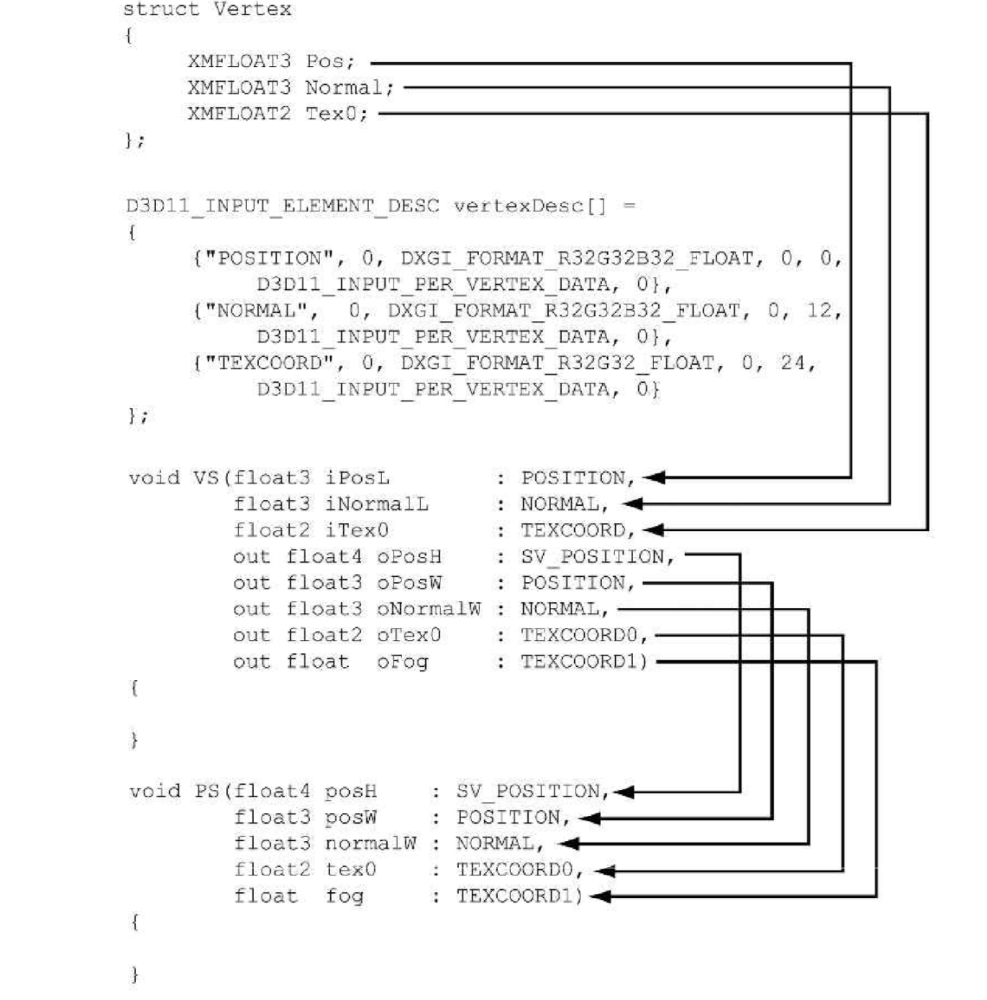

# Chapter 6 DRAWING IN DIRECT3D

在之前的章节中，我们主要是讨论了渲染管道中的一些概念和一些数学知识。
在本章中，我们就转为主要讨论`Direct3D API`，从而来配置渲染管道，编写顶点着色器和像素着色器，以及提交图形到渲染管道并且绘制它。
在本章结束的时候，我们就能够成功绘制一个立方体了。

> 目标:
- 了解一些用于定义，存储绘制图形的`Direct3D API`。
- 了解学习如何编写基础的顶点着色器和像素着色器代码。
- 了解如何使用管道状态来配置渲染管道。
- 了解如何创建一个常缓冲并且将其绑定到渲染管道中去，并且熟悉`Root Signature`(暂且叫做根特征，主要是用于定义在着色器使用哪些资源)。

## 6.1 VERTICES AND INPUT LAYOUTS

回顾5.5.1，在`Direct3D`中，顶点除了他的位置外它还可以附加一些其他数据。
为了创建一个自定义的顶点格式，我们需要创建一个结构体来描述我们要给顶点附加的数据。
下面就举出两个不同的顶点格式的例子，其中一个附加了位置和颜色数据，另外一个附加了位置，法向量，以及两个纹理坐标数据。

```C++

struct Vertex1
{
    Float3 Pos;
    Float4 Color;
};

struct Vertex2
{
    Float3 Pos;
    Float3 Normal;
    Float2 Tex0;
    Float2 Tex1;
};

```

我们虽然定义了顶点格式，但是我们同样需要告诉`Direct3D`我们的顶点格式，不然的话`Direct3D`是没法知道我们给顶点附加了哪些额外的数据。
我们使用`D3D12_INPUT_LAYOUT_DESC`来做这件事。

```C++

struct D3D12_INPUT_LAYOUT_DESC
{
    const D3D12_INPUT_ELEMENT_DESC *pInputElementDescs;
    UINT NumElements;
};

```

- `pInputElementDescs`: 一个数组，告诉`Direct3D`我们的顶点附加的数据信息。
- `NumElements`: 数组的大小。

`pInputElementDescs`里面的每一个元素都相当于顶点格式的一个附加数据信息。
因此如果我们的一个顶点格式他有两个附加数据信息的话，那么这个数组的大小就需要是两个。

```C++
struct D3D12_INPUT_ELEMENT_DESC
{
    LPCSTR SemanticName;
    UINT SemanticIndex;
    DXGI_FORMAT Format;
    UINT InputSlot;
    UINT AlignedByteOffset;
    D3D12_INPUT_CLASSIFICATION InputSlotClass;
    UINT InstanceDataStepRate;
};
```


- `SemanticName`: 一个用于联系元素的字符串。他的值必须在合法的范围内。我们使用这个来将顶点中的元素映射到着色器的输入数据中去。参见图片6.1。
- `SemanticIndex`: 索引值，具体可以参见图片6.1。例如一个顶点可能会有不止一个纹理坐标，我们必须区分这些纹理坐标，因此我们就加入了索引值来区分一个顶点里面的多个纹理坐标。如果一个`semanticName`没有加上索引的话就默认为索引值为0。例如`POSITION`就是`POSITION0`。
- `Format`: 附加的数据信息的格式，类型是`DXGI_FORMAT`。
- `InputSlot`: 指定这个元素从哪个输入口进入，`Direct3D`支持16个输入口(0-15)输入顶点数据。对于现在来说，我们只使用0输入口。
- `AlignedByteOffset`: 内存偏移量，单位是字节。从顶点结构的开端到这个元素的开端的字节大小。下面是一个例子。
    ```C++
    struct Vertex
    {
        Float3 Pos; // 0-byte offset
        Float3 Normal; // 12-byte offset
        Float2 Tex0; // 24-byte offset
        Float2 Tex1; // 32-byte offset
    };
    ```
- `InputSlotClass`: 现在默认使用`D3D12_INPUT_PER_VERTEX_DATA`。另外的一个类型是用于`Instancing`技术的。

这里我们给一个例子:

```C++
struct Vertex
{
    Float3 Pos; // 0-byte offset
    Float3 Normal; // 12-byte offset
    Float2 Tex0; // 24-byte offset
    Float2 Tex1; // 32-byte offset
};

D3D12_INPUT_ELEMENT_DESC desc [] =
{
        {“POSITION”, 0, DXGI_FORMAT_R32G32B32_FLOAT, 0, 0,  D3D12_INPUT_PER_VERTEX_DATA, 0},
        {“NORMAL”,   0, DXGI_FORMAT_R32G32B32_FLOAT, 0, 12, D3D12_INPUT_PER_VERTEX_DATA, 0},
        {“TEXCOORD”, 0, DXGI_FORMAT_R32G32_FLOAT,    0, 24, D3D12_INPUT_PER_VERTEX_DATA, 0},
        {“TEXCOORD”, 1, DXGI_FORMAT_R32G32_FLOAT,    0, 32, D3D12_INPUT_PER_VERTEX_DATA, 0}
};
```

## 6.2 VERTEX BUFFERS

 为了能够让`GPU`访问一组顶点的数据信息，我们需要将顶点信息放入到`GPU`资源中去(**ID3D12Resource**)，我们称之为缓冲。
 我们将存储顶点数据的缓冲称之为顶点缓冲(`Vertex Buffer`)。
 缓冲比纹理简单一些，他只有一维，并且他没有纹理明细(`MipMaps`)，过滤器(`filters`)，多重采样(`multisampling`)这些东西。
 无论在什么时候，如果我们要给`GPU`提供一组数据信息例如顶点数据信息，我们都会使用缓冲来实现。

 我们在之前讲过通过填充`D3D12_RESOURCE_DESC`类型来创建一个`ID3D12Resource`。
 因此我们也会通过这样的方式来创建一个缓冲，即填充`D3D12_RESOURCE_DESC`结构来描述我们要创建的缓冲的属性，然后使用`ID3D12Device::CreateCommittedResource`创建缓冲。

 在`d3dx12.h`中提供了一个简便的类型`CD3D12_RESOURCE_DESC`来创建资源，具体可以去参见`d3dx12.h`。

 **注意我们在`Direct3D 12`中并没有定义一个具体的类型来表示这个资源是一个缓冲或者是一个纹理(`Direct3D 11`中是这样做的)。
 因此我们在创建资源的时候需要通过`D3D12_RESOURCE_DESC::D3D12_RESOURCE_DIMENSION`来指定资源的类型。**

 对于静态的图形(即每一帧中通常不会改变)，我们会将他的顶点缓冲放在默认堆中(**Default Heap**)以保持最优的性能，通常大部分游戏中的图形都会放在默认堆中，例如树，建筑，地形，人物等。
 因为我们在创建好它的顶点缓冲后，`GPU`只会读取里面的顶点信息来绘制它，而不会做其他的事情，因此将其放在默认堆里面是最好的。
 然而由于`GPU`并不能将数据写入到处于默认堆里面的资源，我们该如何将初始的顶点数据放到缓冲中去？

 为了实现这个，我们需要创建一个上传缓冲资源(`Upload Buffer`)，它会被放在上传堆中(**Upload Heap**)。
 回顾4.3.8章节，当我们要将数据从内存拷贝到显存中去的时候，我们提交了一个资源到上传堆中。
 在我们创建完一个上传缓冲后，我们将顶点数据拷贝到上传缓冲中，然后我们从上传缓冲中拷贝顶点数据到我们的顶点缓冲中去。

 之后的内容是一个例子，这里可以自己去看代码。我只将几个主要使用的结构体类型介绍下。

 ```C++
 struct D3D12_SUBRESOURCE_DATA
 {
    const void *pData;
    LONG_PTR RowPitch;
    LONG_PTR SlicePitch;
 };
 ```

- `pData`: 数组的首元素指针。
- `RowPitch`: 对于缓冲来说他就是我们拷贝的数据的大小，单位字节。
- `SlicePitch`: 对于缓冲来说他就是我们拷贝的数据的大小，单位字节。

注意的是，对于顶点缓冲来说，我们创建他的描述符是不需要将其放入描述符堆中的。

```C++
struct D3D12_VERTEX_BUFFER_VIEW
{
    D3D12_GPU_VIRTUAL_ADDRESS BufferLocation;
    UINT SizeInBytes;
    UINT StrideInBytes;
};
```

- `BufferLocation`: 我们想要使用的顶点缓冲的虚拟地址。我们可以使用`ID3D12Resource::GetGPUVirtualAddress`来获取地址。
- `SizeInBytes`: 描述符可以只声明他只使用缓冲中的一部分数据，这个参数就是用来告诉我们要使用的缓冲大小，单位字节，从`BufferLocation`位置开始往后偏移。
- `StrideInBytes`: 每个顶点元素的大小，单位字节。

在我们创建完缓冲和缓冲的描述符后，我们可以将他们绑定到渲染管道的输入口，然后在输入装配阶段将顶点缓冲输入进去。

```C++
    void ID3D12GraphicsCommandList::IASetVertexBuffers(
        UINT StartSlot,
        UINT NumBuffers,
        const D3D12_VERTEX_BUFFER_VIEW *pViews);
```

- `StartSlot`: 绑定的顶点缓冲的输入口的起始位置，总共有16个，范围在0-15之间。
- `NumBuffers`: 我们要绑定的顶点缓冲的个数，我们假设我们绑定n个顶点缓冲，输入口的起始位置是k，那么第i个顶点缓冲的输入口就是`k + i - 1`。
- `pViews`: 我们要绑定的顶点缓冲的描述符数组的首元素的地址。

> 官网中说的是DX12最大支持的输入口个数是32。

由于要支持多个顶点缓冲从任意一个输入口输入数据，这个函数设计的就有点复杂了。
但是在这里我们只使用一个输入口。在章节最后的练习中我们会使用到两个输入口。

只有当我们改变这个输入口绑定的顶点缓冲的时候，原本的顶点缓冲才会取消绑定。
因此我们虽然只使用一个输入口但是我们仍然可以使用多个顶点缓冲。例如这样。

```C++
    D3D12_VERTEX_BUFFER_VIEW_DESC BufferView1;
    D3D12_VERTEX_BUFFER_VIEW_DESC BufferView2;

    /*Create Vertex Buffer Views*/

    commandList->IASetVertexBuffers(0, 1, &BufferView1);

    /*Draw by using VertexBuffer1*/

    commandList->IASetVertexBuffers(0, 1, &BufferView2);

    /*Draw by using VertexBuffer2*/
```

绑定一个顶点缓冲到输入口并不代表我们绘制了这个缓冲，我们只是准备好让顶点输入到渲染管道中而已。
因此最后我们还需要使用绘制函数来绘制这些顶点。

```C++
    void ID3D12CommandList::DrawInstanced(
        UINT VertexCountPerInstance,
        UINT InstanceCount,
        UINT StartVertexLocation,
        UINT StartInstanceLocation);
```

- `VertexCountPerInstance`: 我们需要绘制的顶点个数(对于每个实例来说)。
- `InstanceCount`: 我们要绘制的实例个数，这里我们设置为1。
- `StartVertexLocation`: 指定从顶点缓冲中的第几个顶点开始绘制。
- `StartInstanceLocation`: 这里我们设置为0。

`VertexCountPerInstance`和`StartVertexLocation`一起决定了我们要绘制顶点缓冲中的哪个范围。
图片[6.2](#Image6.2)给出了例子。


`StartVertexLocation`指定了我们要绘制第一个顶点在顶点缓冲中的位置，`VertexCountPerInstance`指定了我们要绘制的顶点个数。

`DrawInstanced`并没有让我们指定我们绘制的时候使用的图元的类型。
因此我们需要使用`ID3D12GraphicsCommandList::IASetPrimitiveTopology`去设置。

## 6.3 INDICES AND INDEX BUFFERS

和顶点类似，为了能够让`GPU`能够访问到索引数据，我们同样需要将索引数据放到缓冲中去。
我们称之为索引缓冲。索引缓冲的创建方式和顶点缓冲是一样的，因此这里就不再讨论了。

我们同样需要将索引缓冲绑定到渲染管道中去，因此我们也要为索引缓冲创建描述符，并且和顶点缓冲一样，我们不需要使用到描述符堆。

```C++
struct D3D12_INDEX_BUFFER_VIEW
{
    D3D12_GPU_VIRTUAL_ADDRESS BufferLocation;
    UINT SizeInBytes;
    DXGI_FORMAT Format;
};
```

- `BufferLocation`: 和顶点缓冲的一样。
- `SizeInBytes`: 和顶点缓冲的一样。
- `Format`: 一个索引占据的字节大小，必须设置为`DXGI_FORMAT_R16_UINT`或者`DXGI_FORMAT_R32_UINT`。

和顶点缓冲一样，以及其他的`Direct3D`资源我们如果想要使用他们的话，一般都需要将其绑定到渲染管道中去。
这里我们同样也需要将索引缓冲绑定到和顶点缓冲一样的阶段(使用`ID3D12CommandList::SetIndexBuffer`)，即输入装配阶段。

下面的代码是一个例子，你可以去自己看看。

如果你需要使用索引缓冲的话，我们就不能够使用`DrawInstanced`来绘制图形了，而必须使用`DrawIndexedInstanced`来绘制。

```C++
    ID3D12GraphicsCommandList::DrawIndexedInstanced(
        UINT IndexCountPerInstance,
        UINT InstanceCount,
        UINT StartIndexLocation,
        INT BaseVertexLocation,
        UINT StartInstanceLocation);
```

- `IndexCountPerInstance`: 我们绘制的时候使用的索引个数。
- `InstanceCount`: 实例个数，这里我们设置为1。
- `StartIndexLocation`: 指定从顶点缓冲中的哪个索引位置开始绘制。
- `BaseVertexLocation`: 指定我们绘制的时候使用的第一个顶点在顶点缓冲中的位置，即在顶点缓冲中这个顶点之前的顶点我们并不使用，我们从这个顶点开始重新编号。
- `StartInstanceLocation`: 我们这里设置为0。

假设我们有一个球体，一个长方体，一个圆柱体。
首先每个物体都有他自己的顶点缓冲和索引缓冲。
然后我们将每个物体的索引缓冲和顶点缓冲连接起来，即拼接起来变成一个索引缓冲和一个顶点缓冲，暂且叫做全局缓冲吧，可以参见图片[6.3](#Image6.3)(将顶点缓冲和索引缓冲拼起来也有一些不好的地方，当我们需要改变其中一个物体的顶点缓冲或者索引缓冲的时候，性能开销会比分开来说要多，但是在大多数情况下来说并起来后的优化会比分开来说大)。
在将它们拼接起来后，那么就会出现一个问题，我们索引缓冲中存储的索引值是相对于原本的那个顶点缓冲来说的，它里面记录的顶点编号也是相对于原本的顶点缓冲来说的，但是我们这里将顶点缓冲拼接起来后，肯定有一些顶点的编号是改变的了。
因此我们需要重新计算索引缓冲。


值得庆幸的是我们的顶点缓冲和索引缓冲并不是分散的，一个物体的顶点缓冲或者索引缓冲都是全局缓冲中的一段缓冲。
因此我们能够很容易的就知道一个物体它的顶点缓冲的范围和索引缓冲的范围。
但是由于索引缓冲他的值是相对于原本的顶点缓冲来说的，如果我们要重新计算索引缓冲的话显然并不划算，但是如果我们假设这个索引缓冲对应的顶点缓冲的第一个顶点的编号在全局缓冲中的编号为0的话，那么就刚好可以对上。
因此我们就有了`BaseVertexLocation`参数来将全局缓冲中的一个顶点的编号暂时看作为0。

```C++
    commandList->DrawIndexedInstanced(numSphereIndices, 1, 0, 0, 0);

    commandList->DrawIndexedInstanced(numBoxIndices, 1,
        firstBoxIndex, firstBoxVertexPos, 0);

    commandList->DrawIndexedInstanced(numCylIndices, 1,
        firstCylIndex, firstCylVertexPos, 0);
```

## EXAMPLE VERTEX SHADER

```hlsl

cbuffer PerObject : register(b0)
{
    float4x4 gWorldViewProj;
};

void VsMain(float3 pos : POSITION,
    float4 inputColor : COLOR,
    out float4 posH : SV_POSITION,
    out float4 outColor : COLOR)
{
    posH = mul(float4(pos, 1.0f), gWorldViewProj);
    outColor = inputColor;
}

```

我们使用**HLSL**(**High Level Shading Language**)语言来编写着色器，他和**C++** 非常类似，因此非常容易就能够学会。
我们会在阅读过程中会逐步学习关于HLSL着色器的一些概念，从而我们能够自己来实现一些简单的演示程序。
我们通常会使用`.hlsl`格式来表示这个文件是一个着色器代码。

在例子中，顶点着色器就是叫做`VSMain`的函数，我们在顶点着色器阶段就会运行这个函数。
你可以给你的顶点着色器取任何合法的函数名，我们只需要在编译的时候指定入口点函数就好了。
我们可以看到例子中的顶点着色器有4个参数，前面两个是输入的参数，后面两个是输出的参数(使用**out**标志)。
在HLSL中是没有任何引用和指针的，所以要想一个函数返回多个参数的话你要么使用结构体要么就使用**out**关键词来声明一个参数是输出参数。
并且要注意，在**HLSL**中所有的函数都是`inline`的。

我们可以知道我们前面两个输入的参数和我们绘制的时候使用的顶点格式是向对应的，在参数后面的`POSITION`,`COLOR`就是用来将顶点中的数据映射到顶点着色器的参数中去。



后面的两个输出参数后面的`SV_POSITION`,`COLOR`则是用来将这个阶段输出的数据映射到下一个阶段(例如几何着色器和像素着色器)输入的数据中去。
需要注意的是`SV_POSITION`是稍微有一点特殊的(**SV**表示的意思是**System Value**)。
它表示我们的顶点在齐次裁剪空间的位置，我们必须使用这个标志输出的顶点位置而不是`POSITION`。
因为`GPU`是需要知道这些顶点的位置的，从而才能够进行一些需要顶点位置信息的操作，例如裁剪，深度测试以及光栅化。
除了系统值外我们需要使用指定的标志，其余的标志名我们是可以任意取的，只需要你到时候能够对应上就好了。

第一行代码中，我们做的就是使用一个矩阵将顶点坐标从模型空间转换到齐次裁剪空间。

```hlsl
    posH = mul(float4(pos, 1.0f), gWorldViewProj);
```

`float4`既是数据类型也是构造函数，`mul`则有多个重载，支持各种类型的乘法。

然后一行代码我们只是将输入的颜色作为输出的颜色而已。

```hlsl
    outColor = inputColor;
```

我们同样也可以在着色器中加入结构体来充当输入和输出的参数，只要能够互相对应就可以了。

```hlsl
cbuffer PerObject : register(b0)
{
    float4x4 gWorldViewProj;
};

struct InputVertex
{
    float3 pos : POSITION;
    float4 inputColor : COLOR;
};

struct OutputVertex
{
    float4 posH : SV_POSITION;
    float4 outColor : COLOR;
};

OutputVertex VsMain(InputVertex input)
{
    OutputVertex output;

    output.posH = mul(float4(input.pos, 1.0f), gWorldViewProj);

    output.outColor = input.inputColor;

    return output;
}
```

如果我们没有使用几何着色器的话，我们就必须在顶点着色器中输出顶点在齐次裁剪空间中的位置，即必须有一个分量是`SV_POSITION`标志。
如果我们有使用几何着色器的话，那么我们就可以在几何着色器中输出。

透视除法并不需要我们去做，通常会由硬件来做。

## 6.5 EXAMPLE PIXEL SHADER

我们之前在**5.10.3**中讲了在光栅化的时候每个三角形的像素的一些属性都会由对应的顶点(**由顶点着色器或者几何着色器输出的顶点**)属性插值而来。
然后这些插值计算出来的属性会作为像素着色器的输入数据。
这里我们默认我们没有使用几何着色器。图片[6.5](#Image6.5)将会介绍他们的关联。


像素着色器类似顶点着色器，他也同样是一个函数。
并且我们会对每个像素运行一次来计算出这个像素的颜色。
但是你需要注意这里我们处理的像素并不是最后放到后台缓冲中的像素，这些像素可能会被`Clip`函数裁剪掉，或者被另外一个深度值更小的像素覆盖。

一些已经确定不可能出现在后台缓冲中的像素会被硬件直接优化掉，即直接不对这个像素运行像素着色器。
例如没有通过深度测试的像素就没有必要去运行像素着色器了，因为无论如何这个像素都不会被写入到后台缓冲中去。

```hlsl
cbuffer PerObject : register(b0)
{
    float4x4 gWorldViewProj;
};

void VsMain(float3 pos : POSITION,
    float4 inputColor : COLOR,
    out float4 posH : SV_POSITION,
    out float4 outColor : COLOR)
{
    posH = mul(float4(pos, 1.0f), gWorldViewProj);

    outColor = inputColor;
}

float4 PsMain(float4 posH : SV_POSITION,
    float4 color : COLOR) : SV_TARGET
{
    return color;

    //lol, 原文这里返回的是pin.Color，我简直是醉了。
}
```

在上面的例子中，我们就直接了返回插值后的颜色。
并且你需要注意的是像素着色器的输入参数要和顶点着色器的输出参数一致。
通常来说像素着色器的返回值是一个4维向量，`SV_TARGET`标志意味着我们的返回值的类型要能够和`Render Target`的格式一致。

我们同样也可以使用结构体来代替上面的顶点和像素着色器的输入输出数据。

```C++
cbuffer cbPerObject : register(b0)
{
    float4x4 gWorldViewProj;
};

struct VertexIn
{
    float3 Pos : POSITION;
    float4 Color : COLOR;
};

struct VertexOut
{
    float4 PosH : SV_POSITION;
    float4 Color : COLOR;
};

VertexOut Vs(VertexIn inPut)
{
    Vertex outPut;

    outPut.posH = mul(float4(inPut.Pos, 1.0f)), gWorldViewProj);

    outPut.Color = inPut.Color;

    return outPut;
}

float4 Ps(VertexOut inPut) : SV_Target
{
    return inPut.Color;
}
```

## 6.6 CONSTANT BUFFERS

### 6.6.1 Creating Constant Buffers

常缓冲就是一种能够被着色器程序引用的`GPU`资源。
在我们之后的学习中，我们会知道纹理以及其他类型的缓冲资源都能够被着色器程序引用。

```C++
cbuffer cbPerObject : register(b0)
{
    float4x4 gWorldViewProj;
}
```

这里我们定义了一个叫做`cbPerObject`的`cbuffer`(**Constant Buffer**)。
在这里，我们的常缓冲中存储了一个4x4的矩阵，将世界变换矩阵，视角矩阵以及投影矩阵组合起来了，用于将一个顶点从模型空间中转换到齐次裁剪空间中去。

不像顶点和索引缓冲，常缓冲通常需要在每一帧的时候都通过`CPU`去更新数据。
例如，如果我们的摄像机在每一帧的时候都在移动，那么我们就需要在每一帧中使用新的视角矩阵更新我们的缓冲。
因此我们创建常缓冲的时候可以将他放到上传堆(**Upload Heap**)而不是默认堆中，这样的话我们就可以直接使用`CPU`去更新常缓冲了。

注意的是，常缓冲的空间大小必须是硬件能够分配的最小的空间大小的倍数，即**256bytes**的倍数。

我们通常可能需要使用多个同样类型的缓冲，例如我们之前代码里的那个缓冲，我们每个不同的物体都需要使用到。

在`Direct3D 12`中我们可以使用`Shader Model 5.1`，因此我们可以使用下面的方法定义一个常缓冲。

```hlsl
struct ObjectConstants
{
    float4x4 gWorldViewProj;
    uint matIndex;
};

ConstantBuffer<ObjectConstants> gObjConstants : register(b0);
```

### 6.6.2 Updating Constant Buffers

由于我们的常缓冲是创建在上传堆中的，因此我们可以直接用`CPU`中更新缓冲。
具体来说我们需要先获取资源数据的指针，我们可以使用`Map`函数来获取。

```C++
    ComPtr<ID3D12Resource> uploadBuffer;
    BYTE* data = nullptr;
    uploadBuffer.Map(0, nullptr, reinterpret_cast<void**>(&data));
```

`Map`函数的第一个参数就是表示我们要获取的是资源中第几个子资源的指针。
对于缓冲来说，他只有一个子资源就是他自己，因此我们就设置为0。
第二个参数的类型是`D3D12_RANGE`来表示我们要映射的内存范围，设置为`null`的话就代表我们要映射的是整个资源。
第三个参数的话就是返回我们要的资源的指针。

我们可以使用下面的方法将数据复制到常缓冲中去:

```C++
    memcpy(data, &SourceData, DataSize);
```

当我们完成更新不需要再更新的时候，我们应该使用`Unmap`函数去释放内存。

```C++
    if (uploadBuffer != nullptr)
        uploadBuffer->Unmap(0, nullptr);

    data = nullptr;
```

第一个参数是我们要对哪个子资源进行释放，对于缓冲来说我们只需要设置为**0**就好了。
第二个参数的类型是`D3D12_RANGE`表示这个子资源中我们要释放的内存范围，设置为`nullptr`表示整个资源。

### 6.6.3 Upload Buffer Helper

Nullptr!!!

### 6.6.4 Constant Buffer Descriptors

回顾4.1.6，我们是通过描述符将资源绑定到渲染管道中去的。
到现在为止我们绑定渲染目标(**Render Target**)，深度模板缓冲(**Depth/Stencil Buffer**)以及顶点和索引缓冲(**Vertex/Index Buffer**)都是使用的描述符。
因此我们要绑定常缓冲到管道上去的话还是需要创建描述符。
常缓冲的描述符在的描述符堆的类型是`D3D12_DESCRIPTOR_HEAP_TYPE_CBV_SRV_UAV`，也就是说这个堆能够存储常缓冲(**Constant Buffer**)，着色器资源(**Shader Resource**)和无序资源(**unordered access**)的描述符。
为了存储这些描述符，我们需要创建一个这样的类型的堆来存储。

```C++
    D3D12_DESCRIPTOR_HEAP_DESC desc;

    desc.NumDescriptors = 1;
    desc.Type = D3D12_DESCRIPTOR_HEAP_TYPE_CBV_SRV_UAV;
    desc.Flags = D3D12_DESCRIPTOR_HEAP_FLAG_SHADER_VISIBLE;
    desc.NodeMask = 0;

    ComPtr<ID3D12DescriptorHeap> cbvHeap;

    device->CreateDescriptorHeap(&desc, IID_PPV_ARGS(&cbvHeap));
```

虽然创建这个类型的堆的代码和我们之前创建其他类型的堆的代码是差不多的，但是我们需要注意设定`D3D12_DESCRIPTOR_HEAP_FLAG_SHADER_VISIBLE`这个标志(`Flags`)来声明这个堆里面的描述符能够被着色器程序访问。

我们需要填充`D3D12_CONSTANT_BUFFER_VIEW_DESC`结构才可以创建常缓冲描述符，然后使用`ID3D12Device::CreateConstantBufferView`函数创建它。

```C++
    D3D12_CONSTANT_BUFFER_VIEW_DESC desc;

    desc.BufferLocation = bufferVisualAddress;
    desc.SizeInBytes = bufferSize;

    device->CreateConstantBufferView(&desc,
        heap->GetCPUDescriptorHandleForHeapStart());
```

我们通常使用`D3D12_CONSTANT_BUFFER_VIEW_DESC`来将缓冲中的一个子资源或者一个缓冲绑定到着色器中对应的常缓冲结构体中。
之前我们也提到过一个常量缓冲可以存储多个物体的数据信息，具体使用某一个资源的时候，我们可以使用`BufferLocation`以及`SizeInBytes`来做到。
并且你需要注意`D3D12_CONSTANT_BUFFER_VIEW_DESC::SizeInBytes`和`D3D12_CONSTANT_BUFFER_VIEW_DESC::OffsetInBytes`的大小必须是`256bytes`的倍数。

### 6.6.5 Root Signature and Descriptor Tables

通常来说，不同的着色器程序在绘制指令执行前需要绑定到管道的资源都会有所不同。
并且资源一般来说都会被绑定到管道中的一个具体的输入点(**register slots**)，这样我们就可以通过着色器访问被绑定的资源了。

我们之前使用的着色器都只使用了一个常缓冲而已，但在之后我们会使用到更多的资源，例如纹理，采样器等，这些都是需要绑定到管道上的。

```C++
SamplerState gsamPointWrap : register(s0);
SamplerState gsamPointClamp : register(s1);
SamplerState gsamLinearWrap : register(s2);
SamplerState gsamLinearClamp : register(s3);
SamplerState gsamAnisotropicWrap : register(s4);
SamplerState gsamAnisotropicClamp : register(s5);

cbuffer PerObject : register(b0)
{
    float4x4 gWorld;
    float4x4 gTexTransform;
};

cbuffer Pass : register(b1)
{
    float4x4 gView;
    float4x4 gProj;

    //Other
};

cbuffer Material : register(b2)
{
    float4 gDiffuseAlbedo;
    float3 gFresnelR0;
    float gRoughness;
    float4x4 gMatTransform;
}
```

来源标记(**Root Signature**)存储我们在绘制指令执行前要绑定到渲染管道的资源有哪些，以及这些资源将会被映射到着色器的哪个输入寄存器中。
来源标记存储的内容必须和我们使用的着色器内容相吻合(即在绘制指令执行之前，我们必须在来源标记中声明那些被着色器声明以及使用的资源)。
我们将会在创建渲染管道的时候验证两者的内容是否吻合。注意不同的绘制指令可能需要不同的着色器程序以及不同的来源标记。

我们可以假设着色器程序是一个函数，在着色器中使用的资源是参数，那么我们可以认为来源标记就是用来声明参数的。

在`Direct3D`中我们使用`ID3D12RootSignature`来表示一个来源标记。
它将存储一组来源参数来描述我们要在着色器中使用哪些资源。
一个来源参数可以是常量，描述符或者描述符表。
我们在之后会讲到常量和描述符，但是在本章中我们会使用到描述符表。
描述符表是在描述符堆的基础上，指定堆的一段范围作为我们要使用的一组描述符。

```C++
//这里给出大致代码

    D3D12_DESCRIPTOR_RANGE cbvRange;
    D3D12_ROOT_PARAMETER rootParameter[1];

    cbvRange.RangeType =
    cbvRange.NumDescriptors = 1;
    cbvRange.BaseShaderRegister = 0;

    rootParameter.ParameterType = D3D12_ROOT_PARAMETER_TYPE_DESCRIPTOR_TABLE;
    rootParameter.ShaderVisibility = D3D12_SHADER_VISIBILITY_ALL;
    rootParameter.DescriptorTable.NumDescriptorRanges = 1;
    rootParameter.DescriptorTable.pDescriptorRanges = &cbvRange;

//代码先坑着，网速不好没法上MSDN看参数。
```

之前说过来源标记只是定义了我们要绑定到渲染管道的资源。
并不意味我们需要在创建它的时候就将资源绑定到渲染管道上。
我们会使用指令列表来设置我们要使用的资源，准确来说是函数`ID3D12GraphicsCommandList::SetGraphicsRootDescriptorTable`。

```C++
    void ID3D12GraphicsCommandList::SetGraphicsRootDescriptorTable(
        UINT RootParameterIndex,
        D3D12_GPU_DESCRIPTOR_HANDLE BaseDescriptor);
```

- `RootParameterIndex`: 我们要设置到哪个来源参数中去。
- `BaseDescriptor`: 描述符在描述符堆中的位置，表示我们要设置的描述符表的第一个元素。例如，我们指定了一个有5个描述符的描述符表，那么`BaseDescriptor`和在他后面4个的描述符就会作为一个描述符表被设置。

下面的代码我们会设置一个`CBV`堆和一个描述符表到管道。

```C++
    commandList->SetGraphicsRootSignature(...);

    commandList->SetDescriptorHeaps(descriptorHeapsCount, descriptorHeaps);

    D3DX12_GPU_DESCRIPTOR_HANDLE cbvPosition = descriptorHeaps->GetGPUDescriptorHandleForHeapStart() + offset;

    commandList->SetGraphicsRootDescriptorTable(0, cbvPosition);
```

> 为了性能考虑，建议不要创建太大的来源标记，以及不要过于频繁更换来源标记。
> 当你更换一个来源标记的时候，你原本绑定的资源全部都会被取消绑定，你需要重新绑定。

## 6.7 COMPILING SHADERS

在`Direct3D`中着色器程序首先需要编译成较为简便的字节码。
然后图形驱动会将编译后的字节码重新编译成`GPU`的指令。
我们可以在程序运行的时候使用下面的函数去编译我们的着色器程序。

```C++
    HRESULT D3DCompileFromFile(
        LPCWSTR pFileName,
        const D3D_SHADER_MACRO *ppDefines,
        ID3DInclude *pInclude,
        LPCSTR pEntrypoint,
        LPCSTR pTarget,
        UINT Flags1,
        UINT Flags2,
        ID3DBlob **ppCode,
        ID3DBlob **ppErrorMsgs);
```

- `pFileName`: 我们要编译的着色器代码所在的文件名。
- `pDefines`: 我们目前不需要使用，如果你需要使用的话，参见SDK文档。
- `pInclude`: 同上。
- `pEntrypoint`: 我们要使用的着色器程序的名字，因为本身来说一个着色器程序就是一个函数，因此就是对应的函数名，我们可以在一个着色器代码文件里面写多个着色器。
- `pTarget`: 指定我们的着色器的类型和版本，具体参数参见文档。
- `Flags1`: 指定我们要如何编译着色器，参数很多。我们这里主要使用`D3DCOMPILE_DEBUG`和`D3DCOMPILE_SKIP_OPTIMIZATION`用来方便我们进行调试。
- `Flags2`: 我们目前不需要使用。
- `ppCode`: 返回编译后的字节码，类型`ID3DBlob`。
- `ppErrorMsgs`: 如果编译错误，返回编译的错误信息，类型`ID3DBlob`。

`ID3DBlob`本质上就是一块内存，我们可能需要使用到下面的两个成员函数。

- `LPVOID GetBufferPointer`: 返回这块内存的头指针。
- `SIZE_T GetBufferSize`: 返回这块内存的大小，单位`byte`。

### 6.7.1 Offline Compilation

除了在运行的时候编译着色器程序，我们也可以预先编译好它。

下面是一些为什么要预先编译的理由:

- 编译着色器程序需要花费一段时间，预先编译的话就可以减少这段时间。
- 预先编译的话能够更好的去调试我们的着色器程序，以及更早的知道我们的着色器程序的错误。
- Windows 8 应用商店程序只能使用预先编译好的着色器程序。

编译后的文件格式会变成`.cso`。

我们通常`DirectX`附带的`FXC`工具来预先编译我们的着色器程序。`FXC`是一个控制台工具，因此我们需要键入一些指令来编译我们的着色器。

下面的例子是我们使用`Debug`模式编译我们的着色器程序。

```command line
    fxc ".hlsl" /Od /Zi /T vs_5_0 /E "entryPoint" /Fo ".cso" /Fc ".asm"

    fxc ".hlsl" /Od /Zi /T ps_5_0 /E "entryPoint" /Fo ".cso" /Fc ".asm"
```

下面的例子是编译成`Release`模式的。

```command line
    fxc ".hlsl" /Od /Zi /T vs_5_0 /E "entryPoint" /Fo ".cso" /Fc ".asm"

    fxc ".hlsl" /Od /Zi /T ps_5_0 /E "entryPoint" /Fo ".cso" /Fc ".asm"
```

参数 | 描述
---- | ---
/Od          | 禁止优化，通常用于调试。
/Zi          | 允许调试信息。
/T "string"  | 着色器的类型和版本。
/E "string"  | 着色器的入口点函数名。
/Fo "string" | 编译完成后的文件名。
/Fc "string" | 输出一个用于调试，检测指令数，以及了解代码是如何生成的文件。

如果你编译的着色器程序有语法错误的话，FXC将会输出错误或者警告信息。例如我们编译的代码中有着一段:

```hlsl
    //worldViewProj is not exist!!
    output.posH = mul(float4(input.pos, 1.0f)worldViewProj);
```

然后他就会输出这样的错误:

```command line
    xxx.hlsl(29,42-54): error X3004: undeclared identifier "worldViewProj"

    xxx.hlsl(29,14-55): error X3013: 'mul': no matching 2 parameter intrinsic function

    ...
```

虽然我们能够预先编译好了着色器代码，但是我们还是需要读入代码到我们的程序中去，我们可以使用输入输出流在完成这个工作。

```C++
    std::ifstream file(fileName, std::ios::binary);

    file.seekg(0, std::ios_base::end);
    std::ifstream::pos_type size = (int)file.tellg();
    file.seekg(0, std::ios_base::beg);

    ComPtr<ID3DBlob> blob;

    ThrowIfFailed(D3DCreateBlob(size, blob.GetAddressOf()));

    file.read((char*)blob->GetBufferPointer(), size);

    file.close();
```

### 6.7.2 Generated Assembly

`/Fc` 参数将会告诉`FXC`生成一段汇编代码。
在调试或者其他时候，时不时看下着色器的汇编码能够很好的帮助我们检查着色器的指令数，以及了解代码如何生成的，并且生成代码是有可能和你预想的不一样的。例如，如果你的代码里面有一个条件语句，你可能会觉得在编译后的代码中会是一个分支指令。
但是在早期的可编程式`GPU`上在着色器上使用分支结构的开销是非常大的。因此有时候编译器就会将一个分支语句变成一种插值形式从而减少开销的同时达到一样的结果。

> 这里是原始代码。

```hlsl
    float x = 0;

    if (s == 1)
        x = sqrt(y);
    else
        x = 2 * y;
```

> 这里是可能编译的时候生成的代码。

```hlsl
float a = 2 * y;
float b = sqrt(y);
float x = a + s * (b - a);

//这样的话，当s是1的时候，x = b，否则x = a。
//效果是一样的。
```

我们从上面的代码可以知道编译器帮我们做了这些事情，但是如果我们不去看汇编码的话，我们是不会知道他做了这些事情的。
因此有时候去详细看看汇编码才可以知道我们的代码到底会变成什么样子。

### 6.7.3 Using Visual Studio to Compile Shaders Offline

Visual Studio 2013以上可以直接编译我们的着色器。你只需要将你的`.hlsl`格式的文件加入到你的工程里面(**应该只支持C++工程**)去，然后Visual Studio识别他们并且提供编译的设置(可以参见图片6.6)。这些设置其实就是将`FXC`工具的参数UI化了而已。
当你将的你的着色器代码加入到工程后，Visual Studio将会在编译过程中也会使用`FXC`去编译我们的着色器代码。


但是使用Visual studio去编译着色器的话就有一个缺点，就是一个文件只能够支持一个着色器程序，即我们不能将多个着色器程序放到一个文件里面去了。