# Chapter 8 LIGHTING

观察图片[8.1](#Image8.1)，可以发现左边的球没有被光照，右边的球有光照。
就如你看到的那样，左边的球显得非常的平坦，感觉和圆基本上没啥区别。
而另外一边的球，就很有3D的感觉了——光照和阴影使得我们看到这个物体更具有体积感。
实际上，我们的视觉感知就是基于光和材质的相互作用，即光照射到物体然后射入人眼。
因此要渲染出更真实的场景的话，就必须了解和解决很多关于光照模型的问题。


当然，如果我们的光照模型越精确，那么我们的计算光照的开销就会越大。
因此我们必须要平衡好真实性和速度。
例如，电影中的3D特效场景我们就可以使用比游戏使用的更加逼真和复杂的光照模型，毕竟电影中的每一帧都是提前渲染好的，我们可以花费不止一天的时间去渲染一帧。
但是对于游戏来说，它的渲染是实时的，我们至少需要每一秒渲染30帧才能保证游戏的流畅性。

> 目标:
- 对光照和材质的相互作用有基本了解。
- 了解全局光照和局部光照的区别。
- 学会使用代数描述面上的一个点的方向(即法线)，从而我们能够确定光照到这个面的角度。
- 学会如何正确的转换法向量。
- 能够区分环境光，漫反射光以及镜面光。
- 学会如何实现平行光，点光源以及聚灯光。
- 能够通过控制衰减参数来使得光的强度能够随着深度而变化。

## 8.1 LIGHT AND MATERIAL INTERACTION

如果我们使用光照的话，我们就不需要直接指定顶点的颜色。
但是我们需要指定材质和光照，然后通过一个关于光照的方程来计算出我们顶点的颜色。
并且这样能够使得我们的物体更加的真实(对比[图片8.1](#Image8.1)中的两个球体)。

材质我们可以认为就是一种属性，来决定光照到物体的一个面的时候的作用。
例如材质就决定了光照到一个面后，哪些颜色的光会被反射，哪些颜色的光会被吸收，这个面的折射率，这个面的光滑程度以及这个面的透明程度。
通过使用材质和光照，我们可以实现各种各样的真实世界的物体的表面，例如木头，石头，玻璃，金属，水等。

在我们的光照模型中，我们的光源可以发出不同强度的红光，蓝光以及绿光。
因此，我们可以模拟出各种颜色的光。
当光从光源出发，然后射到一个物体的时候，会有一些光会被吸收，有一些会被反射(对于透明的物体来说，例如玻璃，光会穿过它。但是这里我们不讨论)。
被反射的光会改变它的方向，然后射到新的物体上，然后继续被吸收一部分，被反射一部分。
在一条光线被完全吸收之前(即没有能力继续反射)，他可能会射到过多个物体。
也有很大可能会射到人眼中去(参见[图片8.2](Image8.2))，射到视网膜上的视觉细胞上去。

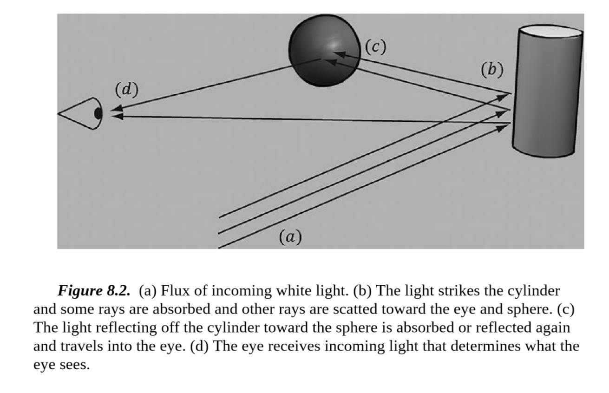

通过三色理论(**trichromatic theory**)，视网膜中包含着三种不同的光线受体，分别对红光，蓝光，绿光敏感。
然后照射过来的光线会刺激对应的光线受体，然后光线受体会根据光线的强度来产生不同强度的刺激。
当光线受体接收到光后会产生神经冲动然后传向大脑，然后你的大脑就会产生对应的视觉(如果你闭上眼睛，那么光线受体就没有接收到任何光线，那么你就会看到一片黑色)。

假设在[图片8.2](#Image8.2)中，圆柱体的材质能够反射$75\%$的红光，$75\%$的绿光，然后吸收剩下的光。
球体能够反射$25\%$的红光，然后吸收所有的光。
并且我们的光源能够发出白色的光。
当我们的光源发出的光射到圆柱体的时候，所有的蓝光都会被吸收，然后只有$75\%$的红光和绿光会被反射(但是看起来的话会是黄色)。
反射的光会分散开来，一部分可能射到人眼中，一部分可能射向球体。
射向人眼的光会刺激细胞产生视觉，然后你就会看到一个黄色的圆柱体。
射向球体的光则会继续被反射，反射$25\%$的红光然后吸收其余的光。
由于经过球体的光在圆柱体反射的时候就已经被削弱了(它只反射了$75\%$)，然后球体又削弱一次，因此它看起来会比较暗淡，没有那么强烈。

我们上面介绍的光照模型我们称之为局部光照。
在局部光照中每个物体的照明都是独立的，也就是说我们在计算一个物体的光照的过程中只讨论光源直接照射到这个物体的情况。

[图片8.3](#Image8.3)介绍了局部光照，光源发出的光线本应该墙挡住，但是在图中，被墙挡住的球体仍然被视为被光照到了。


另一方面，全局光照就不仅仅只是考虑光线从光源出发直接照射到物体了，还要考虑被其他物体反射的光照射到物体的情况。
因此我们称之为全局光照，当在考虑一个物体的光照的时候，我们需要考虑整个场景的所有的物体对它的影响。
并且它虽然能够渲染出更加真实的场景，但是他的开销却非常大。

## 8.2 NORMAL VECTORS

面法线是一个描述多边形面向的方向的单位向量(**它垂直于这个多边形**)。
[图片8.4a](#Image8.4)，面法线就是一个垂直点和这个点所在的表面相切的平面的单位向量。
[图片8.4b](#Image8.4)，面法线能够决定表面上的一个点的朝向。


为了进行光照计算，我们需要知道所有的三角形网格上的每一个点的面法线，从而确定光线照射到这个点时和这个点所在的表面成的角的角度。
因此，我们会在每个顶点数据中加入一个称之为面法线的分量(**vertex normals**)。
然后我们会在光栅化阶段对顶点数据中的面法线分量进行插值，从而得到网格中所有的面上的点的法线的近似值(**显然点是无限多的，但是我们不可能去插值所有的**)。关于插值，[图片8.5](#Image8.5)介绍了插值。


简单来说我们知道起始和终止状态($p_0$和$p_1$)，然后我们对于任意的一个$p=p_0 + t(p_1 - p_0)$，那么$p$这个点的面法线就是$n = n_0 + t(n_1 - n_0)$。

如果我们在像素着色器中，通过插值得到面法线，然后进行光照计算，我们称之为逐像素光照。
我们还有一种开销相对小的，但是质量不高的方法，叫做逐顶点光照，简单来说就是对每个顶点进行光照计算，然后每个像素的值就通过插值来获得。有时候，在使用两种光照视觉效果差别不是很大的时候，我们就会经常将原本的逐像素光照换成逐顶点光照，以便于能够节约开销提高性能。

### 8.2.1 Computing Normal Vectors

计算一个三角形(**$p_0,p_1,p_2$**)的面法线，我们可以先计算出三角形的任意两条边的向量，然后得到三角形的面法线。

两条边的向量:

$$u = p_1 - p_0$$

$$v = p_2 - p_0$$

那么面法线就是:

$$n = \frac{n \times v}{|u \times v|}$$

在一个平面上，我们可以通过计算来得到一个面的法线。
但是在网格中我们要需要计算出顶点的法向量，因此我们需要一个方法。
我们假设有一个点$v$，他的法向量为$n$，那么这个点的法向量$n$就是网格中所有的包含这个顶点的多边形的面法线的平均值。例如在[图片8.6](Image8.6)，一个点被4个多边形共用，那么这个点的法向量的计算方法就是:

$$n_{avg} = \frac{n_0 + n_1 + n_2 + n_3}{|n_0 + n_1 + n_2 + n_3|}$$


在上面的式子中，我们不会对其除以4，而是直接将其标准化(**Normalize**)。
那么在更复杂的图形上，我们的计算也会变得相对简单，我们只需要将所有的面法线相加然后标准化后就可以得到一个顶点的法向量了。

```C++
    for (int i = 0; i < numTriangles; i++)
    {
        uint index0 = indices[i * 3 + 0];
        uint index1 = indices[i * 3 + 1];
        uint index2 = indices[i * 3 + 2];

        Vertex vertex0 = vertices[index0];
        Vertex vertex1 = vertices[index1];
        Vertex vertex2 = vertices[index2];

        Vector3 e0 = vertex1.pos - vertex0.pos;
        Vector3 e1 = vertex2.pos - vertex0.pos;s

        Vector3 faceNormal = Cross(e0, e1);

        vertices[index0].normal += faceNormal;
        vertices[index1].normal += faceNormal;
        vertices[index2].normal += faceNormal;
    }

    for (int i = 0; i < numVertices; i++)
        vertices[i].normal = Normalize(vertices[i].normal);
```

### 8.2.2 Transforming Normal Vectors

在[图片8.7a](Image8.7a)中，向量$u = v_1 - v_0$垂直法向量$n$。
如果我们对其进行一个非均匀的变换$A$，变换成[图片8.7b](Image8.7b)中的样子，我们会发现变换后的向量$uA = v_1A - v_0A$和变换后的$nA$并不垂直。


其中a部分是变换前，b部分是将其X轴部分缩放两个单位后，c部分是将法向量进行一次逆转变换。

也就是说，我们的问题是，一个变换矩阵$A$(**Transformation Matrix**)对一些点和对应的向量(不要求标准化)进行变换，我们需要找到另外一个矩阵$B$，使得变化后的法向量和变化后的向量垂直($uA \cdot nB = 0$)。

现在我们来推导这个矩阵:

式子 | 解释
-----| ----
$u \cdot n = 0$ | 法向量$n$垂直于这个向量$u$。
$un^T = 0$ | 将点乘写成矩阵乘法的形式。
$u(AA^{-1})n^T = 0$ | 插入一个单位矩阵$I = AA^{-1}$。
$(uA)(A^{-1}n^T) = 0$ | 矩阵乘法的结合律。
$(uA)((A^{-1}n^T)^T)^T = 0$ | 转置矩阵的性质$(M^T)^T = M$。
$(uA)(n(A^{-1})^T)^T = 0$ | 转置矩阵的性质$(AB^T)^T = B^TA^T$。
$uA \cdot n(A^{-1})^T = 0$ | 重新将矩阵乘法写成点乘法的形式。
$uA \cdot nB = 0$| 因此这样的转换就能够使得向量垂直。

因此我们只需要使用矩阵$B = (A^{-1})^T$将法向量进行变换就可以使得法向量重新垂直了。

注意如果矩阵是正交矩阵(即$A^T = A^{-1}$)那么矩阵$B$就是:

$$B = (A^{-1})^T = (A^T)^T = A$$ 。

也就是说我们并不需要对矩阵$A$进行变换，但总的来说这样的情况只是特例，我们还是需要对矩阵$A$求逆并且转置从而得到矩阵$B$。

```C++
Matrix InverseTranspose(Matrix matrix)
{
    Matrix A = matrix;
    A[3] = Vector4(0.0f, 0.0f, 0.0f, 1.0f);

    //Get the Determinant
    Matrix determinant = Matrix::Determinant(A);
    Matrix inverse = Matrix::Inverse(&determinant, A);

    return Matrix::Transpose(inverse);
}
```

由于这个变换是对向量进行变换而不是对一个点进行变换，因此我们可以将所有的平移变换清除。不过我们在3.2.1中提到过如果向量的$w$分量为$0$的话，那么平移变换对这个向量是没有任何作用的。也就是说我们并不需要将平移变换清楚也是可以的。但是如果我们要将逆矩阵的转置矩阵和一个不包含非均匀变换的矩阵$V$组合在一起的话，即变成$(A^{-1})^TV$，矩阵$(A^{-1})^T$中被转置后的关于平移的部分就会导致他们的积出现问题。因此，我们就将矩阵$A$中关于平移部分的变换清零，从而避免这样的问题。并且，如果我们要将矩阵$A$的变换和矩阵$V$的变换组合在一起的话，最好的方法还是将其先进行变换然后求逆然后转置，即$((AV)^{-1})^T$形式。

下面就是一个缩放平移矩阵以及逆转置矩阵的例子(**没有将平移部分的清零**)。

原矩阵:

$$
 A = \left[
    \begin{matrix}
    1 & 0 & 0 & 0 \\
    0 & 0.5 & 0 & 0 \\
    0 & 0 & 0.5 & 0 \\
    1 & 1 & 1 & 1
    \end{matrix}
    \right]
$$

逆转置矩阵:

$$
 (A^{-1})^T = \left[
    \begin{matrix}
    1 & 0 & 0 & -1 \\
    0 & 2 & 0 & -2 \\
    0 & 0 & 2 & -2 \\
    0 & 0 & 0 & 1
    \end{matrix}
    \right]
$$

- 注意，法向量经过逆转置矩阵的变换后他的模长可能不是单位长度，因此需要将其重新标准化。

## 8.3 IMPORTANT VECTORS IN LIGHTING

在本部分，我们将会介绍一些参与光照的重要的向量。参考[图片8.8](Image8.8)，$E$表示我们眼睛的位置，并且我们正在注视着点$p$，从点$p$指向我们的眼睛$E$的向量我们设为$v$。点$p$在的平面的法线我们设为$n$，并且点$p$被一条入射方向为向量$I$的光线照过。向量$L$则是从点$p$开始的一个和光线方向相反的单位向量。虽然我们使用向量$I$来表示光线可能较为直观，但是在这里，我们将使用向量$L$来表示。尤其是在我们计算朗伯余弦定理(**Lambert's Cosine Law**)的时候，向量$L$将会被用来计算$L \cdot n = \cos \theta_i$，其中$\theta_i$是$L$和$n$之间的角度。向量$r$则是入射光线照射到点$p$后关于这个面的法线$n$的反射向量。

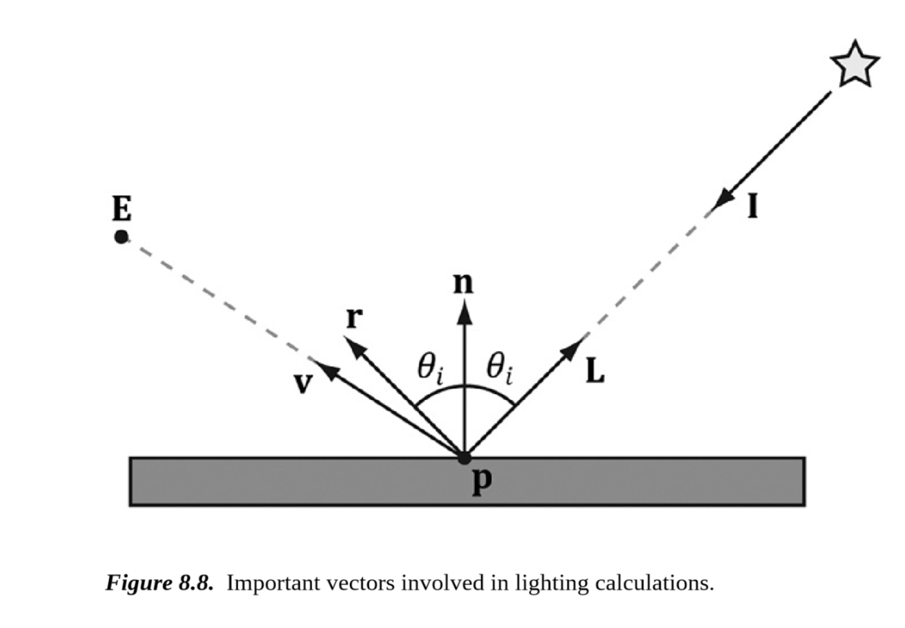

反射向量$r$则为(可以参考[图片8.9](Image8.9)，我们假设$n$是单位向量):

$$r= I - 2(n \cdot I)n$$

实际上的计算我们可以使用`HLSL`内置函数`reflect`来在着色器程序中帮我们计算反射向量。

## 8.4 LAMBERT&RSQUO'S COSINE LAW

光可以被认为是一些光子在空间中朝某一个方向传播。每个光子都是含有能量。我们将光子每秒散发的能量称之为辐射量(**radiant flux**)。辐射量的密度，即每单位面积内的辐射量我们又称之为辐射度(**irradiance**)。辐射度将会决定被光照射到的面的单位面积内能够接收的光，或者说决定面的亮度。简单来说，我们可以认为辐射度就是单位面积内照射到面上的光的数量，或者穿过空间中某一区域的光的数量。

垂直照射到面上的光线会比以某个角度照射到面上的光线强烈很多。思考有一条辐射量为$P$的光线穿过一个横截面$A_1$。如果光线垂直照射到面上([图片8.10](#Image8.10)a)，那么光线照射到的范围就是$A_1$，$A_1$处光线的辐射度$E_1 = P / A$。如果光线是以某一个角度照射到面上([图片8.10](#Image8.10)b)，那么光线照射到的范围就是$A_2$，光线的辐射度$E_2 = P / A_2$。

$A_1$和$A_2$的关系如下：

$$\cos \theta = \frac{A_1}{A_2} \Rightarrow \frac{1}{A_2} = \frac{\cos \theta}{A_1}$$

也就是说：

$$E_2 = \frac{P}{A_2} = \frac{P}{A_1} \cos \theta = E_1 \cos \theta = E_1(n \cdot L)$$

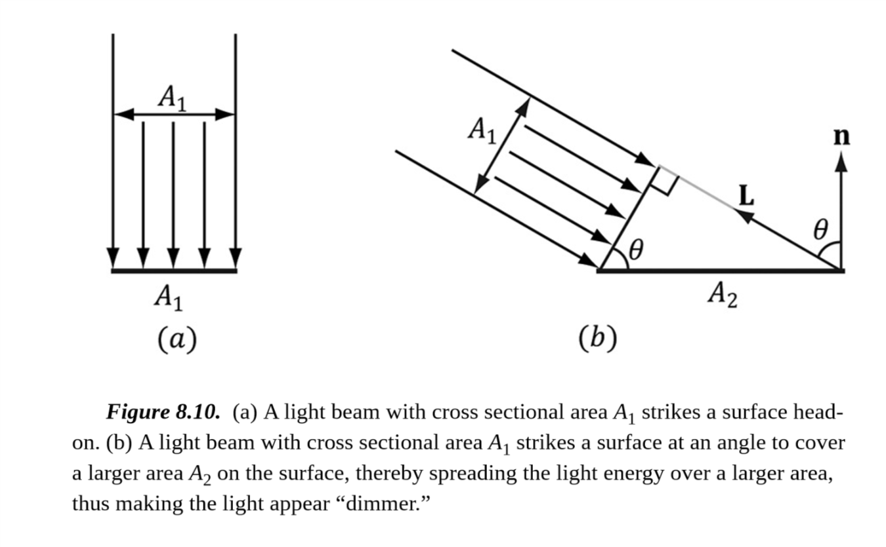

换句话说，光线照射到$A_2$的辐射度就是光线照射到垂直它的面$A_1$的辐射度再乘以$n \cdot L = \cos \theta$。这就是朗伯余弦定理。为了处理光线照射到面的背面的情况(即式子中的点积会为负数)，我们就需要到使用`Max`函数。

$$f(\theta) = max(\cos \theta, 0) = max(L \cdot n, 0)$$

[图片8.11](#Image8.11)就是一张$f(\theta)$的图表，描述了$\theta$在$[0, 2]$范围内的值域。

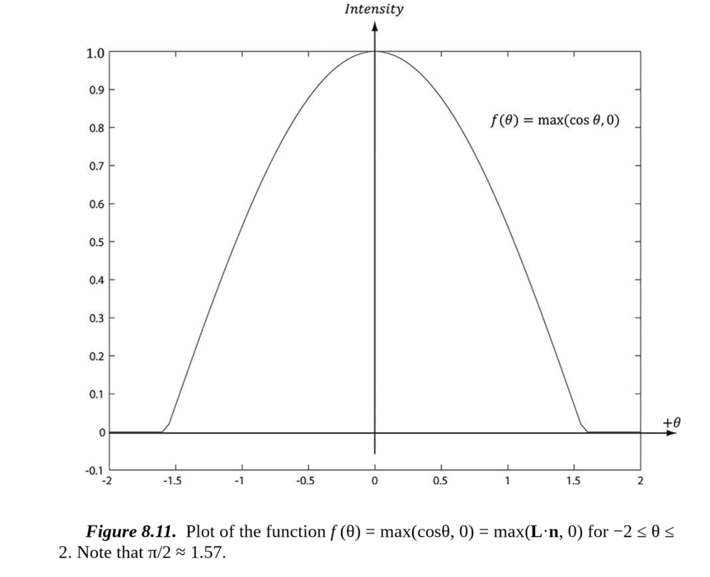

## 8.5 DIFFUSE LIGHTING

考虑一个不透明的物体的表面，例如[图片8.12](#Image8.12)。当光线照射到表面上的一个点时，一些光线会射入到物体的内部，一些光线会作用到物体表面。射入到物体内部的光线会在物体内部不断的反射，其中一些光线会被吸收掉，剩余的光线则会从表面的各个方向散发出去。我们称这种现象为**漫反射(diffuse reflection)**。简化的话，我们可以认为散发出的光线都是从光线照射进来的那个点散发出去的。并且物体的材质将会决定有多少光线会被吸收，又有多少光线会重新发散出去。例如，木头，泥土，砖块，瓷砖，泥灰等物体它们吸收和散发的光各自不同(这也是它们看起来材质不一样的原因)。在我们的模型中，我们规定经过发散后的光线就是从它照射到面上的点出发射向各个方向的光线(但是不穿过这个面，因此射向面的反面的光线是不包括的)。因此，无论眼睛的位置在哪里，发散后的光线都能够到达我们的观察点(眼睛，当然我们的眼睛位置必须在面的上方)。因此，我们并不需要关心观察点(眼睛)的位置(换言之，关于漫反射的光照计算是独立于观察点的)，并且面上的点的颜色无论观察点在哪里，它们看起来都会是一样的。

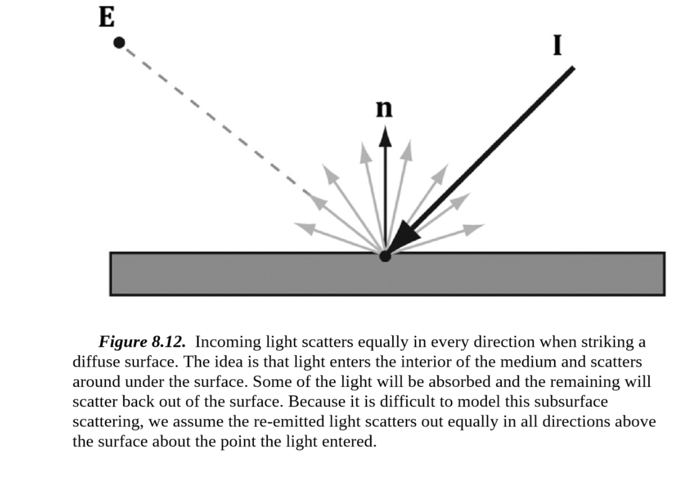

我们将漫反射光照的计算分为两个部分。第一部分，确定光的颜色和材质漫反射的反射率。反射率决定了照射到这个面的光会有多少被反射(用能量守恒的观点来说，那些没有被反射的光就会被材质所吸收)。我们会使用颜色乘法来计算被反射的光的强度。例如，面上的一个点能够反射$50\%$的红光，$100\%$的绿光以及$75\%$的蓝光，而照射到这个点的光线则是强度为$80\%$的白光。也就是说光为$B_L = (0.8, 0.8, 0.8)$以及材质的反射率为$m_d = (0.5, 1.0, 0.75)$，那么这个点反射后的光就为:

$$c_d = max(L \cdot n, 0) \cdot B_L \otimes m_d$$

## 8.6 AMBIENT LIGHTING

早先我们讲过，我们的光照模型不去讨论那些被其他物体反射后的光,但是在真实场景中我们看到的很多光线都是经过了其他的物体反射后才到我们的眼中。例如，我们有一个走廊和一个房间，房间里面一盏灯，虽然走廊并没有光直接照射到，但是房间的灯发出的光仍然可以通过照射到墙上然后反射然后照射到走廊上。再举一个例子，假设我们坐在一个有一个桌子和茶壶的房间里，并且有一盏灯，茶壶只有正面会被照射到，然而茶壶的背面却并不是完全黑的，这是因为有一些光照射到其他物体或者墙上的时候被反射到了茶壶的背面，因此茶壶的背面也是实际有光线照射的。

为了模拟这样的情况，我们将会介绍坏境光，以及关于它的方程:

$$c_d = A_L \otimes m_d$$

$A_L$表示这个面会有接收到多少的坏境光。虽然这样做会和真实情况有一些不同。漫反射率$m_d$则是表示有多少照射过来的光会被反射。并且这里的$m_d$和我们在漫反射光照中使用的$m_d$是同一个量。也就是说，环境光照就是处理非直接照射到物体的光的漫反射。显然这样的计算并不是真实的物理模拟，但是由于通常光线会经过很多次的散射或者反射，所以可以近似的认为光线照射到物体是从全方位的。

## 8.7 SPECULAR LIGHTING

我们使用漫反射光照来处理物体的漫反射，也就是处理光线照射到介质后，部分被吸收然后剩下的从介质中散发到各个方向。由于菲涅耳效应(**Fresnel Effect**)，第二种反射就出现了。当光线照射到两种折射指数不同的介质的交界处时，会有一部分光会被反射，剩下的一部分光则会折射(参见[图片8.13](#Image8.13))。折射指数是介质的物理性质，它是光在介质中传播的速度和光在真空中的传播速度的比值。我们将这种光反射的过程称为镜面反射(**specular reflection**)，由镜面反射反射的光我们称之为镜面光(**specular light**)。

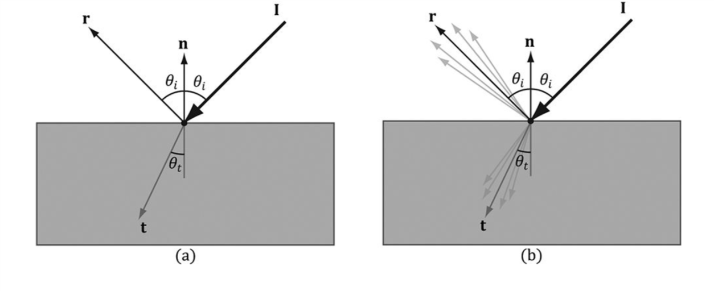

[图片8.13](#Image8.13): 法线为$n$的平面镜上的菲涅尔效应。入射光$I$分成了两部分，一部分被反射且方向为$r$，另外一部分折射到介质中方向为$t$。同时这些方向向量都共面。并且反射角(即反射向量和法线的夹角)和入射角始终都为$\theta_i$，即向量$r$和法线$n$的夹角等于向量$L = -I$和法线$n$的夹角。折射方向$t$的向量$-n$的夹角$\theta_t$的大小则取决于两个介质间的折射系数以及斯涅尔定理。由于大多数物体都不是完全光滑的，所以真实的光线会从反射方向和折射方向散开。

如果折射光线从介质中出来(从另外一边)并且射入眼中，那么呈现出的物体是透明的。这也是为什么会有透明物体。实时图形(**Real-time Graphics**)往往通常会使用混合或者处理后的效果去实现透明物体的折射，我们将会在后面一部分讲到这些。现在我们只考虑不透明的物体。

对于不透明的物体来说，折射光线进入介质中去然后会经历漫反射。因此对于不透明的物体，我们可以参见图片[8.14](#Image8.14)b，物体表面反射的光由主要的反射(漫反射)以及镜面反射混合而成。相比漫反射，由于镜面反射的反射方向是某一特定的方向，因此它最后未必会射向眼睛。也就是说，镜面反射的计算是需要知道视点的。这也意味着当我们的视点在场景中移动的时候，它接收到的镜面反射发出的光的数量也会改变。

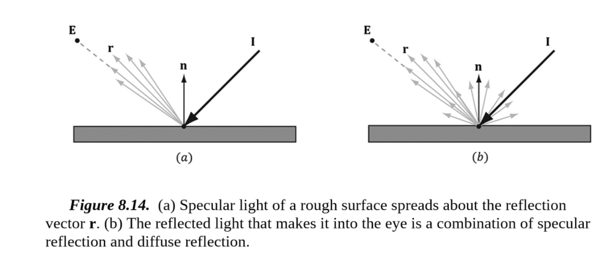

**a**部分中镜面反射的光线方向为向量$r$，**b**部分中反射到眼中的光线由镜面反射的光线和漫反射的光线混合而成。

### 8.7.1 Fresnel Effect

我们考虑一个在两个折射系数不同的介质之间的光滑的平面。由于折射系数的原因，当入射光线照射到平面上的时候，部分光线会被反射出去，另外一部分则会折射，射入平面内(参见[图片8.13](#Image8.13))。菲涅尔方程则给出了有百分之多少的入射光线会被反射，$0 \le R_F \le 1$。从能量的角度来看，如果$R_F$是反射的光的量，那么$(1 - R_F)$就是折射光线的量。由于我们的光是以**RGB**定义的，因此$R_F$会是一个**RGB**向量。

介质(有一些材质反射的光会多于其他的材质)以及法线$n$和光线方向向量$L$的夹角$\theta_i$将会决定反射光线的量。由于原本的菲涅尔方程过于复杂，因此我们在实时渲染中并不使用它，我们是使用的是近似值(**Schlick's approximation**):

$$R_F(\theta_i) = R_F(0^{\omicron}) + (1 - R_F(0^{\omicron}))(1 - \cos \theta_i)^5$$

$R_F(0^{\omicron})$是介质的属性，下面是一些常见材质的值。

介质 | $R_F(0^{\omicron})$
---- | ------------------
水   | $(0.02, 0.02, 0.02)$
玻璃 | $(0.08, 0.08, 0.08)$
塑料 | $(0.05, 0.05, 0.05)$
黄金 | $(1.00, 0.71, 0.29)$
银   | $(0.95, 0.93, 0.88)$
铜   | $(0.95, 0.64, 0.54)$

[图片8.15](#Image8.15)则显示了不同的介质的$R_F(0^{\omicron})$的近似值的图像。我们可以发现，反射光线的数量随着$\theta_i$增长到$90^{\omicron}$而增长。我们以现实中的情况为例。参见[图片8.16](#Image8.16)。假设我们站在一个只有几英尺深的池塘里，池塘的水清澈见底。如果我们向下看，我们基本上可以看到池塘底的沙子和石头。这是由于光线照射到水面后以非常小的角度$\theta_i$(接近于$0.0^\omicron$)射入我们的眼中。也就是说，射入我们的眼中的光线中反射后的光线会较少，而折射后的光线会较多。另一方面，如果我们水平的看向水面的话，我们将会看到水面反射出非常强烈的光。这是由于光线照射水面后以接近$90.0^\omicron$的角度射入我们的眼中，因此反射的光线会较多。我们将这样的现象称为菲涅尔效应。总的来说，反射的光线的量由入射角和材质($R_F(0^\omicron)$)决定。

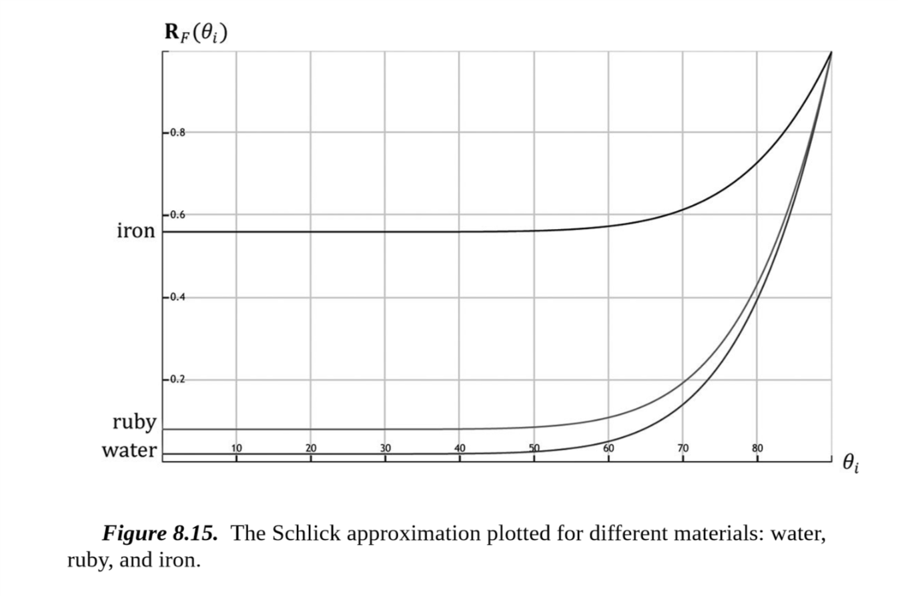

不同的材质的近似值，依次为水，红宝石和铁。

金属会吸收射入的光线，这意味着他没有漫反射。但是金属不会只显示为黑色，因为只要金属的$R_F(0^\omicron)$够高的话，即使是接近于$0^\omicron$的入射角，它仍然会反射出大量的镜面光。

### 8.7.2 Roughness

在现实中，物体并不是完美平滑的。即使一个物体看起来非常的平滑，但是在微观层面中它还是粗糙不平的。参考[图片8.17](#Image8.17)，我们可以认为完美的镜面是光滑的，即没有任何粗糙的地方，这也意味着在微观上，它的所有法线(**micro-normals**)和在宏观上这个面的法线(**macro-normal**)的方向是一致的。随着表面的粗糙度的增强，微观上的法线的方向将会逐渐散开，导致反射的光线展开成镜瓣(如果你把镜子稍微靠近地面或者其他地方你可以看见地面有一层光，这个就指的这个东西)。

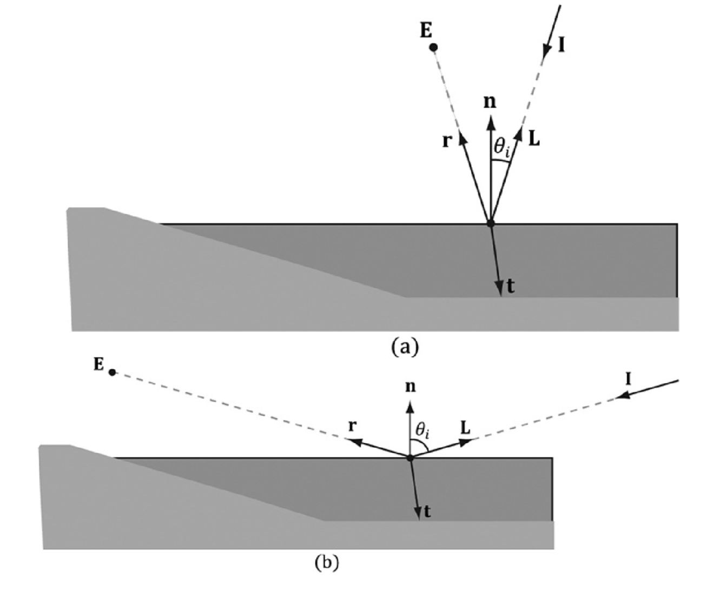

a部分，就是入射角非常小的时候，折射的光线比较多，而反射的比较少。b部分则是入射角比较大的时候，反射的光线比较多，而折射的光线比较少。

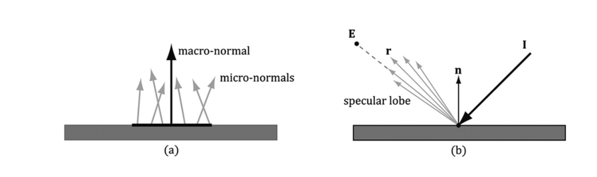

a部分中，黑色的部分是一块平面的一部分，我们将其放大。在微观层次上，由于表面粗糙的原因，这个表面就会有很多朝向不同的法线。而如果表面越光滑，那么这些法线的方向则会越接近宏观上这个面的法线的方向。
b部分，这是由于表面粗糙的原因，光线照射到一块表面的时候，反射的光线会朝各个方向散发出去。

为了给粗糙度数学建模，我们需要使用到微平面这个模型，即认为一块微小的平面由多块光滑的平面构成。同时，这些光滑的平面的法线，就是我们之前所说的微观上的法线。假设有一个视点$E$以及一条光线$L$。我们想知道有多少光滑的平面能够将光线$L$反射到视点$E$，换句话说就是有多少的光滑平面它的法线$h = normalize(L + v)$。观察[图片8.18](#Image8.18)，就是一个能够将光线$L$反射到视点$v$的光滑的平面。

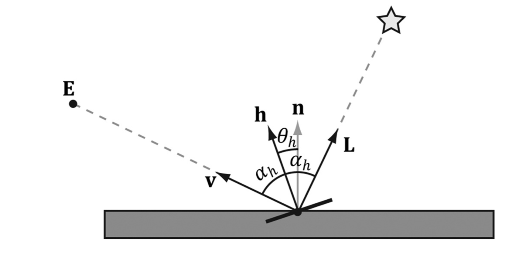

光滑平面的法线$h$我们则称之为中间法线(**halfway**)，即它位于光线向量$L$和视点向量$v$之间。同时我们设中间法线$h$和整个面的法线(即宏观上的法线)的夹角为$\theta_h$。

我们定义一个函数$\rho(\theta_h) \in [0, 1]$来表示微面的法向量$h$和平面的法向量$n$的夹角$\theta_h$，也就是说表示微面的法向量偏向于平面的法向量的程度。且当$\theta_h = 0^\omicron$时，$\rho(\theta_h)$取得最大值。也就是说，当$\theta_h$递增的时候($h$偏离$n$的时候)，我们的函数值会随着递减。通常我们则使用下面的函数来对其建模:

$$\rho(\theta_h) = cos^m(\theta_h)$$

$$\rho(\theta_h) = cos^m(n \cdot h)$$

因为$h$和$n$都是单位向量，因此$cos(\theta_h) = (n \cdot h)$是成立的。[图片8.19](#Image8.19)则显示了$m$取不同的值的时候，函数的图像。随着$m$的减少，平面就越来越粗糙，微面的法线逐渐和平面的法线分离。而随着$m$的增加，平面变的越来越光滑，微面的法线逐渐偏向于平面的法线。

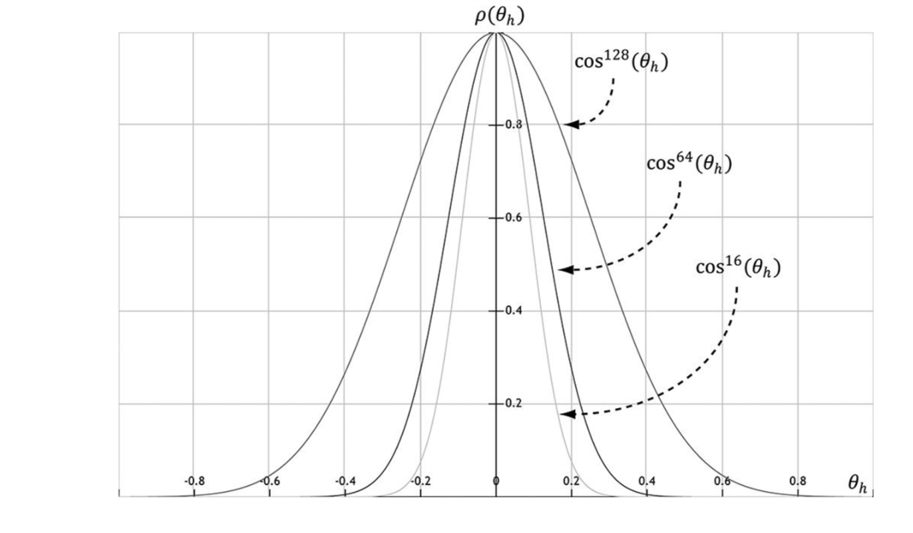

我们可以将$\rho(\theta_h)$以及标准化系数(normalization factor)组合成一个新的函数，使镜面反射的量与粗糙度相关。即下面这个函数：

$$S(\theta_h) = \frac{m + 8}{m}cos^m(\theta_h)$$
$$S(\theta_h) = \frac{m + 8}{m}(n \cdot h)^m$$

[图片8.20](#Image8.20)则呈现了当$m$取不同值的时候函数的图像。就和刚刚的图像一样，$m$将控制着粗糙的程度，只是我们增加了一个系数$\frac{m + 8}{m}$。当$m$越小的时候，平面就越粗糙，反射产生的镜瓣的范围就越广，能量也越分散。因此产生的镜面高光就会因为能量的分散而减弱。而当$m$越大的时候，平面就越光滑，产生的镜瓣的范围就越小，能量也就越集中。因此产生的镜面高光就非常的强烈。从几何角度来看，$m$控制着镜瓣的大小范围。

如果我们需要的是光滑的平面，那么$m$的值大一点好，如果需要粗糙的平面，那么小一点好.

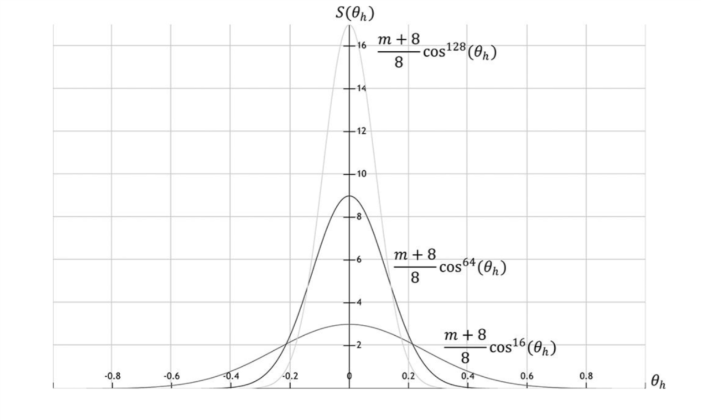

最后我们来总结，我们将菲涅尔效应以及平面的粗糙度组合在一起，首先我们要计算有多少的光反射后朝向方向$v$。将光线反射到$v$的微面的法线为$h$(即中间法线))，设$\alpha_h$为光线向量和中间法线两者之间的夹角，那么$R_F(\alpha_h)$就是反射到$v$向量方向的光的数量。由于粗糙度的存在，可能不止只有一条光线会反射到$v$的方向，因此我们还要将我们的$R_F(\alpha_h)$乘以一个$S(\theta_h)$(它将告诉我们大概有多少光线会反射到$v$的方向)。然后，我们设$(max(L \cdot h, 0) \cdot B_L)$为光线射到我们正在处理光照的点上的光的量，那么我们最后的式子则是：

$$c_s = max(L \cdot n, 0) \cdot B_L \otimes R_F(\alpha_h) \frac{m + 8}{m}(n \cdot h)^m$$

如果$L \cdot h \leq 0$那么就表示光线照射到的是点所在的面的背面。

## 8.8 LIGHTING MODEL RECAP

总的来说，平面反射光线就是将环境光，漫反射光，镜面反射光组合在一起。

- 环境光$c_a$: 一些并不直接射向物体而是经过多次反射后再射向物体的光照模型。
- 漫反射光$c_d$：射入介质内部，然后在内部经过多次反射折射，剩余的光重新从表面扩散出去的光照模型。
- 镜面光$c_s$：由于菲涅尔效应以及粗糙度导致的光线模型。

那么，我们最后再着色器中实现的光照模型的方程则为：

$$LitColor = c_a + c_d + c_s$$
$$LitColor = A_L \otimes m_d + max(L \cdot n, 0) \cdot B_L \otimes \bigg( m_d + R_F(\alpha_h) \frac{m + 8}{m}(n \cdot h)^m \bigg)$$

注意所有在式子中出现的向量都是单位向量。

- $L$：指向光源的向量。
- $n$：平面的法线。
- $h$：光线向量$L$和视点向量$v$的中间向量。
- $A_L$：表示照射过来的环境光的量，或者说强度。
- $B_L$: 表示直接照射过来的光线的量，或者说强度。
- $m_d$：表示照过来的光线会被平面漫反射的量。
- $L \cdot n$：朗伯余弦定理。
- $\alpha_h$：中间向量$h$和光线向量$L$之间的夹角。
- $R_F(\alpha_h)$：对于法线为$h$的微平面，其由于菲涅尔效应反射的光的量。
- $m$：控制平面的粗糙度。
- $n \cdot h$：表示微平面的法线$h$和平面的法线$n$的夹角$\theta_h$。
- $\frac{m + 8}{m}$：使得镜面反射的能量守恒的系数。

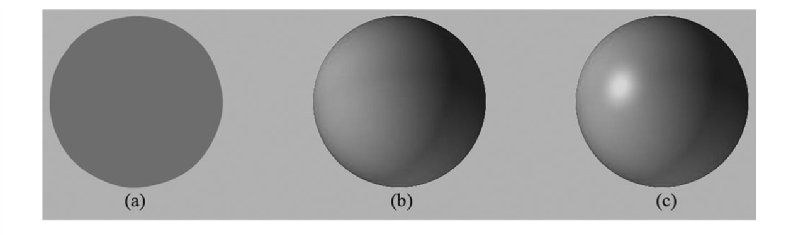

图片中$a$部分则是没有进行任何光照的球体，$b$部分则是漫反射光和环境光的组合，$c$部分则是三种光的组合。

最后提一句，书中关于计算光照的方程只是对应书中建立的模型，并不意味着我们对于光照的计算只有这一种模型。

## 8.9 IMPLEMENTING MATERIALS

对于材质，其结构如下:

```C++

struct Material {
    float4 DiffuseAlbedo; //default: (1f, 1f, 1f, 1f)
    float3 FresnelR0; //default: (0.01f, 0.01f, 0.01f)
    float Roughness; //default: 0.25f
}

```

想要建立更加真实的材质模型，我们不仅需要定义**DiffuseAlbedo**和**FresnelR0**还可能需要对其进行一些艺术上的微调。例如，金属将会吸收所有的进入金属内部的光线，也就是说金属没有漫反射一说(**DiffuseAlbedo**将会被设置为$0$)。然而由于我们的模型并不是$100\%$模拟的真实光照，为了弥补这个因素，我们可能会将**DiffuseAlbedo**设置的较为小而不是为0，使得我们得到更好的艺术效果。换句话说，我们虽然在模拟真实的光照，但是如果我们可以通过一些微调使得我们的结果看起来更好的话，那么一些微调也是可以的。

在我们的材质结构体中，粗糙度是一个标准化的浮点类型，即他的范围在$[0, 1]$之间。当粗超度为0的时候，则代表平面非常的光滑，如果为1的话，则代表平面粗糙至极。将粗糙度标准化也同样方便了我们为材质设定粗糙度，以及比较不同的材质的粗糙度。例如我们可以轻松知道粗糙度的为$0.6$的材质的粗糙程度是为$0.3$的两倍。我们通过粗糙度来获得**式子8.4**中的$m$值(同时注意在我们的定义中，光滑度和粗糙度互为相反数，即$shininess = 1 - roughness \in [0, 1]$)。

有这么一种情况，一个面上的材质的值在不断变换，即面上不同的点上有不同的材质。例如在[图片8.22](#Image8.22)中，车子模型的支架，窗户，灯，轮胎反射的光和吸收的光各不相同，车的表面不同位置的材质就可能不同。

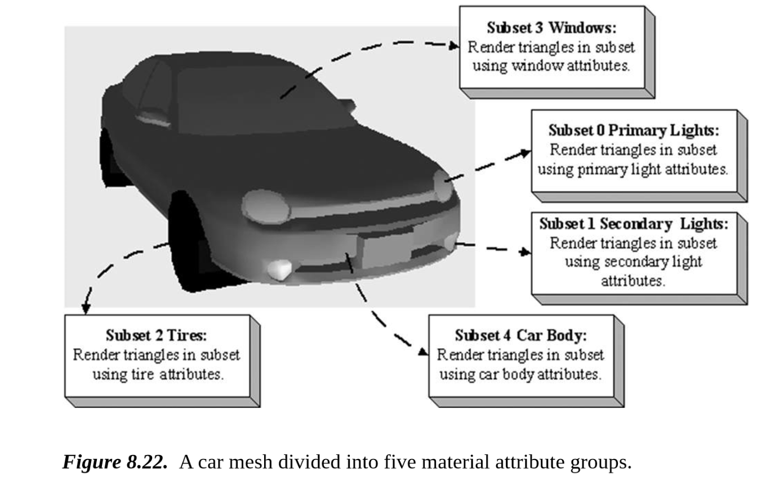

其中一种实现这样的情况方法就是为每个顶点都设置材质，然后在光栅化的时候通过插值来获取面上对应的点的材质值。但是现今常用的方法并不是这样，而是纹理映射(**Texture Mapping**)，将会在之后的章节中讲到。在本章节，我们允许在每次渲染的时候更换我们的材质，因此我们需要为不同的材质都创建实例，并将其放入表中。

```C++

Material grass;
Material water;

grass->Name = "grass";
grass->MatCBIndex = 0;
grass->DiffuseAlbedo = float4(0.2f, 0.6f, 0.6f, 1.0f);

....

mMaterials["grass"] = std::move(grass);
mMaterials["water"] = std::move(water);

```

上述表中的材质数据存放在系统内存中，为了我们能够在着色器中能够访问它，我们得需要将我们所需要的材质数据复制到常缓冲中去。就如同我们为每个物体都创建一个常缓冲一样，我们为为一个`FrameResource`都建立一个缓冲来存放材质数据。

```C++

struct FrameResource{
    public:

    std::unique_ptr<Buffer<Material> MaterialBuffer = nullptr;
};

```

我们在渲染中需要设置好材质，可能每次渲染是用的物体不同，因此我们的每个`Material`都记录了一个索引，以方便我们在缓冲中取出我们所需要的材质。我们可以通过对GPU虚拟地址(`GPU Virtual Address`)进行偏移，从而在缓冲中取出我们所需要的材质。

```C++
    ...

    D3D12_GPU_VIRTUAL_ADDRESS matCBAddress = matCB->GetGPUVirtualAddress() + mat->MatCBIndex * matCBByteSize;

    commandList->SetGraphicsRootConstantBufferView(1, matCBAddress);

    ...
```

我们需要三角形的每个面的法向量，以便我们能够确定光线照射到面上的时候和面的夹角。因此我们在顶点层次中为其加上一个法线属性，在光栅化的时候，我们的法线会被插值，从而每个像素都能够得到他所在的三角形面的法线。

到现在为止，我们讨论了光线的一些属性，并没有讨论具体的光源的种类。在下一部分，我们将会讨论如何实现平行光，点光源，以及聚光源。

## 8.10 PARPALLEL LIGHTS

从距离很远的光源发出的光我们可以近似的认为其为平行光([图片8.23](#Image8.23))。并且由于光源距离很远，我们可以忽略距离的影响，只指定光照射到场景时的强度。

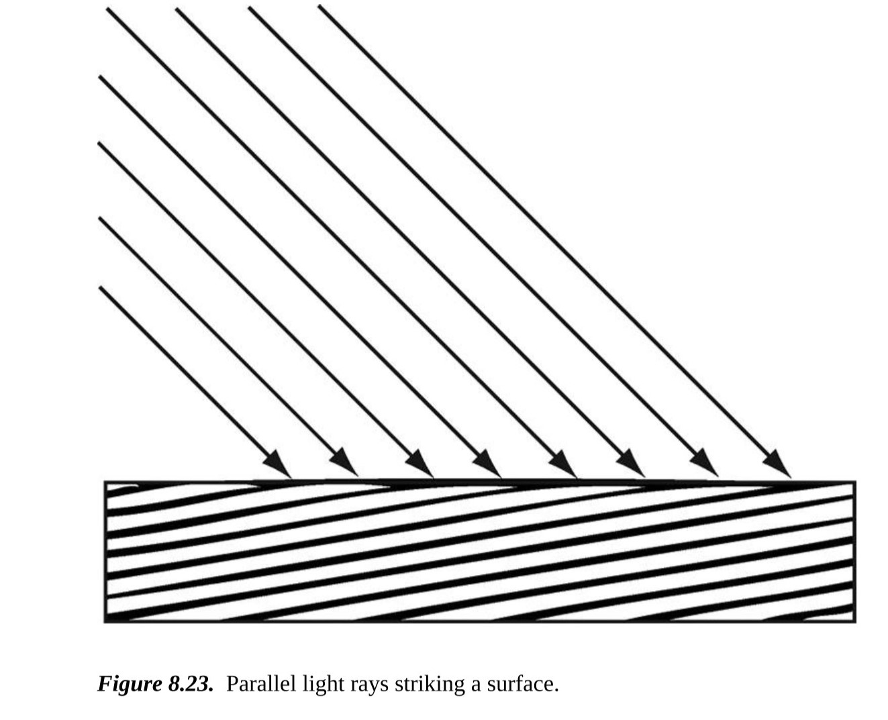

对于平行光，我们只需要一个向量来表示它的方向即可(我们使用的是光照射的方向的反方向)。因为所有的光线的方向互相平行，其方向向量是相同的。现实世界中的太阳，实际上就是平行光的例子，从很远的地方照射到地球的时候，光线已经互相近似平行了([图片8.24](#Image8.24))。

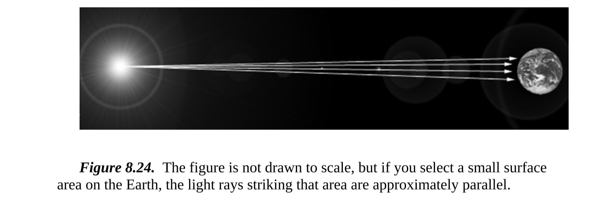

## 8.11 POINT LIGHTS

在现实世界中灯泡是最为典型的点光源的例子，它以球形的方式向四周辐射能量([图片8.25](#Image8.25))。具体来说，对于任意的一个点$P$，存在一条光线从点光源的位置$Q$发出到$P$点。**同样的，我们定义光的方向向量为光线朝向的相反向量**，即从$P$点到$Q$点。

$$L = \frac{Q - P}{ \| Q - P \|}$$

基本上说，点光源和平行光的不同的地方就是，它们计算光的向量的方式不同。点光源是两点之间的向量，而平行光则是一个常量。

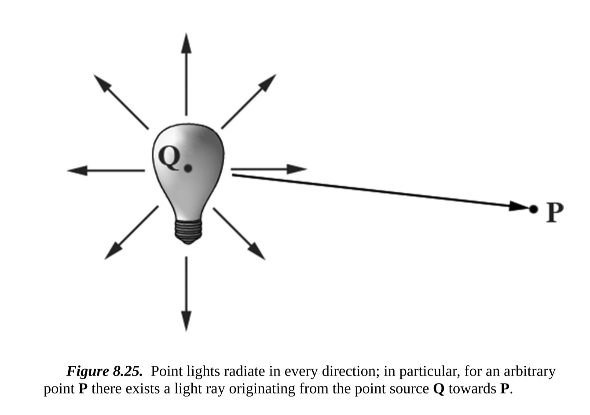

### 8.11.1 Attenuation

从物理上来说，光的强度的衰减量是一个和距离的平方有关的函数。和光源距离为$d$的点，其受到的光的强度为：

$$I(d) = \frac{I_0}{d^2}$$

$I_0$是当$d = 1$的时候的光的强度。如果你设置基于物理的光照值，并且使用HDR光照，它能够运行的很好。然而，为了方便初学，我们使用一个更为简单的公式，一个线性的衰减函数。

$$att(d) = saturate(\frac{falloffEnd - d}{falloffEnd - falloffStart})$$

[图片8.26](#Image8.26)表示了函数的图像。$staurate$函数将值裁剪成[0, 1]范围内。

$$staurate(x) = \begin{cases} x, 0 \le x \le 1 \\ 0, x < 0 \\ 1, x > 1 \end{cases}$$

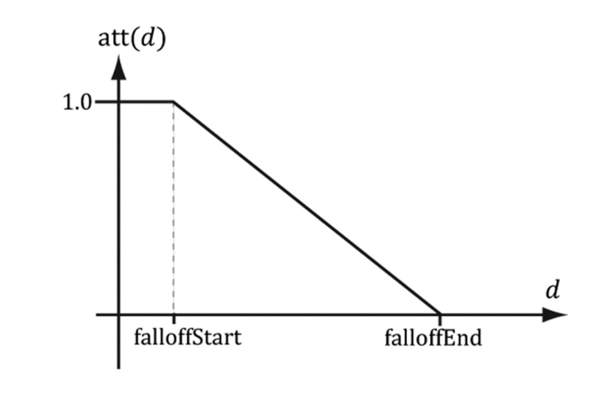